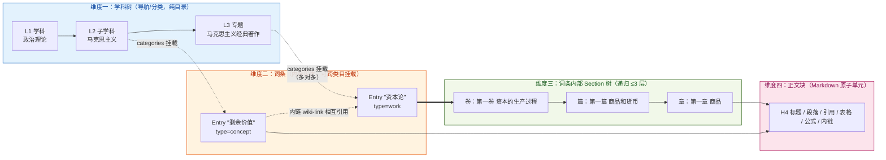
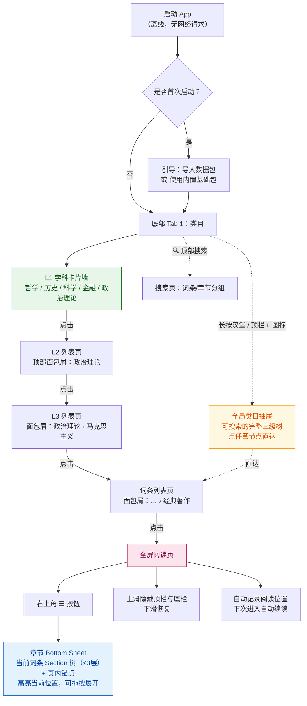
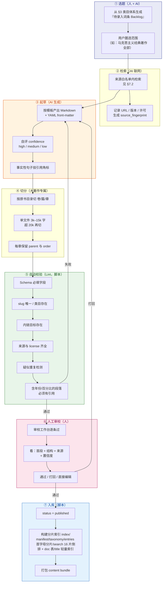

# 个人本地知识学习站 · 产品需求文档（PRD）

| 项目 | 内容 |
| --- | --- |
| 文档编号 | 01-PRD |
| 版本 | **v1.1**（已并入架构裁决 C1–C6，待 M0 冻结） |
| 撰写人 | 许清楚（产品经理） |
| 项目名（snake_case） | `personal_knowledge_station` |
| 语言 | 简体中文（界面 + 内容） |
| 技术路线 | React + Vite + TypeScript + MUI + Tailwind CSS；Capacitor 打包 iOS / Android |
| 形态 | Web（桌面浏览器）+ 移动 App（iOS / Android），一套代码 |
| 网络依赖 | **零**。全离线可用，无账号、无服务器、无同步 |

> 📌 **补充文档**：学习顺序模型、历史类目双时间线完整展开、类目可扩展机制、一期排产（v2）见
> [`01b-PRD补充-学习顺序与类目扩展.md`](./01b-PRD补充-学习顺序与类目扩展.md)。
> 该文档基于用户拍板结果（Android 先行 / 文件夹编辑 / 原文+导读 / **五大类目并行铺开**）对本文 §3.6 排产与部分优先级做了修订，**冲突处以补充文档为准**。
>
> 📌 **v1.1 修订说明**：架构师在 [`02-架构设计-知识学习站.md`](./02-架构设计-知识学习站.md) §1 中指出本文 6 处矛盾/技术不可行点（C1–C6），已全部接受并回改，明细见 **[§0.4 架构裁决回改记录](#04-架构裁决回改记录c1c6)**。

---

## 0. 原始需求与已定决策

### 0.1 用户原始需求（原文）

> 我想搭建一个全新的知识类的网站和对应的手机App，里面的功能是这样的：
> 1. 在电脑端的web打开，左侧是各类的知识类目比如：哲学、历史、科学、金融、政治理论
> 2. 当点击对应的类目就要显示出相应的知识点，比如当我点击左侧的哲学类目，右侧会出现相关的知识点，供我学习
> 3. 所有的这些知识点是存储在本地的，然后渲染上网页
> 4. 我的主要应用场景还是手机app，要求也是所有的知识数据存储在手机本地，当我打开app能够直接使用。
> 我做这个项目的目的就是供我学习相应的知识。

### 0.2 已拍板决策（本 PRD 的前提，不可推翻）

| # | 决策 | 约束含义 |
| --- | --- | --- |
| D1 | Web + Capacitor 一套代码 | 不得引入任何需要服务端的架构；所有能力必须能在 `file://`/`capacitor://` 下运行 |
| D2 | 内容由 AI 联网检索后录入 | 内容生产是本项目第一瓶颈；PRD 必须定义"AI 抓取 → 结构化 → 审校 → 入库"全链路 |
| D3 | **只要阅读浏览** | 不做闪卡、不做间隔重复、不做自测、不做学习进度/统计 |
| D4 | 一期纯本地，手工导入导出搬运 | 不做账号、不做云端同步、不做自动更新 |

### 0.3 关键理解（决定架构的那句话）

用户原话：

> "政治理论中的知识就涉及到马克思主义，那么就要把马克思的相关著作都录入到『马克思主义』这个词条内"

这句话定死了内容模型的**下限和上限**：

- **上限**：一个词条下可能挂着**整本书的体量**（《资本论》三卷约 200 万字），不是三五百字的小卡片。
- **下限**：也存在"200 字的小概念"（如"商品二因素"）。

> ⚠️ 因此本 PRD 的核心不是"做个笔记应用"，而是设计一套**能同时容纳 200 字词条和 200 万字著作的分层内容模型**，并且这套模型在手机端要能流畅导航和渲染。这是架构师最需要对齐的点。

### 0.4 架构裁决回改记录（C1–C6）

> 来源：[`02-架构设计-知识学习站.md`](./02-架构设计-知识学习站.md) §1。6 项全部**接受**，v1.1 已回改。

| ID | 问题 | 裁决 | 本文件已改处 |
| --- | --- | --- | --- |
| **C1**【严重】 | 目录结构自相矛盾：§9.1 说"目录名 = 英文 slug"，但 §8.1/§9.3/§9.4 示例全是中文类目嵌套路径；且**多归属（Q7=B）+ 按类目嵌套 = 无解**（"剩余价值"同时属政治理论和金融，复制两份即双份真相，违反 G3） | **内容目录按 slug 扁平化**，类目归属只写在 front-matter `categories[]`；中文类目只存在于 `taxonomy.yaml`；`pnpm content:link` 生成 `_by-category/` 软链接视图供人肉浏览 | §8.1、§9.1、§9.3、§9.4 |
| **C2**【严重】 | §8.4 用 `local_rev`/`base_rev` 判"双方都改过"，但字段表里没有；且 D4 无服务器 → **没有中心基线**，光靠 `updated_at` 区分不了"本地改了"和"包更新了" | **基线随包走**：新增 `rev: number`；导出时 `bundle.json` 写 `base_snapshot`；本地 `.pks/imports.json` 记上次导入基线；三方比对；`rev` 缺失时用正文 sha1 兜底 | §8.1、§8.4、§9.5 |
| **C3**【中】 | `search-index.bin` 是全量单文件，导入后要么整体替换（丢掉本地其他索引）要么手机重建；两个包连导必互相覆盖 | **索引分片化 + 可合并**：按 `fnv1a(slug) & 15` 分 16 片，包内只带本包所属分片，导入时按片覆盖合并 | §8.1 |
| **C4**【中】 | §11.1 要求"100k 字章节 ≤800ms"，但 §7.3 规定 Section 硬上限 20k 字 —— 不存在 100k 字的章节文件 | 拆成两个验收口径：**单章 20k 字 ≤600ms**（物理单元）；**连续阅读模式 ≥100k 字首屏 ≤800ms + 滚动 ≥55fps**（逻辑单元） | §11.1 |
| **C5**【中】 | 推荐的"构建期 nodejieba 分词"是 Node 原生模块，**跑不进浏览器/Capacitor WebView**；手机导入 zip 后无法重建索引，手工编辑 md 后索引与正文不一致 | **分词器必须纯 TS 同构**：CJK bigram + 拉丁词 + 数字，零依赖；词典分词降为**可选增强**（缺失自动回退 bigram）。搜索改为**自研倒排 + BM25**，MiniSearch 保留为 fallback | §10-Q6、§11.2 |
| **C6**【轻】 | `order: "1.1.1"` 字符串排序错误（`"1.10.1" < "1.2.1"`，《资本论》第三卷 7 篇 48 章必踩）；entry.md 用 `##` 与 chapters 用 `####` 层级会断 | `order` 改为**数字数组** `[1,1,1]` + 构建期生成零填充 `orderKey: "001.001.001"`；新增 **Heading 层级全局约定表** | §7.4、§9.4、§9.5、新增 §9.6 |
| **C7**（分歧已接受） | §6.1 为移动端列了独立 `/m/*` 路由 | **单一路由表 + 双 Layout**：手机浏览器打开 Web 端也该是移动布局，两套 URL 会让书签/分享/续读记录维护双份 | §6.1 |

---

## 1. 产品目标与人群

### 1.1 一句话定位

> **一个完全装在你自己设备里的、离线可用的私人知识维基——电脑建、手机读。**

### 1.2 产品目标（3 条，正交）

| 目标 | 描述 | 可衡量标准 |
| --- | --- | --- |
| G1 **读得爽** | 无论 200 字词条还是 200 万字著作，都能在电脑和手机上快速定位、舒适阅读 | 手机端冷启动到可读 ≤ 2s；任意词条 ≤ 3 次点击可达；万字段落滚动 60fps |
| G2 **建得快** | 让 AI 按类目骨架批量产出可用的词条初稿，人只做审校不做搬运 | 单词条（3000 字 + 来源）从选题到入库 ≤ 5 分钟人工耗时 |
| G3 **永不锁定** | 内容是你自己的纯文件，任何时刻可以拿走、用别的工具打开、进 Git | 内容目录为纯 Markdown + YAML，不依赖本应用即可阅读；导出包为普通 zip |

### 1.3 人群

主用户 = 用户本人，**既是读者也是内容建设者**（双角色，这一点影响功能设计：需要"读者模式 / 建设者模式"两套能力，但共用一套数据）。

| 角色 | 场景 | 诉求 |
| --- | --- | --- |
| 读者（主场景：手机） | 通勤、睡前碎片时间 | 打开即读、离线、不累眼、能续读 |
| 读者（次场景：电脑） | 深度学习、主题式查阅 | 大屏、目录树、全文搜索、跨词条跳转 |
| 建设者（仅电脑） | 让 AI 填充类目、审校、整理 | 批量、可控、可追溯来源 |

### 1.4 明确「不做什么」（边界）

| 不做 | 原因 |
| --- | --- |
| ❌ 闪卡 / 间隔重复 / 自测题 | 用户明确不要（D3） |
| ❌ 学习进度、阅读时长统计、成就体系 | 用户明确不要（D3） |
| ❌ 账号、登录、云端同步、多端自动同步 | 用户明确不要（D4） |
| ❌ 在线内容更新 / 热更新 | 必须离线可用 |
| ❌ 社交、评论、分享到社区 | 私人知识库，无社交需求 |
| ❌ 推荐算法、信息流 | 主动学习场景，不需要被动投喂 |
| ❌ 富文本所见即所得编辑器 | 内容与格式分离，Markdown 是唯一数据源（G3） |
| ❌ 数据库（SQLite/IndexedDB 存正文） | 正文必须是可读文件，索引才是二进制 |

---

## 2. 核心概念定义（★最重要，架构师请优先对齐）

### 2.1 四个概念的定义

| 概念 | 英文 / 代码名 | 定义 | 是否承载正文 | 典型数量级 |
| --- | --- | --- | --- | --- |
| **学科/类目** | `Category` | **导航维度**（分类法 taxonomy）。纯目录，本身不含知识内容，只负责"把词条归类、让你能一路点进去" | ❌ 否 | 5 个 L1 / ~40 个 L2 / ~200 个 L3 |
| **词条** | `Entry` | **内容实体**，是知识的最小独立单元，有全局唯一 ID，可被搜索、可被链接、可被收藏 | ✅ 是（概述/导言） | 一期 ~500，长期 ~5000 |
| **篇目/章节** | `Section` | **仅大部头词条内部**使用的递归切分单元（卷 / 篇 / 章） | ✅ 是（主要正文所在） | 大著作 10–200 个 |
| **正文块** | `Block` | Markdown 渲染后的**原子内容单元**（段落、标题、引用、列表、表格、代码块、公式、图片、脚注、内链） | — | 渲染/索引/锚点的操作对象 |

### 2.2 四者的关系

关键点：**学科树（导航）与 词条树（内容）是两个正交的维度**，不是同一棵树。

- 学科树解决"我在哪个领域"。
- 词条内部的 Section 树解决"我在这本书的哪一章"。
- 词条通过 `categories[]`（1..n 个学科路径）**挂载**到学科树上；一个词条可以同时属于多个学科（"剩余价值"既属政治理论也属金融）。



### 2.3 层级总树（自上而下全部层级）

```
L0 知识库 Root
│
├── L1 学科 Category（5 个：哲学 / 历史 / 科学 / 金融 / 政治理论）
│   └── L2 子学科 Category（每个 L1 下 6–9 个）
│       └── L3 专题 Category（每个 L2 下 3–8 个）
│           │
│           │  ← 以下切换到「内容维度」
│           ▼
├── 词条 Entry ─────────────────────────────────────────┐
│   ├── front-matter（YAML 元数据）                      │
│   ├── 概述正文（词条自带，Markdown）                    │
│   └── Section 篇目树（可选，仅 type=work 有，递归 ≤3 层）│
│       ├── L1 篇目（卷 / 部）                            │
│       │   └── L2 篇目（篇 / 编）                        │
│       │       └── L3 篇目（章）                         │
│       │           └── 正文块 Block（H4/H5 小节标题 + 段落）│
│       └── （Section 树深度硬上限 3；更细层级不建 Section，│
│            用 Markdown 标题表达，由渲染器生成页内 TOC）   │
└───────────────────────────────────────────────────────┘
```

### 2.4 为什么这样分层能同时容纳两个极端

| 极端 | 建模方式 | 结果 |
| --- | --- | --- |
| **200 字小概念**（"商品二因素"） | `type: concept`，**零 Section**，正文直接写在词条 `entry.md` 内 | 一个目录一个文件，轻量 |
| **200 万字大部头**（《资本论》） | `type: work`，**有 Section 树**（3 卷 / 25 篇 / 90+ 章），每章一个独立 `.md` 文件 | 单文件不超过 ~15k 字，手机渲染不卡；可按章定位、按章续读 |

> **为什么大著作必须拆成多文件而不是一个巨型 Markdown？**
> 1. 手机端一次性解析 2MB Markdown 会明显卡顿（Capacitor WebView 性能）；
> 2. 无法做"按章续读 / 按章搜索定位 / 按章导入导出"；
> 3. 单文件损坏 = 整本书丢失；
> 4. Git diff 无法看。
> **结论：词条是逻辑单元，文件是物理单元，二者解耦。**

### 2.5 ★ 完整展开示例：政治理论 → 马克思主义 → 《资本论》

这条线是用户唯一明确点名的，作为**架构验收样例**——架构师需要保证下面这棵树能被完整表达。

```
📁 政治理论                                        [L1 学科]
│
├── 📁 政治学基础 …………………………………………………  [L2]
├── 📁 政治思想史 …………………………………………………  [L2]
│
├── 📁 马克思主义  ★用户点名 ………………………………  [L2]
│   │
│   ├── 📁 马克思主义总论 ………………………………………  [L3]
│   │    词条：什么是马克思主义 / 马克思主义的三个组成部分 /
│   │          马克思主义的创立与发展 / 马克思主义的当代意义
│   │
│   ├── 📁 马克思主义哲学 ………………………………………  [L3]（辩证唯物主义 + 历史唯物主义）
│   │    词条：辩证唯物主义 / 历史唯物主义 / 实践 / 矛盾 /
│   │          矛盾的普遍性与特殊性 / 主要矛盾 / 量变质变规律 /
│   │          否定之否定规律 / 异化 / 唯物史观 / 社会存在与社会意识 /
│   │          生产力与生产关系 / 经济基础与上层建筑 / 阶级分析方法 /
│   │          认识论（马克思主义的）/ 真理的实践标准 / 反映论
│   │
│   ├── 📁 马克思主义政治经济学 ………………………………  [L3]
│   │    词条：商品二因素 / 劳动二重性 / 价值形式 / 货币 / 货币转化为资本 /
│   │          剩余价值 / 绝对剩余价值 / 相对剩余价值 / 不变资本与可变资本 /
│   │          资本积累 / 资本有机构成 / 资本循环与周转 / 社会再生产 /
│   │          平均利润与生产价格 / 商业利润 / 借贷资本与利息 / 地租 /
│   │          经济危机 / 雇佣劳动 / 劳动力商品
│   │
│   ├── 📁 科学社会主义 …………………………………………  [L3]
│   │    词条：空想社会主义 / 阶级斗争 / 无产阶级专政 / 共产主义两个阶段 /
│   │          巴黎公社 / 社会主义改造 / 国际主义
│   │
│   ├── 📁 马克思主义发展史 ……………………………………  [L3]
│   │    词条：第一国际 / 第二国际 / 列宁主义 / 民主集中制 /
│   │          西方马克思主义 / 法兰克福学派 / 葛兰西与文化领导权 /
│   │          阿尔都塞 / 中国化马克思主义 / 毛泽东思想 / 中国特色社会主义理论体系
│   │
│   ├── 📁 代表人物 ………………………………………………  [L3]
│   │    词条：卡尔·马克思 / 弗里德里希·恩格斯 / 列宁 / 罗莎·卢森堡 /
│   │          卢卡奇 / 葛兰西 / 阿尔都塞 / 毛泽东
│   │
│   └── 📁 马克思主义经典著作 ★……………………………  [L3]
│        │  ← 以下每一个都是 type=work 的「词条」，内部还有自己的篇目树
│        │
│        ├── 📖 《共产党宣言》(1848)          [work｜约 3 万字｜4 章]
│        │     ├── 一、资产者和无产者
│        │     ├── 二、无产者和共产党人
│        │     ├── 三、社会主义的和共产主义的文献
│        │     └── 四、共产党人对各种反对党派的态度
│        │
│        ├── 📖 《关于费尔巴哈的提纲》(1845)   [work｜约 1500 字｜11 条提纲]
│        ├── 📖 《德意志意识形态》(1845–46)    [work｜第一卷 第一篇 费尔巴哈]
│        ├── 📖 《1844年经济学哲学手稿》        [work｜手稿三 + 异化劳动]
│        ├── 📖 《哲学的贫困》(1847)           [work]
│        ├── 📖 《雇佣劳动与资本》(1849)       [work]
│        ├── 📖 《哥达纲领批判》(1875)         [work]
│        ├── 📖 《反杜林论》(1878)             [work｜哲学/政治经济学/社会主义 三编]
│        ├── 📖 《家庭、私有制和国家的起源》    [work]
│        ├── 📖 《路德维希·费尔巴哈和德国古典哲学的终结》(1886) [work]
│        ├── 📖 《法兰西内战》(1871)           [work]
│        ├── 📖 《国家与革命》(列宁, 1917)     [work]
│        │
│        └── 📖 《资本论》 ★全库最大的词条 … [work｜三卷｜约 200 万字]
│             │
│             ├── 📕 第一卷 资本的生产过程（1867）
│             │   ├── 第一篇  商品和货币
│             │   │   ├── 第一章  商品
│             │   │   │   └── [Block] 1.商品的两个因素／2.劳动的二重性／
│             │   │   │             3.价值形式或交换价值／4.商品的拜物教性质
│             │   │   ├── 第二章  交换过程
│             │   │   └── 第三章  货币或商品流通
│             │   ├── 第二篇  货币转化为资本
│             │   ├── 第三篇  绝对剩余价值的生产（工作日／剩余价值率）
│             │   ├── 第四篇  相对剩余价值的生产（协作／分工工场／机器大工业）
│             │   ├── 第五篇  绝对剩余价值和相对剩余价值的生产
│             │   ├── 第六篇  工资
│             │   └── 第七篇  资本的积累过程（原始积累／殖民制度）
│             │
│             ├── 📕 第二卷 资本的流通过程（1885，恩格斯整理）
│             │   ├── 第一篇  资本形态变化及其循环
│             │   ├── 第二篇  资本周转
│             │   └── 第三篇  社会总资本的再生产和流通
│             │
│             └── 📕 第三卷 资本主义生产的总过程（1894，恩格斯整理）
│                 ├── 第一篇  剩余价值转化为利润
│                 ├── 第二篇  利润转化为平均利润
│                 ├── 第三篇  利润率趋向下降的规律
│                 ├── 第四篇  商品资本和货币资本转化为经营资本
│                 ├── 第五篇  生息资本与利息
│                 ├── 第六篇  超额利润转化为地租
│                 └── 第七篇  各种收入及其源泉
```

**验收标准**：上面这棵树中的每一个节点，都必须能在数据模型里被唯一表达，且手机端能在 ≤ 4 次点击内到达最深处的"第一章 商品"。

---

## 3. 知识类目体系草案（内容骨架）

> **说明**：本节是内容建设的"施工图纸"。一级沿用用户指定的 5 个；二三级由 AI 基于学科通行分类起草，供用户增删。
> `【数字】` 标注建议的一期词条数量（用于排产，非硬约束）。

### 3.1 🏛 哲学

| L2 子学科 | L3 专题（3–8 个） | 一期词条 |
| --- | --- | --- |
| **哲学总论** | 哲学的定义与分支／哲学方法论／哲学史分期／世界哲学传统（西方·中国·印度·伊斯兰） | 【15】 |
| **形而上学** | 存在与本体／时间与空间／因果性／模态（可能与必然）／同一性与变化／自由意志与决定论／心身问题 | 【30】 |
| **认识论** | 知识的定义与葛梯尔问题／怀疑论／经验主义／理性主义／先验与后验／真理理论（符合·融贯·实用）／知觉与信念 | 【25】 |
| **伦理学** | 美德伦理学／义务论（康德）／功利主义／契约论／元伦理学／应用伦理学（生命·环境·AI·商业） | 【30】 |
| **逻辑学** | 命题逻辑／一阶谓词逻辑／模态逻辑／演绎与归纳／逻辑谬误／论证理论与批判性思维 | 【25】 |
| **美学与艺术哲学** | 美的本质／艺术的定义／审美经验／各艺术门类哲学（音乐·文学·绘画·电影） | 【15】 |
| **政治哲学**（与政治理论交叉） | 正义理论／自由与平等／国家与权威／权利理论／民主理论／财产权 | 【25】 |
| **西方哲学史** | 古希腊哲学／中世纪哲学／近代哲学（笛卡尔·休谟·康德）／德国古典哲学（黑格尔·费尔巴哈）／现象学与分析哲学／存在主义／后现代主义 | 【60，人物+著作词条为主】 |
| **中国哲学史** | 先秦诸子（儒·道·墨·法·名·阴阳）／汉唐经学与玄学／宋明理学（程朱·陆王）／明清实学／近代新儒家 | 【50】 |

### 3.2 📜 历史

| L2 子学科 | L3 专题 | 一期词条 |
| --- | --- | --- |
| **史学理论与方法** | 史料学与考据／史学流派（兰克·年鉴·马克思主义史学）／历史分期理论／考古学与口述史／历史编纂学 | 【15】 |
| **中国史** | 先秦／秦汉／魏晋南北朝／隋唐／宋辽金元／明清／晚清与中华民国／中华人民共和国史 | 【80，以断代+事件+人物三条线】 |
| **世界史·全球史** | 古代文明（两河·埃及·印度·希腊罗马）／中世纪世界／大航海与早期全球化／工业革命／帝国主义与殖民主义／两次世界大战／冷战／当代世界（1991–今） | 【60】 |
| **区域国别史** | 美国史／英国史／法国史／德国史／俄国·苏联史／日本史／东亚史／中东史／拉美史／非洲史 | 【50】 |
| **专门史** | 经济史／军事史／科技史／思想史／宗教史／社会史／环境史／外交与国际关系史／法制史 | 【40】 |
| **重大事件专题** | 法国大革命／辛亥革命／十月革命／大萧条／第二次世界大战／冷战重大事件／苏联解体 | 【25，type=event】 |
| **历史人物** | 帝王·政治家／思想家／军事家／科学家／改革者 | 【40，type=person】 |

### 3.3 🔬 科学

| L2 子学科 | L3 专题 | 一期词条 |
| --- | --- | --- |
| **科学总论与科学哲学** | 科学方法／可证伪性（波普尔）／范式革命（库恩）／科学史／科研伦理与学术规范／科学实在论之争 | 【15】 |
| **数学** | 数学基础与数理逻辑／代数（线性代数·抽象代数）／分析（微积分·实分析·复分析）／几何与拓扑／概率论与数理统计／数论／应用数学（优化·微分方程·数值分析） | 【60】 |
| **物理学** | 经典力学／热力学与统计物理／电磁学／相对论／量子力学／粒子物理与标准模型／凝聚态物理／天体物理与宇宙学 | 【60】 |
| **化学** | 无机化学／有机化学／物理化学／分析化学／高分子化学／生物化学 | 【30】 |
| **生命科学** | 分子生物学与遗传学／细胞生物学／进化论／生理学与解剖学／生态学／神经科学／微生物与免疫学 | 【45】 |
| **地球与空间科学** | 地质学／气象与气候学／海洋学／天文学／行星科学 | 【25】 |
| **计算机与信息科学** | 算法与数据结构／计算理论／体系结构与操作系统／编程语言与编译原理／数据库／计算机网络／人工智能与机器学习／密码学与安全／软件工程 | 【60】 |
| **工程技术** | 材料科学／机械工程／电气与电子／土木与建筑／化学工程／能源（核能·新能源）／航空航天／生物工程 | 【35】 |
| **交叉与前沿** | 复杂系统／信息论／控制论／认知科学／量子信息／系统生物学 | 【20】 |

### 3.4 💰 金融

| L2 子学科 | L3 专题 | 一期词条 |
| --- | --- | --- |
| **金融基础与货币银行** | 货币与货币制度／信用与利率／商业银行与存款创造／中央银行与货币政策／金融监管／汇率与国际收支／通货膨胀与通缩 | 【35】 |
| **投资学** | 资产定价（CAPM·APT）／现代投资组合理论／有效市场假说／行为金融学／大类资产配置／因子投资 | 【30】 |
| **固定收益** | 债券基础／利率期限结构／久期与凸性／信用债与评级／利率衍生品／可转债 | 【25】 |
| **权益市场** | 股票估值（DCF·相对估值）／财务报表分析／行业分析框架／市场结构与交易所／指数与被动投资／市场微观结构 | 【35】 |
| **公司金融** | 资本预算（NPV·IRR）／资本结构（MM 定理）／股利政策／兼并与收购／公司治理／营运资本管理 | 【25】 |
| **衍生品与风险管理** | 远期与期货／期权（Black-Scholes·希腊字母）／互换／风险度量（VaR·压力测试）／对冲策略／结构化产品 | 【30】 |
| **金融市场与机构** | 一级与二级市场／投资银行／基金与资产管理／保险与养老金／私募股权与风险投资／对冲基金 | 【25】 |
| **投资流派与经典著作** | 价值投资（格雷厄姆·巴菲特）／成长投资（费雪）／宏观对冲（索罗斯·达利欧）／技术分析／量化投资／经典书目（《证券分析》《聪明的投资者》《漫步华尔街》《金融炼金术》） | 【30，著作类 type=work】 |
| **金融史与危机** | 郁金香泡沫／南海泡沫／1929 大萧条／布雷顿森林体系／滞胀与沃尔克时刻／日本资产泡沫／1997 亚洲金融危机／2008 次贷危机／欧债危机 | 【25，type=event】 |

### 3.5 ⚖️ 政治理论

| L2 子学科 | L3 专题 | 一期词条 |
| --- | --- | --- |
| **政治学基础** | 政治与权力的定义／国家理论／政体类型学／主权与合法性／政治制度（选举·议会·行政·司法）／官僚制／政党与利益集团／公共政策 | 【35】 |
| **政治思想史** | 古典（柏拉图·亚里士多德）／近代（马基雅维利·霍布斯·洛克·卢梭·孟德斯鸠）／自由主义／保守主义／共和主义／民族主义／无政府主义／法西斯主义／女性主义政治理论 | 【45】 |
| **马克思主义** ★ | 见 §2.5 完整展开：总论／哲学／政治经济学／科学社会主义／发展史／代表人物／**经典著作** | 【120，含整本录入的著作】 |
| **国际关系理论** | 现实主义／自由主义／建构主义／地缘政治／均势理论／霸权稳定论／国际制度 | 【25】 |
| **比较政治** | 民主化与转型／威权主义／联邦制与单一制／选举制度／国家能力／政治发展理论 | 【20】 |
| **中国政治** | 中国政治制度／政府体制／法治建设／基层治理／公共行政／中国近现代政治史 | 【30】 |
| **政治经济学** | 重商主义／古典政治经济学（斯密·李嘉图）／边际革命／凯恩斯主义／新自由主义／制度经济学／发展经济学 | 【35】 |

### 3.6 一期内容排产建议

| 批次 | 学科 | 目标词条数 | 说明 |
| --- | --- | --- | --- |
| 批次 1（骨架） | 政治理论 → 马克思主义全支 | ~120 | 用户点名，含整本著作，用于**验证大部头的建模与渲染**（最关键的技术验证） |
| 批次 2 | 哲学（哲学史 + 核心分支） | ~150 | 验证"中等体量词条 + 大量人物/概念" |
| 批次 3 | 金融 | ~120 | 用户明确列出的学科 |
| 批次 4 | 历史 / 科学 | 各 ~100 | 补齐 |

> **排产原则**：先做**最难**的（马克思主义整本著作），因为它会暴露所有架构问题；如果架构能扛住《资本论》，剩下四类都是同一种模式的重复。

---

## 4. 用户故事

> 格式：作为〔角色〕，我希望〔能力〕，以便〔价值〕。

| # | 用户故事 | 覆盖端 | 验收要点 |
| --- | --- | --- | --- |
| US-1 | 作为**学习者**，我希望在电脑打开网站时左侧常驻看到全部学科类目树，以便我随时切换学习领域 | Web | 左栏常驻，支持展开/收起，记住上次展开状态 |
| US-2 | 作为**学习者**，我希望点击"哲学"后右侧立刻列出该类目下的全部知识点（含子类的），以便我按兴趣挑选 | Web | 支持"含子类"开关；显示词条类型徽标与字数 |
| US-3 | 作为**学习者**，我希望在地铁/飞机上（无网络）打开手机 App 就能直接阅读，以便利用碎片时间 | Mobile | 飞行模式下全流程可用，零网络请求 |
| US-4 | 作为**学习者**，我希望《资本论》这种大部头能按"卷→篇→章"展开目录，以便我分章节读完而不是面对一整坨文字 | Web + Mobile | 三层 TOC，滚动自动高亮当前章 |
| US-5 | 作为**学习者**，我希望全文搜索一个关键词后能按"词条 / 章节"分组看到结果并高亮命中，以便做主题式学习 | Web + Mobile | 500 词条 + 1 万章节内搜索响应 ≤ 300ms |
| US-6 | 作为**学习者**，我希望下次打开时自动回到上次读到的位置，以便连续阅读长篇 | Web + Mobile | 记录 `entry_slug + section_slug + 滚动百分比` |
| US-7 | 作为**学习者**，我希望正文里的术语能直接点进去看解释并能一键返回原位，以便遇到不懂的概念不中断阅读 | Web + Mobile | `[[词条]]` 内链，返回时恢复滚动位置 |
| US-8 | 作为**学习者**，我希望调节字号、行距、日间/夜间/纸色主题，以便长时间阅读不疲劳 | Web + Mobile | 设置持久化，手机端跟随一次设置即可 |
| US-9 | 作为**学习者（手机）**，我希望在没有左侧栏的屏幕上也能快速在两个学科之间切换，以便我在不同主题间跳跃 | Mobile | 见 §6.3 推荐方案：底部 Tab + 面包屑下钻 + 全局类目抽屉 |
| US-10 | 作为**内容建设者**，我希望能对某个 L3 专题（如"马克思主义经典著作"）下达"把这里的书补齐"的指令，让 AI 批量产出初稿，以便快速填满空类目 | Web（电脑） | 支持按类目批量生成任务 |
| US-11 | 作为**内容建设者**，我希望 AI 产出的每篇内容都带来源链接和置信度，且**未经我审校通过不会出现在正式库中**，以便保证内容可信 | Web（电脑） | 状态机 `draft → reviewed → published`；正式库只索引 `published` |
| US-12 | 作为**内容建设者**，我希望看到"疑似重复词条"和"断链/缺来源"的质量报告，以便在入库前把问题清掉 | Web（电脑） | Lint 报告可导出 |
| US-13 | 作为**内容建设者**，我希望能把电脑上整理好的内容一键导出成一个 zip 数据包，以便在手机上导入 | Web → Mobile | 支持全量/按类目/自选三种范围 |
| US-14 | 作为**内容建设者**，我希望导入时先看到"新增 X 条 / 更新 Y 条 / 冲突 Z 条"的预览，并自主选择策略，以便不会静默覆盖我手机上的改动 | Mobile | Dry-run 预览 + 合并/覆盖/跳过 三选一 |
| US-15 | 作为**内容建设者**，我希望内容目录就是一个普通文件夹，我可以用 VS Code 或 Obsidian 直接打开编辑，以便不被这个应用锁定 | 电脑 | 纯 Markdown 文件，无二进制数据库存放正文 |
| US-16 | 作为**学习者**，我希望把某个词条加入收藏并能在"我的收藏"里快速找回，以便反复温习重点内容 | Web + Mobile | 收藏仅存 slug 列表，不复制内容 |

---

## 5. 功能需求池（P0 / P1 / P2）

> P0 = 一期必须有；P1 = 一期后快速迭代；P2 = 可延后。

### 5.1 阅读浏览类

| ID | 功能 | 优先级 | 说明 |
| --- | --- | --- | --- |
| R-01 | 三级类目树导航（Web 左栏常驻） | **P0** | 展开/收起、当前类目高亮、每个节点显示词条计数；支持"含子类"开关 |
| R-02 | 词条列表 | **P0** | 展示标题、类型徽标（概念/著作/人物/事件）、摘要、字数、更新时间；支持按更新时间/标题/字数排序 |
| R-03 | Markdown 正文渲染 | **P0** | 标题、粗斜体、列表、表格、引用、代码块、脚注、分隔线、内链、外链、任务列表 |
| R-04 | **长文内 TOC（词条目录）** | **P0** | 《资本论》级必需。展示当前词条的 Section 树（≤3 层）+ 页内 H2/H3 锚点；滚动自动高亮；点击平滑滚动 |
| R-05 | 全文搜索 | **P0** | 本地倒排索引；搜索范围 = 标题 + 摘要 + 正文；结果按"词条 / 章节"分组；关键词高亮；点击跳转并滚动到命中处 |
| R-06 | 字号 / 主题 | **P0** | 字号 5 档；主题 = 日间 / 夜间 / 纸色（sepia）；行距 3 档；设置本地持久化 |
| R-07 | 续读（阅读位置记忆） | **P0** | 记录 `entry + section + scroll%`；列表页显示"读到 32%"；进入时自动恢复 |
| R-08 | `[[词条]]` 内部链接跳转 | **P0** | 点击跳转；返回时恢复原滚动位置；断链显示为灰色虚线并提示"尚未录入" |
| R-09 | 收藏 / 书签 | P1 | 收藏词条；可在正文中对段落打书签（仅本地记录锚点） |
| R-10 | 最近阅读列表 | P1 | 最多 50 条，按时间倒序，可清空 |
| R-11 | 阅读排版微调 | P1 | 字体（衬线/无衬线）、页宽（窄/中/宽）、段间距 |
| R-12 | 术语 hover/长按释义卡 | **P0** | 基于别名表自动识别术语，弹卡显示摘要，点进去看全文（与词典/高亮共用选区工具条，见 §5.1.1） |
| R-13 | 图片点击大图预览 | P1 | 支持双指缩放（移动端） |
| R-14 | 复制 / 分享选中片段 | **P0** | 长按选段 → 复制/分享（自动附带"—— 出自《XXX》"引用格式）；与词典/高亮共用选区工具条 |
| R-15 | 数学公式渲染（KaTeX） | P1 | 科学/金融类目需要；纯前端渲染，无网络依赖 |
| R-16 | TTS 朗读 | P2 | 系统 TTS，可调语速；长文分块（一期暂不纳入） |
| R-17 | 高亮 / 批注 | **P0** | 选中可高亮或加小注；数据独立于正文（用户 KV + 随包走 overlay）；与词典/复制共用选区工具条 |
| R-18 | 词条关系图谱 | P2 | 基于内链的可视化关系图（force graph） |
| R-19 | 随机词条 / 每日一词 | P2 | 首页小组件 |
| R-20 | **内置离线词典（画线查词）** | **P0** | 长按/拖选文字→工具条"查词"；本地分片词库（生僻字/成语/英文三套），零网络；查不到可一键加入 feedback 待补源；复用 `04 §2.6` 闭环 |

### 5.1.1 阅读辅助簇（2026-09-06 新增：画线查词 + 高亮 + 术语卡 + 复制）

用户提出阅读时"画线即可查生僻字/成语/英文意思"，并采纳助手建议补充高亮批注、术语卡、复制分享。四者**共用一个统一的选区工具条**（移动端长按拖选、桌面端鼠标选区 → 浮现工具条：查词 / 高亮 / 复制 / 标记问题），交互一致、零额外手势成本。

- **R-20 内置离线词典**：词库随包内置，构建期分片、Worker 后台加载，查询纯本地、零网络——强化"一期 App 不申请网络权限"决策（见 `05 §6` Q23）。三套词库：① 生僻字/汉字 ② 成语 ③ 英文（CC-CEDICT 子集等），均按 `04 §2.4.5` 版权三档标注 license。
- **R-12 术语卡 / R-17 高亮批注 / R-14 复制分享**：用户的个人高亮/批注存用户 KV，随导出包走（与修正层 overlay 分离）；标记问题走 `feedback.json`（`04 §2.6`）。
- **边界**：均为阅读时的即时辅助，**不含打卡/进度/闪卡**，符合"只要阅读浏览"定位（`01 §1.4`）。
- **离线 TTS 朗读（R-16）用户暂未纳入一期**，留 P2。
- 交互细节见 `05 §2.4` 选区工具条设计。

### 5.2 内容管理类（电脑端）

| ID | 功能 | 优先级 | 说明 |
| --- | --- | --- | --- |
| C-01 | 内容目录规范 + 目录结构约定 | **P0** | 见 §9；一个词条 = 一个目录 |
| C-02 | Front-matter Schema + 校验器（Lint） | **P0** | 校验必填字段、slug 唯一、类目存在于 `taxonomy.yaml`、内链目标存在、文件编码、字数阈值 |
| C-03 | **AI 内容录入工作流** | **P0** | 见 §7：选题 → 检索 → 起草 → 切分 → 校验 → 审校 → 入库 |
| C-04 | 待录入词条 Backlog | **P0** | 由类目体系自动生成词条清单，标记状态（未开始/起草中/待审校/已发布） |
| C-05 | 审校工作台 | **P0** | 逐条审校：显示正文、来源列表、置信度、疑似重复；一键通过/打回/打开源文件 |
| C-06 | 内容索引构建（Build） | **P0** | 扫描内容目录 → 构建分片索引 `index/`（按 02 §3.4）：`manifest.json` + `taxonomy.json` + `entries/a.json…z.json`（首字母 26 片）+ `search/meta.json` + `search/s00.bin…s15.bin`（倒排）+ `search/s00.json…s15.json`（doc 表）+ `search/title.bin\|json`（L1）；**不再产出单文件 `search-index.bin`**；`graph.json` 仍为可选单文件 |
| C-07 | 重复检测 | P1 | 基于标题相似度 + 别名 + 来源 URL 指纹；输出疑似重复对 |
| C-08 | 质量报告 | P1 | 统计：无来源词条、正文 < 300 字词条、断链数、未归类词条、license 缺失 |
| C-09 | Web 端轻量编辑（File System Access API） | P1 | Chrome/Edge 下可直接读写本地内容目录，实现"网页里改一行立刻生效"；不支持的浏览器降级为导出 patch |
| C-10 | 本地预览服务器（开发态） | **P0** | `npm run dev` 直接读内容目录，改文件热更新 |
| C-11 | Git 友好提示 | P2 | 提供 `.gitignore`、提交前自动运行 Lint 的 hook 建议 |
| C-12 | 批量重命名 / 类目迁移 | P2 | 移动词条时自动更新所有内链 |

### 5.3 导入导出类

| ID | 功能 | 优先级 | 说明 |
| --- | --- | --- | --- |
| X-01 | 导出数据包（zip） | **P0** | 全量 / 按类目 / 自选词条三种范围；见 §8 |
| X-02 | 导入数据包 | **P0** | 手机端选择 zip；Dry-run 预览；合并/覆盖/跳过策略 |
| X-03 | 增量包（仅含变更） | P1 | 基于 `updated_at` 生成差量包，减小传输体积 |
| X-04 | 用户数据导出（收藏/书签/阅读位置/设置） | P1 | 独立 `userdata.json`，与内容包分离，便于换机不丢阅读进度 |
| X-05 | 局域网 Wi-Fi 传输 | P1 | 电脑端启动临时服务 + 二维码，手机浏览器下载 zip 后用 App 打开（见 §8.3） |

### 5.4 端差异与端专属能力

| ID | 功能 | 优先级 | 端 | 说明 |
| --- | --- | --- | --- | --- |
| M-01 | 底部 Tab 导航（类目 / 最近 / 我的） | **P0** | Mobile | 见 §6.3 |
| M-02 | 类目下钻 + 面包屑 | **P0** | Mobile | 三级下钻列表页，顶部面包屑可点击回退 |
| M-03 | 章节目录 Bottom Sheet | **P0** | Mobile | 阅读页唤起，半屏→全屏可拖拽，显示当前词条 Section 树 |
| M-04 | 全屏沉浸阅读 + 滚动隐藏 Tab | **P0** | Mobile | 上滑隐藏底栏与顶栏，下滑显示 |
| M-05 | 系统返回键语义（Android） | **P0** | Mobile | 优先回退面包屑层级，其次退出 |
| M-06 | 内容随 App 打包 | **P0** | Mobile | 构建时把内容包拷进 `public/`，Capacitor 一并打进 apk/ipa，装完即用（见 §8.3） |
| M-07 | 状态栏/刘海屏/安全区适配 | **P0** | Mobile | `viewport-fit=cover` + safe-area |
| M-08 | 键盘快捷键（⌘K 搜索、⌘B 切换目录、←/→ 前后词条） | P1 | Web | 桌面端效率 |
| M-09 | 三栏 / 四栏响应式布局（宽屏显示 TOC 侧栏） | P1 | Web | ≥1440px 四栏；1024–1440 三栏 + TOC 悬浮按钮 |
| M-10 | PWA（可安装到桌面 / 添加到主屏） | P2 | Web + Mobile | 离线缓存，作为"不想打包 App"时的降级方案 |

---

## 6. 页面与交互结构

### 6.1 页面清单

> ⚠️ **v1.1 修订（裁决 C7）**：原方案为移动端单列 `/m/*` 独立路由，**改为单一路由表 + 双 Layout**。
> 理由：① 手机浏览器打开 Web 端时，URL 是 `/e/xxx` 也应当渲染移动布局——按 URL 前缀区分会让同一内容有两个 URL，书签/分享/续读记录全部要维护双份；②「最近阅读」存的是 `slug`，跨设备（电脑记的进度、手机继续读）不需要路由层做转换；③ 续读/面包屑/返回栈都是**状态**不是路由，放 `useNavigationStack()` 比放 URL 简单；④ 减少一半路由配置与测试成本。

**统一路由表（一份 URL，两种渲染）**

| 路由 | 桌面渲染（≥1024px / 非触摸优先） | 移动渲染（<768px 或触摸优先） | 优先级 |
| --- | --- | --- | --- |
| `/` | 首页：五大学科卡片 + 最近阅读 + 搜索入口 | Tab1 类目：L1 卡片墙 + 最近 | P0 |
| `/c/:path*` | 左栏类目树 + 中栏词条列表 | 下钻列表 + 顶部面包屑（Tab1 内） | P0 |
| `/e/:slug` | 三/四栏阅读（宽屏含 TOC 侧栏） | 全屏沉浸阅读（独立页，隐藏底部 Tab） | P0 |
| `/e/:slug/:sectionSlug` | 同上，定位到具体章节 | 同上 | P0 |
| `/s?q=` | 搜索结果页（分组 + 高亮） | 搜索页（顶部固定搜索框 + 实时结果） | P0 |
| `/settings` | 设置页：主题 / 字号 / 导入导出 / 关于 | Tab3「我的」→ 设置 | P0 |
| `/review` | 审校工作台（建设者模式，仅列 `draft`/`reviewed`） | **移动端隐藏入口**（重定向到 `/`） | P0 |
| `/admin/topics` | 内容管理 / Backlog：待录入清单 + 触发 AI 生成 | 不可达 | P1 |
| `/admin/quality` | 质量报告：Lint / 重复 / 断链 | 不可达 | P1 |
| *(overlay)* | 词条内 TOC 抽屉（窄屏） | 词条内 TOC **Bottom Sheet**（半屏可拖拽） | P0 |

> 移动端"最近阅读""我的"作为 **Tab 内的面板**存在（Tab2 / Tab3），不占用独立路由。

### 6.2 Web 端布局（≥1440px 四栏 / 1024–1440px 三栏）

```
┌──────────────────────────────────────────────────────────────────────────────┐
│  📚 知识学习站        [ 🔍 搜索词条、章节…            ⌘K ]   [🌓][A][⋮ 导入导出] │
├──────────────┬───────────────────────┬─────────────────────────┬────────────┤
│ 类目树（常驻） │  词条列表               │  正文区                   │ 本页 TOC   │
│ 240px        │  300px                │  自适应                   │ 220px      │
│              │                       │                         │            │
│ ▸ 哲学        │ 马克思主义经典著作      │ # 《资本论》              │ ▸ 第一卷    │
│ ▸ 历史        │ ☑ 含子类    12 个词条  │                         │   ▾ 第一篇  │
│ ▸ 科学        │ ─────────────────────│ 概述                     │     • 第一章│
│ ▸ 金融        │ 📖 共产党宣言           │ 《资本论》是马克思…        │     · 第二章│
│ ▾ 政治理论     │    著作 · 3.2万字 · 4章│                         │   ▸ 第二篇  │
│   ▸ 政治学基础 │ ─────────────────────│ 第一卷 资本的生产过程      │ ▸ 第二卷    │
│   ▸ 政治思想史 │ 📖 资本论      ⭐32%  │                         │ ▸ 第三卷    │
│   ▾ 马克思主义 │    著作 · 200万字 · 3卷│ 第一篇 商品和货币         │            │
│     ▸ 马哲     │ ─────────────────────│                         │ (滚动高亮)  │
│     ▸ 马政经   │ 📖 关于费尔巴哈的提纲  │ 第一章 商品               │            │
│     ▾ 经典著作 │    著作 · 1.5千字     │                         │            │
│       • 共产党宣言│ ─────────────────────│ 1. 商品的两个因素         │            │
│       • 资本论★│ 📄 剩余价值            │  商品首先是一个外界的对象…  │            │
│       • 反杜林论│    概念 · 2.1千字     │                         │            │
└──────────────┴───────────────────────┴─────────────────────────┴────────────┘
     ①                    ②                        ③                    ④
```

**响应式规则**

| 视口 | 布局 |
| --- | --- |
| ≥1440px | 四栏全显示 |
| 1024–1439px | 三栏（隐藏 ④，TOC 变右下角悬浮按钮 → 点开为抽屉） |
| <1024px（平板竖屏） | 两栏：类目树变抽屉（汉堡键），保留列表 + 正文 |
| <768px | 切换为**移动端布局**（见 §6.3） |

### 6.3 ★ 手机端：没有"左侧栏"时，类目树怎么呈现？

#### 三个候选方案对比

| 方案 | 描述 | 优点 | 缺点 | 结论 |
| --- | --- | --- | --- | --- |
| A. 汉堡抽屉（Drawer）为主导航 | 左上角汉堡键滑出完整三级类目树 | 随时可达顶层；能一眼看全树 | 每层都要"开关抽屉"，从顶层到 L3 需 3 次滑出；抽屉里长树滚动体验差；遮挡内容 | ❌ 不作为**主**导航 |
| B. 底部 Tab 直接放 5 个学科 | 5 个 Tab：哲学/历史/科学/金融/政治理论 | 切换快 | **学科会增长**（5→9→12），Tab 放不下；Tab 内仍需二级导航，等于没解决问题；无法承载"最近/我的" | ❌ 否决 |
| C. **两级下钻 + 顶部面包屑**（列表页本身就是导航） | 首屏 = 5 张学科卡片 → 点进去是 L2 列表 → 再进 L3 列表 → 再进词条列表；每级顶部面包屑可点回退 | 符合移动端心智（同 iOS 设置/文件 App）；层级无限扩展；面包屑提供"返回任意上级"的捷径；无遮挡 | 从深层回顶层需多次返回（用面包屑缓解） | ✅ **推荐为主导航** |
| D. 全局类目抽屉（辅助） | 任意页面长按汉堡键/顶栏图标，全屏弹出**可搜索的完整类目树**，点任意 L3 直达 | 解决 C 的"深层回跳"痛点；搜索类目本身很有用 | 需要额外的实现成本 | ✅ **推荐为辅助** |

#### 最终推荐：**C（主） + D（辅） + Bottom Sheet（章节）**



#### 手机端页面草图

**Tab1 · 类目下钻（L3 层示例）**

```
┌─────────────────────────────┐
│ ‹ 政治理论 › 马克思主义        │ ← 面包屑，可点击回退（可横向滚动）
├─────────────────────────────┤
│ 🔍 搜索词条、章节…            │
├─────────────────────────────┤
│ 📁 马克思主义总论        4    │
│ 📁 马克思主义哲学       18    │
│ 📁 马克思主义政治经济学  21   │
│ 📁 科学社会主义          6    │
│ 📁 马克思主义发展史      12   │
│ 📁 代表人物               8   │
│ 📁 马克思主义经典著作    11   │
├─────────────────────────────┤
│  （L3 是最后一层类目）         │
│  直接展示词条列表：            │
│  📖 共产党宣言       3.2万字  │
│  📖 资本论         200万字 ⭐32%│
│  📖 反杜林论         28万字  │
│  📄 剩余价值        2.1千字  │
├─────────────────────────────┤
│  [ 类目 ]   最近   我的       │ ← 底部 Tab（3 个）
└─────────────────────────────┘
```

**阅读页 + 章节 Bottom Sheet**

```
┌─────────────────────────────┐         ┌─────────────────────────────┐
│ ‹ 资本论              [☰] [A] │         │ ═══ 目录          ✕         │
├─────────────────────────────┤  ☰ →    ├─────────────────────────────┤
│                             │         │ ▾ 第一卷 资本的生产过程       │
│  《资本论》                  │         │   ▾ 第一篇 商品和货币         │
│  第一卷 · 第一篇 · 第一章     │         │     ┃第一章 商品      ←当前   │
│                             │         │     · 第二章 交换过程         │
│  第一章 商品                 │         │     · 第三章 货币或商品流通   │
│                             │         │   ▸ 第二篇 货币转化为资本     │
│  1. 商品的两个因素            │         │ ▸ 第二卷 资本的流通过程       │
│                             │         │ ▸ 第三卷 资本主义生产的总过程  │
│  商品首先是一个外界的对象，    │         │                             │
│  一个靠自己的属性来满足人的    │         │ ── 本页小节 ──               │
│  某种需要的物……              │         │ 1. 商品的两个因素            │
│                             │         │ 2. 劳动的二重性              │
│  [读到 32%]                  │         │ 3. 价值形式或交换价值         │
├─────────────────────────────┤         └─────────────────────────────┘
│  [ 类目 ]   最近   我的       │           ↑ 可上拖全屏，点击任意节点跳转
└─────────────────────────────┘             并自动关闭 Sheet
```

**推荐理由（4 条）**

1. **学科会增长**：底部 Tab 只能放"功能域"（类目/最近/我的），绝不能放"学科"，否则类目从 5 涨到 9 时整个导航要重做。
2. **下钻 + 面包屑是移动端处理多级树的标准范式**（iOS 设置、文件管理器、电商分类），用户零学习成本；且面包屑天然解决了"从第 3 层回到第 1 层"的问题。
3. **大部头必须有独立的章节入口**：《资本论》有 3 层 90+ 章，靠滚动绝对找不到——所以阅读页右上角的 ☰ 和 Bottom Sheet 是 P0，不是锦上添花。
4. **抽屉降级为"全局跳转 + 类目搜索"**：不占用日常路径，但在"我想从《资本论》直接跳到'宋明理学'"这种跨域跳转时非常高效。

---

## 7. AI 内容录入流程设计（★本项目最特殊的一环）

### 7.1 总体流水线



### 7.2 触发方式与抓取范围

| 项 | 设计 |
| --- | --- |
| **触发方式** | 三种：① 在 Backlog 页面按 L3 专题批量下达；② 单个词条手工触发；③ 命令行脚本 `npm run ingest -- --category "政治理论/马克思主义/经典著作"` |
| **抓取范围** | 严格限定在"当前 Backlog 条目"内。AI 不得自作主张扩充词表；发现新词条 → 写入 Backlog 待用户确认 |
| **来源白名单（默认）** | 🟢 公版/权威：中文马克思主义文库（marxists.org 中文站）、Project Gutenberg、Stanford Encyclopedia of Philosophy（CC BY-NC）、Internet Archive<br/>🟡 需署名：中文/英文维基百科（CC BY-SA 4.0）、百度百科（仅作交叉校验，不作为主来源）<br/>🔴 禁止全文录入：仍在版权期内的现代出版物、付费数据库、微信公众号长文 |
| **多源交叉** | 概念类词条要求 ≥ 2 个独立来源；只有 1 个来源时 `confidence` 强制降为 `medium` |
| **原文 vs 改写** | 公版著作（马克思、恩格斯、列宁等）→ **录入原文全文**（这是用户的核心诉求）；概念词条 → AI 综述 + 标注来源 |
| **抓取深度上限** | 单个 work 词条最多 200 个 Section；单个 concept 词条正文 800–8000 字 |

### 7.3 内容切分规则（大著作）

| 规则 | 值 | 理由 |
| --- | --- | --- |
| Section 树最大深度 | **3 层**（卷 / 篇 / 章） | 手机端 Bottom Sheet 超过 3 层缩进不可用 |
| 更细层级（节、小节） | 用 Markdown `####` / `#####` 标题表达，进入"页内 TOC"，**不建 Section 记录** | 避免索引爆炸；渲染器自动生成即可 |
| 单 Section 文件字数 | 建议 3,000–15,000 字；**硬上限 20,000 字** | 超过则按小节再切 |
| 切分依据 | 严格遵循**原书目录**，不自行编造章节标题 | 保证与纸质书可对照，便于按页码查阅 |
| 章节标题格式 | 保留原书编号："第一章 商品"、"1. 商品的两个因素" | 便于检索和引用 |
| 空章节处理 | 目录里有但内容缺失 → 建占位 Section，`status: stub`，TOC 中显示为灰色 | 让用户知道"这里还没录"，而不是悄悄消失 |

### 7.4 结构化要求（AI 输出的硬性模板）

**概念类词条（`type: concept`）正文结构**

```
## 定义            —— 一句话 + 一段展开
## 核心内容         —— 分点阐述主要内涵
## 背景与来源       —— 谁提出、在哪部著作、历史语境
## 要点/分类        —— 若有分支（如"绝对/相对剩余价值"）
## 常见误解         —— 可选
## 与其他概念的关系  —— 用 [[内链]]
## 参见            —— 相关词条列表
```

**著作类词条（`type: work`）结构**

```
词条 entry.md：
  ## 概述          —— 这本书是什么、写作背景、出版情况、历史地位
  ## 内容概要      —— 全书主线（1500–3000 字）
  ## 版本说明      —— 依据哪个中文/外文版本、译者、出版社
  ## 阅读建议      —— 阅读顺序、难点提示
  ## 目录          —— 由构建脚本自动生成

章节 Section 文件：
  原书正文（公版原文，不得改写）
  + 可选的「导读」块（AI 写的 200–500 字，用引用块区分，标注为编者注）
  + 可选的「难句注释」（脚注形式）
```

> ⚠️ **原文与 AI 解读必须视觉可区分**：AI 写的内容一律放在 `> 📝 编者注：…` 引用块中，且 front-matter 里 `ai_annotated: true`。用户要能一眼分辨"这是马克思写的"还是"这是 AI 说的"。

### 7.5 是否需要人工审校？—— 需要，且是必过关卡

| 状态 | 含义 | 是否出现在正式库 |
| --- | --- | --- |
| `draft` | AI 已生成，Lint 未过或刚过 | ❌ 否（仅在审校工作台可见） |
| `reviewed` | 人已看过，但标记为"待修订" | ❌ 否 |
| `published` | 人已通过 | ✅ 是 |
| `stub` | 占位，内容缺失 | ✅ 是（TOC 中置灰） |
| `deprecated` | 已废弃，等合并 | ❌ 否 |

**审校强度建议（分级，避免用户被 500 篇审校淹没）**

| 内容类型 | 审校强度 | 理由 |
| --- | --- | --- |
| 公版著作原文（马克思、列宁等） | **批量快速通过**：只校验"来源版本正确 + 章节结构正确 + 无乱码" | 原文是权威的，不需要逐字审事实 |
| AI 撰写的概念词条（confidence=high，≥2 来源） | **抽样 30% 细看 + 其余快速通过** | 事实性内容有来源支撑 |
| AI 撰写的概念词条（confidence=medium/low，或单来源） | **100% 逐条细看** | 高风险 |
| 涉及具体数字/日期/引文的段落 | **必看**（Lint 会强制标红） | 幻觉高发区 |

### 7.6 质量把控机制

| 机制 | 具体做法 |
| --- | --- |
| **来源强制** | 每个 Section / 词条 front-matter 必有 `sources[]`；Lint 拒绝无来源内容入库 |
| **数字/日期引用强制** | Lint 规则：段落中若出现 4 位年份、百分比、金额、"根据……统计"，必须存在引用角标 `[^n]` 或 `sources` 条目，否则标红 |
| **AI 自评置信度** | front-matter 的 `confidence` 字段；`low` 内容不允许批量通过 |
| **幻觉自检** | AI 输出后，脚本抽取所有 URL 做可达性校验（构建期，非运行期）；死链标黄 |
| **断链检查** | 所有 `[[内链]]` 指向的 slug 必须存在；不存在则渲染为灰色并汇总到质量报告 |
| **重复检测** | 三重：(a) slug 冲突；(b) 来源 URL 指纹 `source_fingerprint` 相同；(c) 标题 + 首段相似度 > 0.85 → 输出疑似重复对，人工决定合并或保留 |
| **字数下限** | 概念词条正文 < 300 字 → 标记为"待扩充"，不阻止入库但进质量报告 |
| **编码与格式** | 强制 UTF-8、LF 换行、无 BOM；禁止内嵌 HTML（防止渲染不一致） |
| **原文未被改写校验** | 公版著作章节与来源做首段 hash 比对，若不一致 → 提示"疑似 AI 改写，请确认" |

### 7.7 失败 / 重复内容处理

| 场景 | 处理 |
| --- | --- |
| 检索无结果 | 标记 `status: stub`，写入 Backlog 的"待人工补充"队列，附 AI 的检索记录（查了哪些源） |
| 来源冲突（两源说法不一） | AI **不得自行取舍**，在正文中并列表述 + 加 `> ⚠️ 来源分歧` 引用块，审校时强制人工决策 |
| 内容与已有词条重复 | 不新建；在已有词条上追加 `aliases`，并在 `see_also` 建立关联；新的来源追加到 `sources[]` |
| 生成中断（长著作） | 按 Section 增量落盘，已生成的章节保留；下次继续从断点章节开始，不清空重来 |
| Lint 失败 | 不进入审校队列，直接回到起草阶段（最多重试 2 次，仍失败则转人工） |
| 审校打回 | 记录 `review_notes`，重新起草时作为 prompt 的一部分 |

### 7.8 版权与来源标注

| 内容类别 | 许可策略 | 标注要求 |
| --- | --- | --- |
| 公版（作者逝世 ≥ 50 年，如马克思 1883 卒） | `license: public-domain`，**可全文录入** | front-matter 注明 `source_edition`（版本/译者/出版社/年份） |
| 维基百科等 CC BY-SA | `license: CC-BY-SA-4.0`，可录入 | 必须署名"来源：维基百科，作者列表见 URL，许可 CC BY-SA 4.0"；页脚显示许可声明 |
| 其他 CC 协议 | `license: CC-BY-4.0` 等，按协议 | 署名 + 协议链接 |
| 现代出版物（在版权期内） | **禁止全文录入** | 只允许 200–500 字概述 + 链接 + 出处；页面显示"摘要，全文请购买正版" |
| AI 撰写的综述 | `license: ai-generated` | 正文顶部显示"本文由 AI 综述，已人工审校"（或显示审校状态） |

**页面级呈现**：每个词条/章节底部固定渲染一个「来源与许可」折叠块，列出全部来源 URL、抓取日期、许可协议。这是硬性 P0（合规 + 便于日后自己核对）。

> 📌 使用性质说明：本项目为**个人本地自用**、不对外分发、不上传服务器。即便如此仍坚持标注来源，因为：(1) 未来若想分享内容可无风险；(2) 便于自己回溯核对原文。

---

## 8. 导入导出设计

### 8.1 数据包格式

> ⚠️ **v1.1 修订（裁决 C1 扁平目录 / C2 基线随包 / C3 索引分片 / overlay+feedback 随包）；本版索引命名对齐 02 §3.4**

```
knowledge-pack-20250112-1430.zip
├── bundle.json                 ← 包元信息（02 命名 bundle.json；index_shards 为本包携带的搜索分片号）
│   {
│     "format": "pks-bundle",
│     "version": 2,                          ← v1.1 起为 2
│     "generator": "personal_knowledge_station/0.4.0",
│     "created_at": "2025-01-12T14:30:00+08:00",
│     "scope": { "type": "category", "value": "政治理论/马克思主义" },
│     "stats": { "entries": 128, "sections": 1042, "words": 1840320, "bytes": 6312456 },
│     "checksum": "sha256:...",
│     "base_snapshot": {                     ← ★ 新增（C2）：本包的分叉基线
│       "surplus-value": { "u": "2025-01-12", "r": 3 },
│       "das-kapital":   { "u": "2025-01-10", "r": 1 }
│     },
│     "index_shards": [3, 7, 11]             ← ★ 本包携带的搜索分片号（仅含本包词条所属片）
│   }
├── content/                    ← 基础层（扁平，按 slug）
│   ├── taxonomy.yaml           ← 类目体系源（唯一权威）
│   └── entries/
│       ├── surplus-value/entry.md
│       └── das-kapital/entry.md + chapters/*.md
├── overlay/                    ← 修正层（用户校订，随包走，与基础层物理分离；见 04）
├── tracks/                     ← 顺序轴定义（随包走，zip 顶层；关闭 03 §6 项 E；见 01b §6.2）
├── index/                      ← 预构建分片索引（02 §3.4，省去手机重建）
│   ├── manifest.json           ← 索引清单：schema/generator/contentHash/stats/entryShards/search.shards
│   ├── taxonomy.json           ← 类目树 + 每类目 slug 列表（首屏必读，由 taxonomy.yaml 构建）
│   ├── entries/
│   │   ├── a.json … z.json     ← 按 slug 首字母分 26 片（每片 <300KB；500 词条时 <60KB）
│   │   └── review.json         ← draft/reviewed 词条（仅 Web admin，可选不进 App 包）
│   ├── toc/
│   │   └── <slug>.json         ← Section 数 > 30 的词条独立 TOC（其余内联在 entries 分片）
│   └── search/
│       ├── meta.json           ← { shards:16, docs, terms, avgDocLen, k1:1.2, b:0.75 }
│       ├── s00.bin … s15.bin   ← 倒排：字典 + postings（varint/delta 压缩）；分片 = fnv1a(slug) & 15
│       ├── s00.json … s15.json ← 分片 doc 表：docId -> {slug,kind,title,anchor,entryTitle,words}
│       └── title.bin / title.json  ← L1 轻量索引：title+aliases+summary（~400KB，秒开兜底）
├── feedback.json               ← 可选：App 标记问题回传（04 §2.6，与 overlay 物理分离）
└── userdata.json               ← 可选：收藏 / 阅读位置 / 设置（与内容分离，换机不丢进度）
```

| 设计要点 | 说明 |
| --- | --- |
| **内容与用户数据分离** | 内容包与 `userdata.json` 是两个文件，换设备时可只传内容不覆盖自己的阅读进度 |
| **预构建索引随包携带** | 手机导入 1 万章节时不必重建索引（省几十秒 + 省电）；导入仅覆盖 `bundle.json.index_shards` 对应片，无索引片时才在 Worker 后台重建 1/16 ≈ 3–5s |
| **★ 索引分片化（C3 / 02 §3.4）** | 搜索倒排按 `fnv1a(slug) & 15` 分 **16 片**（`search/s00.bin…s15.bin` + `s00.json…s15.json`），**分片是最小替换单位**：导入时只覆盖本包所属分片，其他分片不动；entries 索引按 slug 首字母分 26 片（`entries/a.json…z.json`）。标题/别名/摘要另出 L1 轻量索引 `title.bin\|json`（~400KB），冷启动 0.3s 就绪兜底 80% 查询 |
| **★ 基线随包（C2）** | `base_snapshot` 记录"这个包是从哪个版本分叉出去的"，配合本地 `.pks/imports.json` 与词条 `rev` 做三方比对，才能判定"双方都改过"。详见 §8.4 |
| **修正层 + feedback 随包** | `overlay/`（修正层）与 `feedback.json`（标记问题回传）随包走，物理分离（见 04 §2.2 / §2.6） |
| **zip 而非自定义格式** | 任何设备都能解压；内容永不锁定（G3） |
| **checksum 校验** | 导入前校验完整性，损坏则拒绝导入并提示重传 |

### 8.2 导出范围

| 范围 | 说明 | 典型体积 |
| --- | --- | --- |
| **全量** | 整个内容库 | 150 万字纯文本 ≈ **5 MB**（中文 UTF-8 约 3 字节/字）；加图片后视情况 |
| **按类目** | 选 1..n 个 L1/L2/L3 | 如"马克思主义"全支 ≈ 2.5 MB |
| **自选词条** | 勾选列表 | 视勾选 |
| **增量包**（P1） | 仅 `updated_at` 晚于某时间的内容 | 通常 < 1 MB |

> 📌 **体积结论**：纯文本根本不是问题。**包体压力 100% 来自图片**——这是 §10-Q6 要用户拍板的原因。

### 8.3 电脑 → 手机的三种搬运方式

| 方式 | 操作 | 适用 | 优先级 |
| --- | --- | --- | --- |
| **① 随 App 打包（默认主路径）** | 构建时把 `content/` 拷进 `public/content/`，Capacitor 打进 apk/ipa。装完 App 直接有内容，零导入操作 | **首次装机、大批量内容** | **P0** |
| **② 文件传输导入** | 电脑导出 zip → 微信/QQ/网盘/USB 传到手机 → 存到"下载"目录 → App 内「我的 → 导入数据包」→ 系统文件选择器选中 zip | **日常增量更新** | **P0** |
| **③ 局域网 Wi-Fi 传输（P1）** | 电脑端 `npm run serve-bundle` 启动临时 HTTP 服务并显示二维码 → 手机同一 WiFi 扫码用浏览器下载 zip → 选择"用知识学习站打开" | 不想用网盘/微信时 | P1 |

**导入流程（手机端）**

```
我的 → 导入数据包
   ↓
选择 zip 文件（系统文件选择器）
   ↓
校验 checksum + 解压          ← 失败则提示重传
   ↓
┌──────── Dry-run 预览 ────────┐
│ 新增词条：23                  │
│ 更新词条：5                   │
│ 冲突（双方都改过）：2   ⚠️     │
│ 将删除（本包已移除）：0        │
│ 预计占用：+12.4 MB            │
│                              │
│ 冲突处理策略：                │
│  ○ 保留两份（推荐）           │
│  ○ 用新包覆盖                │
│  ○ 跳过冲突项                │
│                              │
│  [ 取消 ]      [ 确认导入 ]   │
└─────────────────────────────┘
   ↓
解压 → 合并到内容目录 → 重建索引 → 完成
```

### 8.4 冲突处理策略

> ⚠️ **v1.1 重写（裁决 C2）**：原方案用 `local_rev`/`base_rev` 判"双方都改过"，但这两个字段在 §9.5 字段表里根本不存在；更根本的是 **D4「一期纯本地，无服务器」意味着没有中心化的版本基线**——只靠 `updated_at` 区分不了"本地改了"和"包比本地新"，因为双方都是普通文件，谁也不知道分叉点在哪。
>
> ✅ **新方案：基线随包走（三方比对）**

**三个参与方**

| 方 | 载体 | 内容 |
| --- | --- | --- |
| **base（基线）** | 导出时写入 `bundle.json` 的 `base_snapshot` | `{ "<slug>": { "u": "<updated_at>", "r": <rev> } }` —— "我这个包是从哪个版本分叉出去的" |
| **local（本地）** | 词条 front-matter 的 `updated_at` + `rev` | 本地当前版本 |
| **incoming（包内）** | 包内词条 front-matter 的 `updated_at` + `rev` | 对方当前版本 |

**本地基线台账**：`content/.pks/imports.json`（`.gitignore`，不进包）
```json
{ "surplus-value": { "u": "2025-01-12", "r": 3, "bundleId": "20250112-1430", "at": "2025-01-12T15:02:00+08:00" } }
```

**判定表**

| 情况 | base | local vs base | incoming vs base | 结论 | 处理 |
| --- | --- | --- | --- | --- | --- |
| 1 | 有 | 未变 | 变了 | 只有包更新 | ✅ 直接用包内版本 |
| 2 | 有 | 变了 | 未变 | 只有本地改 | ✅ 保留本地 |
| 3 | 有 | 未变 | 未变 | 一致 | ✅ 跳过 |
| 4 | 有 | **变了** | **变了** | **双方都改过** | ⚠️ 走冲突策略（见下） |
| 5 | 无（首次导入该词条） | — | — | 新增 | ✅ 直接写入 |
| 6 | `rev` 缺失（手工编辑场景） | — | — | 无法用 rev 判定 | ✅ **sha1 兜底**：比对规范化后正文的哈希，哈希同 → 视为未变；哈希不同 → 走冲突策略 |

**冲突（情况 4）的默认处理：保留两份**

- 本地版本重命名为 `<slug>.conflict-<YYYYMMDD>.md`（`type` 不变，`status` 置为 `deprecated`）；
- 写入包内版本作为主版本，并在其阅读页顶部显示提示条："检测到你在 2025-01-10 修改过本词条，[查看我的版本]"；
- 用户可在审校工作台并排对比后手动合并，合并完自行删除副本。

**其他冲突**

| 冲突类型 | 处理 |
| --- | --- |
| 已删除 vs 已修改 | 本地标记删除但包内仍有更新 → 保留包内版本并提示用户 |
| slug 冲突但内容不同源 | `source_fingerprint` 不同 → 提示"同名不同源"，要求重命名或合并 |
| 索引分片冲突 | 按分片整体覆盖（见 §8.1 C3），不做条目级三方合并 |

**用户可选择的全局策略**（导入预览页）

| 策略 | 说明 | 推荐度 |
| --- | --- | --- |
| 保留两份（**默认**） | 上述行为 | ⭐ 推荐 |
| 用新包覆盖 | 直接丢弃本地修改 | 谨慎 |
| 跳过冲突项 | 冲突的不动，只导入无冲突的 | 保守 |

> **原则：绝不静默覆盖。** 内容建设是耗时活，丢内容的代价远高于多一份副本。所有破坏性操作必须有预览 + 二次确认。

---

## 9. 数据与内容规范

### 9.1 目录结构

> ⚠️ **v1.1 重大修订（裁决 C1）**：原方案把词条按中文类目嵌套存放（`entries/政治理论/资本论/`），**与「多归属（Q7=B）」根本冲突**——"剩余价值"同时属于政治理论和金融，该放哪个目录？复制两份即"双份真相"，直接违反 G3「永不锁定」；且中文目录名正是 §9.1 自己论证要规避的 Unicode 归一化问题。
>
> ✅ **新方案：内容目录按 slug 扁平化，类目归属只写在 front-matter 的 `categories[]`。**

```
personal_knowledge_station/
├── content/                          ← 内容源（唯一数据源，纯文本，可 Git）
│   ├── taxonomy.yaml                 ← 类目体系定义（唯一权威，中文）
│   ├── _browse/                    ← 【影子导航树，脚本生成，.gitignore，不进包，见 02 §9.7】
│   │   └── 政治理论/马克思主义/经典著作/_index.md   ← [[slug|title]] wikilink 清单
│   ├── tracks/                       ← 学习序列（见 01b 补充文档 §6.2）
│   └── entries/                      ← ★ 扁平：一个 slug 一个目录
│       ├── surplus-value/            ← 【concept】小词条
│       │   └── entry.md
│       ├── karl-marx/                ← 【person】人物词条
│       │   └── entry.md
│       ├── communist-manifesto/      ← 【work】小著作（4 章）
│       │   ├── entry.md
│       │   └── chapters/ch01.md … ch04.md
│       └── das-kapital/              ← 【work】大著作（3 卷 92 章）
│           ├── entry.md
│           ├── meta.yaml             ← 可选：>50 章时显式声明 Section 树
│           └── chapters/
│               ├── v1-p1-ch01.md     ← 第一卷·第一篇·第一章 商品
│               ├── v1-p1-ch02.md
│               └── … v3-p7-ch48.md
├── .pks/                             ← 工具状态（.gitignore）
│   ├── imports.json                  ← 导入基线台账（C2 冲突检测）
│   └── lint-report.json
├── src/                              ← 应用代码
├── scripts/
│   ├── ingest.ts                     ← AI 录入
│   ├── lint.ts                       ← 校验
│   ├── browse.ts                    ← 生成 _browse/ 影子导航树（见 02 §9.7）
│   └── build-index.ts                ← 构建分片索引
└── public/content/                   ← 构建产物（索引 + 内容的拷贝，供 App 打包）
```

**命名约定**

| 对象 | 规则 | 正则 / 示例 |
| --- | --- | --- |
| 词条目录 | 英文小写连字符 = slug | `/^[a-z0-9]+(-[a-z0-9]+)*$/` → `das-kapital` |
| 词条正文 | 固定 `entry.md` | — |
| 章节文件 | `<层级代号>-<短名>.md`；层级代号 = 卷 `v{n}` / 篇 `p{n}` / 章 `ch{n}` | `v1-p1-ch01.md` |
| 章节 slug | `<workSlug>/<key>` | `das-kapital/v1-p1-ch01` |
| 类目路径 | **中文，斜杠分隔，必须存在于 `taxonomy.yaml`**（只存在于 front-matter，不做物理目录） | `政治理论/马克思主义/马克思主义经典著作` |

> **为什么 slug 用英文**：中文目录在 Windows/macOS/iOS/Android 的 Unicode 归一化（NFC/NFD）行为不一致，会导致 Git 冲突和手机上打不开文件。中文显示为 `title`，英文做 ID。
>
> **扁平化后怎么"人肉按文件夹浏览"**：运行 `pnpm browse:gen` 生成 `content/_browse/` 影子导航树（按类目组织的 wikilink 清单页，指向 `entries/` 里的真实词条；见 02 §9.7）。它只是**视图**，删掉重建即可，不进 Git、不进包，因此不产生双份真相。多归属词条会同时出现在多个类目清单下。因 symlink 跨平台/跨 Obsidian 不稳，**否决软链接方案，改静态 wikilink 树**。
>
> **附带收益**：词条换类目 = 改一行 YAML，零文件移动；批量重命名零成本；AI 录入时不需要先决定"往哪个类目目录里写"。

### 9.2 `taxonomy.yaml` 示例

```yaml
version: 1
updated_at: 2025-01-12
categories:
  - id: politics
    title: 政治理论
    order: 5
    children:
      - id: marxism
        title: 马克思主义
        order: 3
        children:
          - { id: marxism-intro,       title: 马克思主义总论,       order: 1 }
          - { id: marxism-philosophy,  title: 马克思主义哲学,       order: 2 }
          - { id: marxism-economics,   title: 马克思主义政治经济学, order: 3 }
          - { id: marxism-socialism,   title: 科学社会主义,         order: 4 }
          - { id: marxism-history,     title: 马克思主义发展史,     order: 5 }
          - { id: marxism-figures,     title: 代表人物,             order: 6 }
          - { id: marxism-classics,    title: 马克思主义经典著作,   order: 7 }
```

### 9.3 ★ 示例 A：小概念词条（200 字级 → 实际约 2000 字）

**路径**：`content/entries/surplus-value/entry.md`（★ v1.1：扁平，不再按中文类目嵌套；下方 `categories` 里写了两个类目 —— 这正是扁平化的理由）

```markdown
---
slug: surplus-value
title: 剩余价值
aliases: [剩余价值论, Mehrwert]
type: concept
categories:                                # ← 多归属：同时属于政治理论和金融
  - 政治理论/马克思主义/马克思主义政治经济学
  - 金融/政治经济学基础
tags: [马克思, 资本论, 核心概念]
summary: >-
  剩余价值是雇佣工人创造的、被资本家无偿占有的、超过劳动力价值的价值。
  它是马克思主义政治经济学的核心范畴，揭示了资本主义剥削的秘密。
status: published
confidence: high
license: CC-BY-SA-4.0
ai_generated: true
ai_annotated: false
created_at: 2025-01-12
updated_at: 2025-01-12
rev: 3                                     # ★ 新增（C2）：本地修订号，每次保存 +1
words: 2100

sources:
  - title: 剩余价值 - 维基百科
    url: https://zh.wikipedia.org/wiki/剩余价值
    license: CC-BY-SA-4.0
    fetched_at: 2025-01-12
  - title: 资本论 第一卷 第三篇 绝对剩余价值的生产
    ref: entry://das-kapital/v1-p3
    license: public-domain
    edition: 《马克思恩格斯全集》中文第2版 第44卷，人民出版社，2001

see_also: [das-kapital, labour-theory-of-value, variable-capital, absolute-surplus-value]
---

## 定义

**剩余价值**（Mehrwert）是雇佣工人所创造的并被资本家无偿占有的、超过
劳动力价值的那部分价值。[^1] 如果用公式表达：

$$m = W - (c + v)$$

其中 $W$ 是商品价值，$c$ 是不变资本（生产资料转移的价值），$v$ 是可变
资本（劳动力价值），$m$ 即剩余价值。

## 核心内容

### 1. 前提：劳动力成为商品

货币转化为资本的关键，不是货币本身，而是**劳动力成为商品**。劳动力商品
的特殊性在于：它的使用价值（劳动）本身创造价值，而且能创造出**大于**它
自身价值的价值。

### 2. 必要劳动时间与剩余劳动时间

工人的一个工作日分为两部分：

| 部分 | 内容 | 对应价值 |
| --- | --- | --- |
| 必要劳动时间 | 再生产劳动力价值所需的时间 | 工资（$v$） |
| 剩余劳动时间 | 超出必要劳动的部分 | 剩余价值（$m$） |

> 举例：工人每天工作 12 小时，其中 6 小时创造的价值就足以抵偿他的日工资，
> 剩下的 6 小时创造的价值则被资本家无偿占有。这 6 小时即剩余劳动时间。

### 3. 两种生产方式

- **绝对剩余价值**：通过延长工作日或提高劳动强度获得。见 [[absolute-surplus-value]]
- **相对剩余价值**：通过提高全社会劳动生产率、降低劳动力价值，从而缩短
  必要劳动时间获得。见 [[relative-surplus-value]]

## 背景与来源

剩余价值理论由 [[karl-marx|马克思]] 在《[[das-kapital|资本论]]》第一卷
（1867）中系统阐述。他继承了 [[david-ricardo|李嘉图]] 的劳动价值论，
但通过区分"劳动"与"劳动力"，解决了李嘉图体系无法解释"等价交换如何产生
利润"的难题。

## 常见误解

> ⚠️ **误解**：剩余价值 = 利润。
> **澄清**：利润是剩余价值的**转化形式**。在现象层面剩余价值表现为全部
> 预付资本的产物（利润），但其本质来源是工人的剩余劳动。这一"转化"过程
> 在《资本论》第三卷中详细分析。

## 与其他概念的关系

- [[labour-theory-of-value]] → 剩余价值理论的理论基础
- [[variable-capital]] → 只有可变资本（劳动力）才创造剩余价值
- [[rate-of-exploitation]] → 剩余价值率 $m' = m/v$

## 参见

- [[das-kapital]] · [[capital-accumulation]] · [[organic-composition-of-capital]]

## 来源与许可

[^1]: 维基百科《剩余价值》，CC BY-SA 4.0，抓取于 2025-01-12。
本条目由 AI 综述生成，已人工审校（2025-01-12）。
```

### 9.4 ★ 示例 B：大部头著作（词条本体 + 章节）

**路径 1**：`content/entries/das-kapital/entry.md`（词条本体）

```markdown
---
slug: das-kapital
title: 资本论
subtitle: 政治经济学批判
original_title: Das Kapital. Kritik der politischen Ökonomie
aliases: [资本论, Kapital]
type: work
author: 卡尔·马克思
editor: 弗里德里希·恩格斯（整理第二、三卷）
categories:
  - 政治理论/马克思主义/马克思主义经典著作
tags: [马克思, 政治经济学, 经典著作, 整本录入]
summary: >-
  《资本论》是马克思毕生研究的集大成之作，共三卷。第一卷分析资本的生产
  过程（1867），第二、三卷由恩格斯整理遗稿于 1885、1894 年出版，分别
  讨论资本的流通过程与资本主义生产的总过程。
status: published
confidence: high
license: public-domain
ai_generated: false
ai_annotated: true
created_at: 2025-01-10
updated_at: 2025-01-12
rev: 1                                     # ★ 新增（C2）

# 结构定义：Section 树的层级名称（最多 3 层）
structure:
  levels: [卷, 篇, 章]
  total_sections: 92
  total_words: 1980000

# 版本说明（用于引用与核对）
source_edition:
  base: 《马克思恩格斯全集》中文第2版，第44/45/46卷，人民出版社，2001–2003
  online: 中文马克思主义文库 https://www.marxists.org/chinese/
  license: public-domain
  note: 马克思逝世于 1883 年，作品已进入公有领域

sources:
  - title: 中文马克思主义文库 · 资本论
    url: https://www.marxists.org/chinese/marx-engels/
    license: public-domain
    fetched_at: 2025-01-10
  - title: 资本论 - 维基百科
    url: https://zh.wikipedia.org/wiki/资本论
    license: CC-BY-SA-4.0
    fetched_at: 2025-01-10

see_also: [communist-manifesto, surplus-value, marxism, karl-marx]
---

## 概述

《资本论》是卡尔·马克思花费四十年写成的主要著作，副标题为"政治经济学
批判"。第一卷于 1867 年在汉堡出版；马克思逝世后，恩格斯将其遗稿整理为
第二卷（1885）和第三卷（1894）出版。

> 📝 **编者注（AI 生成，非原文）**：对初次阅读者，建议的顺序是：
> 先读第一卷第一篇（商品与货币）建立基本概念 → 跳到第三篇第五篇
> （剩余价值生产）→ 再回头读第七篇（资本积累）。
> 第二卷的再生产图式较抽象，可第二轮阅读时再攻。

## 内容概要

- **第一卷 资本的生产过程**：从商品分析出发，揭示货币如何转化为资本，
  剩余价值如何被生产出来，以及资本积累的一般规律与原始积累的历史。
- **第二卷 资本的流通过程**：考察资本在循环中经历的形态变化、周转速度，
  以及社会总资本再生产的实现条件。
- **第三卷 资本主义生产的总过程**：考察剩余价值转化为利润、利润转化为
  平均利润、利润率趋向下降的规律，以及生息资本、地租和收入分配。

## 版本说明

本录入版以《马克思恩格斯全集》中文第 2 版为底本，章节编号与原文一致。
文中方括号 `[ ]` 内为原文所有；圆括号补充说明为编者所加。

## 阅读建议

| 读者类型 | 建议路径 |
| --- | --- |
| 首次阅读 | 一卷一篇 → 一卷三篇 → 一卷五篇 → 一卷七篇 |
| 有经济学基础 | 按原书顺序通读第一卷 |
| 研究性阅读 | 三卷全读 + 对照《剩余价值理论》（第四卷手稿） |

## 目录

<!-- 由 build-index 自动生成，勿手工编辑 -->
<!--AUTOGEN-TOC-->

## 来源与许可

底本：《马克思恩格斯全集》中文第2版。马克思逝世于 1883 年，本作品已
进入公有领域，可自由复制与传播。编者注部分由 AI 生成，已人工审校。
```

**路径 2**：`content/entries/das-kapital/chapters/v1-p1-ch01.md`（章节文件）

```markdown
---
slug: das-kapital/v1-p1-ch01
work: das-kapital
title: 第一章 商品
order: [1, 1, 1]            # ★ v1.1（C6）：数字数组，不再用字符串 "1.1.1"
orderKey: "001.001.001"     # ★ 构建期生成，零填充，用于字符串排序与稳定比较
path: [第一卷 资本的生产过程, 第一篇 商品和货币, 第一章 商品]
parent: das-kapital/v1-p1
status: published
license: public-domain
ai_generated: false
ai_annotated: true
words: 12800
rev: 1                      # ★ 新增（C2）
pages: 47–101
source_edition: 《马克思恩格斯全集》中文第2版 第44卷，人民出版社，2001

sources:
  - title: 资本论 第一卷 第一篇 第一章 商品
    url: https://www.marxists.org/chinese/marx-engels/23/001.htm
    license: public-domain
    fetched_at: 2025-01-10
    fingerprint: sha1:8f2a9c...
---

> 📝 **编者注（AI 生成，非原文）**：本章是全书的逻辑起点，也是公认最难读的
> 一章，尤其是第三节"价值形式"。建议第一遍先跳过第三节的展开分析，读完
> 第四节"商品的拜物教"后再回头。

#### 1. 商品的两个因素：使用价值和价值（价值实体，价值量）

商品首先是一个外界的对象，一个靠自己的属性来满足人的某种需要的物。
这种需要的性质如何，例如是由胃产生还是由幻想产生，是与问题无关的。
这里的问题也不在于物怎样来满足人的需要，是作为生活资料即消费品来
直接满足，还是作为生产资料来间接满足。

每一个有用物，如铁、纸等等，都可以从质和量两个角度来考察。每一种
这样的物都是许多属性的总和，因此可以在不同的方面有用。发现这些不同
的方面，从而发现物的多种使用方式，是历史的事情。

……

商品的**交换价值**首先表现为一种使用价值同另一种使用价值相交换的
量的关系或比例，这个比例随着时间和地点的不同而不断改变。

#### 2. 体现在商品中的劳动的二重性

……

#### 3. 价值形式或交换价值

……

#### 4. 商品的拜物教性质及其秘密

……

---

## 来源与许可

本章为《资本论》第一卷原文，马克思（1883 年逝世）作品，公有领域。
底本：《马克思恩格斯全集》中文第2版 第44卷，第 47–101 页，人民出版社，2001。
编者注为 AI 生成，已人工审校（2025-01-12）。
```

### 9.5 Front-matter 字段总表

| 字段 | 类型 | 必填 | 适用 | 说明 |
| --- | --- | --- | --- | --- |
| `slug` | string | ✅ | 全部 | 全局唯一，英文小写连字符 |
| `title` | string | ✅ | 全部 | 中文显示名 |
| `aliases` | string[] | ⬜ | 全部 | 别名，用于搜索与自动链接 |
| `type` | enum | ✅ | 全部 | `concept` / `work` / `person` / `event` / `term` |
| `categories` | string[] | ✅ | 全部 | 类目路径，1..n 个，必须存在于 taxonomy |
| `tags` | string[] | ⬜ | 全部 | 自由标签 |
| `summary` | string | ✅ | 词条 | 100–300 字摘要，用于列表页与搜索 |
| `status` | enum | ✅ | 全部 | `draft`/`reviewed`/`published`/`stub`/`deprecated` |
| `confidence` | enum | ✅ | 全部 | `high` / `medium` / `low` |
| `license` | string | ✅ | 全部 | `public-domain` / `CC-BY-SA-4.0` / `ai-generated` 等 |
| `ai_generated` | bool | ✅ | 全部 | 内容主体是否 AI 生成 |
| `ai_annotated` | bool | ⬜ | 全部 | 是否含 AI 编者注（需在正文中用引用块区分） |
| `created_at` / `updated_at` | date | ✅ | 全部 | 用于增量导出与冲突判定 |
| **`rev`** | number | ✅ | 全部 | **★ 新增（C2）**：本地修订号，每次保存 `+1`，默认 `1`。与 `base_snapshot` / `.pks/imports.json` 三方比对判定"双方都改过"。缺失时 Lint 自动补 `1`，冲突判定回退到正文 sha1 |
| `words` | int | ⬜ | 全部 | 字数，构建时自动计算 |
| `sources` | object[] | ✅ | 全部 | `{title, url\|ref, license, fetched_at, fingerprint}` |
| `see_also` | string[] | ⬜ | 全部 | 相关词条 slug |
| `structure` | object | ⬜ | work | `{levels, total_sections, total_words}` |
| `source_edition` | object | ⬜ | work | 底本/版本/译者/出版社 |
| `work` | string | ✅ | Section | 所属词条 slug |
| `path` | string[] | ✅ | Section | 层级路径（如 `[第一卷, 第一篇, 第一章]`） |
| `parent` | string | ⬜ | Section | 父 Section slug |
| **`order`** | **number[]** | ✅ | Section | **★ v1.1 改（C6）**：数字数组 `[1, 1, 1]`，长度 ≤3、同级不重复。**不再用字符串** `1.1.1` —— 字符串比较会让 `"1.10.1" < "1.2.1"`，第 10 章排到第 2 章前面（《资本论》第三卷 7 篇 48 章必踩） |
| **`orderKey`** | string | ✅ | Section | **★ 新增（C6）**：构建期由 `order` 生成的零填充键 `"001.001.001"`，用于字符串排序与稳定比较。Lint 可自动重算 |
| `pages` | string | ⬜ | Section | 原书页码，便于对照纸质书 |
| `review_notes` | string | ⬜ | 全部 | 审校意见（打回时填写） |

**学习顺序相关字段**（`sort_date` / `date_label` / `era` / `timeline` / `level` / `school` / `requires`）见补充文档 §6.1。

### 9.6 ★ Heading 层级全局约定表（v1.1 新增，裁决 C6）

**问题**：§9.3 的 entry.md 用 `##`，§9.4 的 chapters 用 `####`。同一阅读页里两棵树混用，若不约定，页内 TOC 层级会断裂（卷/篇/章由 Section 树渲染，节/小节由 md 标题渲染）。

| 位置 | 允许使用的 Markdown 标题 | 渲染为 | 由谁渲染 | 进入哪个 TOC |
| --- | --- | --- | --- | --- |
| 词条标题 | 不写在 md 里 | `h1` | UI（取 front-matter `title`） | Section 树根 |
| 卷（Section depth=1） | 不写在 md 里 | `h2` | UI（取 Section `path[0]`） | Section 树 L1 |
| 篇（Section depth=2） | 不写在 md 里 | `h3` | UI（取 Section `path[1]`） | Section 树 L2 |
| 章（Section depth=3） | 不写在 md 里 | `h3`（与篇同级，用分隔符区分） | UI（取 Section `path[2]`） | Section 树 L3 |
| **entry.md 正文** | `##` / `###` | `h2` / `h3` | markdown-it | **页内 TOC** |
| **chapters/*.md 正文** | `####` / `#####` | `h4` / `h5` | markdown-it | **页内 TOC** |
| 任意位置 | `#`（H1） | — | ❌ **Lint 禁止** | — |

> 效果：Section 树（h1–h3，由 UI 渲染）与页内 TOC（h2–h5，由 md 渲染）在视觉上拼成一棵完整的 5 级大纲，互不冲突。
> 实现：`MarkdownView` 把 `h2/h3` 归为"词条级锚点"、`h4/h5` 归为"章节级锚点"，TOC 组件合并展示。
> **AI 录入时也必须遵守**：起草模板见 §7.4，Lint 规则需在 C6 后补一条"禁止 H1、entry.md 只允许 H2/H3、chapters 只允许 H4/H5"。

---

## 10. 待确认问题清单（★需用户拍板）

> 按影响面从大到小排序。**Q1–Q5 会直接改变架构设计，请优先回答。**

| # | 问题 | 选项 | 我的推荐 | 理由 |
| --- | --- | --- | --- | --- |
| **Q1** | **内容编辑的主路径是什么？**（纯本地无后端，浏览器不能直接写磁盘，这是必须先定的） | A. 内容目录 = 普通文件夹，用 VS Code / Obsidian 编辑，应用只负责渲染<br/>B. Web 端用 File System Access API 直接读写本地目录（仅 Chrome/Edge）<br/>C. Web 端编辑存 IndexedDB，再导出 patch 合并 | **A 为主 + B 增强** | A 最符合"永不锁定"（G3），且零开发成本；B 作为 P1 增强让改一个错别字不用切窗口；C 会造成"内容两份"的混乱，不推荐 |
| **Q2** | **马克思主义经典著作，要"原文全文"还是"原文 + 导读"？** | A. 只录原文，纯净<br/>B. 原文 + 每篇 200–500 字 AI 导读 + 难句注释<br/>C. 原文 + 导读 + 每章思考提示 | **B** | 用户目的是"学习"，纯原文对《资本论》第一章几乎不可读；导读 + 注释能显著降低门槛，且已在 §7.4 强制要求"AI 内容用引用块与原文字视觉区分"，不会污染原文 |
| **Q3** | **图片要不要？**（包体压力的唯一来源） | A. P0 纯文本，不要图（含公式用 KaTeX 渲染为 SVG/文本）<br/>B. 允许少量关键图（人物像、地图、示意图），单包 ≤ 50MB<br/>C. 图片按需，全部外链（需联网，违背离线） | **A → B 渐进** | 一期纯文本可让 150 万字仅 ~5MB，手机传输零压力；先跑通链路，P1 再加图并做压缩（WebP + 缩略图）。C 直接违背离线原则，否决 |
| **Q4** | **手机端内容怎么装载？** | A. 内容随 App 一起打包（每次更新内容要重新打包装机）<br/>B. 随包带基础包 + 后续用 zip 增量导入<br/>C. 首次启动必须导入 zip | **B** | A 首次体验最好（装上就有）但每次加内容都要重打包；C 首次体验差；B 兼顾：**基础包随 App 打进 apk/ipa（保证"打开即用"），日常增量走 zip 导入** |
| **Q5** | **移动端首发目标平台？**（影响 Capacitor 配置、文件导入权限、你的使用成本） | A. 只做 Android（侧载自用，无需开发者账号）<br/>B. Android + iOS（需 Apple 开发者账号 ¥688/年，或 7 天免费签名）<br/>C. 先只做 Web（手机浏览器 + PWA 添加到主屏） | **A + C 并行** | Web 本来就要做，手机浏览器 + PWA 可立刻用起来（零安装成本）；Android 侧载自用无需账号；iOS 因签名成本和审核，建议二期。请确认你手上是 Android 还是 iPhone——**这直接决定 M-01~M-07 的排期** |
| **Q6** | **全文搜索的技术方案与中文分词？** | A. MiniSearch（轻量纯 JS，中文靠 bigram）<br/>B. FlexSearch（更快，中文需自定义分词）<br/>C. 构建期用 nodejieba 分词建倒排索引，运行期纯查表<br/>D. 自研倒排 + BM25，配纯 TS 同构分词器 | **~~A + C 组合~~ → 改为 D（v1.1 修订，见裁决 C5）** | **原推荐 C 不可行**：`nodejieba` 是 Node 原生模块，**跑不进浏览器/Capacitor WebView**。而手机导入 zip 后必须能重建索引分片、手工编辑 md 后索引需与正文一致——一旦索引里混入只有 Node 才能产出的分词结果，这两件事都做不了。<br/>**新结论：分词器必须纯 TS 同构**（CJK bigram + 拉丁词 + 数字，零依赖，Node/Web/WebView 行为一致）；词典分词降为**可选增强**（缺失自动回退 bigram）。搜索采用**自研倒排 + BM25**（可分片、可增量合并、体积可控 3–6MB），MiniSearch 保留为可切换 fallback。详见 §11.2 与架构文档 §4 |
| **Q7** | **一个词条能否挂在多个类目下？**（如"剩余价值"同时在政治理论和金融下） | A. 只能挂 1 个（单一归属）<br/>B. 可挂多个（多归属） | **B** | 知识本来就是跨域的；多归属只影响 TOC 显示（词条会出现在两处），不影响存储。成本极低，收益明显 |
| **Q8** | **AI 录入的审校强度：全量还是抽样？**（500 篇全审会劝退） | A. 100% 逐条审<br/>B. 公版原文批量快速通过；AI 综述 high 置信度抽样 30%，medium/low 全审<br/>C. 全部抽样 10% | **B** | 见 §7.5 分级策略。公版原文是权威内容，逐字审是浪费时间；风险集中在 AI 综述部分，把审校精力花在那里 |
| **Q9** | **维基百科（CC BY-SA）内容能否直接录入？** | A. 可以，但必须署名 + 页脚标注许可<br/>B. 只做参考，必须重写<br/>C. 不用维基，只用公版 + 自建 | **A** | 个人本地自用场景下 CC BY-SA 允许复制（署名 + 相同方式共享即可）；要求"重写"会大幅降低内容生产效率且质量未必更好。若未来想公开分发再评估 |
| **Q10** | **现代出版物（在版权期内）怎么处理？** | A. 只写 200–500 字摘要 + 出处 + 购买链接<br/>B. 允许摘录原文若干段落（合理引用）<br/>C. 不管，先录了 | **A（可叠加 B 的少量摘录）** | 个人自用风险极低，但养成规范习惯成本低。建议：全文不录，允许 2–3 段合理引用并标注出处 |
| **Q11** | **一期内容规模目标？**（决定排产与验收） | A. 小而精：100 词条 / 50 万字<br/>B. 中等：300 词条 / 150 万字（含 3–5 本整本著作）<br/>C. 大而全：1000 词条 / 500 万字 | **B** | 150 万字纯文本仅约 5MB，手机无压力；且足够验证"大部头 + 小概念"两种极端。先做完 B 再扩，避免一上来铺太大导致审校做不完 |
| **Q12** | **术语自动链接要不要做？**（正文里出现"剩余价值"自动变成可点击链接） | A. P0 就做<br/>B. P1 做，基于 aliases 表自动匹配<br/>C. 不做，全部手工加 `[[ ]]` | **B** | 手工加链接在 500 篇规模下不可持续；自动匹配基于 aliases 表零额外维护成本。风险是误链（如"价值"这种通用词），可通过"只匹配长度 ≥3 字的完整别名 + 白名单"规避 |

### 10.1 需要用户补充的信息（非选择题）

1. **你的手机是 iPhone 还是 Android？型号与系统版本？**（直接影响 Q5 与 M-01~M-07 排期）
2. **除五大类目外，是否还有想要但没列出的学科？**（如"文学""心理学""法律"——类目体系现在改成本最低，代码写完后改要动数据迁移）
3. **对"整本录入的著作"，除了马克思，还有哪些是必须的？**（如《国富论》《通往奴役之路》《沉思录》——这决定公版来源的采购清单）
4. **是否有偏好的中文阅读字体 / 排版风格？**（如思源宋体 vs 系统默认，影响 §5.1 R-11）

---

## 11. 附录

### 11.1 非功能性需求

| 类别 | 指标 |
| --- | --- |
| **离线** | 断开网络后全部功能（含搜索）100% 可用；运行期零网络请求 |
| **启动性能** | 手机冷启动到可读 ≤ 2s（内容随包时）；索引常驻内存 |
| **渲染性能（★ v1.1 拆分，裁决 C4）** | 原指标"100k 字章节打开 ≤800ms"与 §7.3「Section 硬上限 20k 字」矛盾——**不存在 100k 字的章节文件**。拆成两条：<br/>① **物理单元**：单章 20k 字打开 **≤ 600ms**<br/>② **逻辑单元**：连续阅读模式（多章拼接 ≥100k 字）**首屏 ≤ 800ms + 滚动 ≥ 55fps**（通过 chunk 化挂载达成，非虚拟滚动） |
| **搜索性能** | 500 词条 + 1 万章节，查询响应 ≤ 300ms |
| **包体** | App 基础包 ≤ 30MB（不含内容）；内容另计，纯文本 150 万字 ≈ 5MB |
| **存储** | 内容目录 + 索引总占用 ≤ 设备可用空间的 20%，超额时提示 |
| **数据安全** | 所有破坏性操作（删除/覆盖/清空）必须二次确认；冲突默认保留双份 |
| **可移植性** | 内容目录可被任何文本编辑器打开；导出包为普通 zip |

### 11.2 技术选型建议（供架构师参考，可推翻）

| 层 | 建议 | 理由 |
| --- | --- | --- |
| 框架 | React 18 + Vite + TypeScript | 用户已定 |
| UI | MUI（组件）+ Tailwind（布局/排版微调） | 用户已定；MUI 提供 Drawer/Sheet/主题系统，Tailwind 负责阅读区精细排版 |
| 路由 | React Router（HashRouter） | Capacitor 下 `file://` 协议用 Hash 路由最稳 |
| Markdown | markdown-it / unified(remark) + 自定义插件（`[[内链]]`、`📝编者注` 块） | 插件化，易扩展自定义语法 |
| 公式 | KaTeX（构建期或运行期渲染，纯前端） | 科学/金融类目需要 |
| 搜索 | **自研倒排 + BM25**（★ v1.1 改，见 C5）；MiniSearch 保留为可切换 fallback | 可分片、可增量合并、体积可控 3–6MB；MiniSearch 作为 P0 兜底与对比基线 |
| **分词** | **纯 TS 同构 tokenizer：CJK bigram + 拉丁词 + 数字**（★ v1.1 改，C5） | **必须同构**——手机导入 zip 后要能重建索引分片、手工编辑 md 后索引要与正文一致。~~nodejieba~~ **明确否决**（Node 原生模块，跑不进 WebView）。P1 可叠加载入式词典做最大正向匹配，词典缺失自动降级 bigram，不破坏同构性 |
| Front-matter 解析 | 自研 30 行切分 + js-yaml | ~~gray-matter~~ 依赖 Buffer/fs，浏览器打包需 polyfill 且体积 40KB+ |
| 状态 | Zustand 或 Context（轻量） | 无需 Redux |
| 本地存储 | 内容 = 文件（Capacitor Filesystem / fetch 静态资源）；用户数据 = localStorage / Capacitor Preferences | 正文绝不进数据库 |
| 打包 | Capacitor 6+；`@capacitor/filesystem` + 文件选择器插件 | 导入导出需要 |
| 长文渲染 | 大章节（>30k 字）考虑分段渲染 / 虚拟滚动 | 防止手机卡顿 |

### 11.3 里程碑建议（待架构师确认后细化）

| 阶段 | 目标 | 交付物 |
| --- | --- | --- |
| M0 规范冻结 | §2 / §9 / §10 确认 | 数据规范 + taxonomy v1 |
| M1 骨架验证 ★ | 用 10 个真实词条（含 1 本小著作）跑通"文件 → 索引 → Web 渲染" | 可运行的 Web 原型 |
| M2 大部头验证 ★ | 用《共产党宣言》+《资本论》第一卷跑通"3 层 TOC + 手机渲染 + 续读" | 移动端原型，**这是风险最高的一步** |
| M3 录入链路 | AI 录入 + Lint + 审校工作台可用 | 内容生产流水线 |
| M4 导入导出 | zip 包 + 手机导入 + 冲突处理 | 跨端搬运闭环 |
| M5 内容填充 | 按 §3.6 批次 1–2 填充内容 | 300 词条 / 150 万字 |
| M6 打磨 | 搜索优化、排版、性能、PWA | 可日常使用的版本 |

---

**文档结束** · 下一步：请用户回答 §10 的 Q1–Q12（尤其 Q2 / Q4 / Q5）后，交由架构师输出系统设计。
