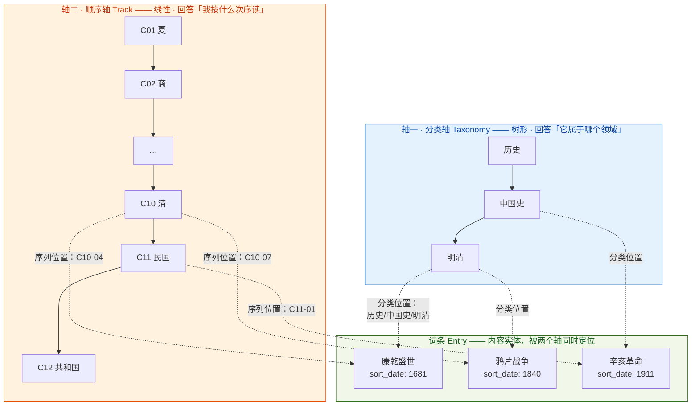
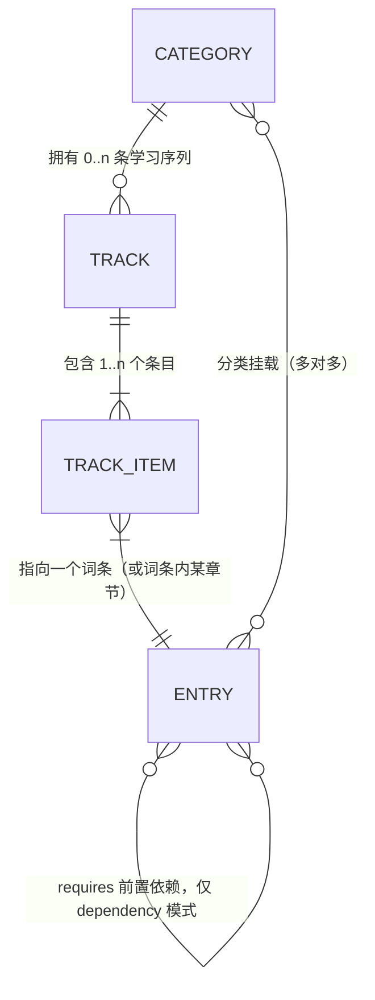
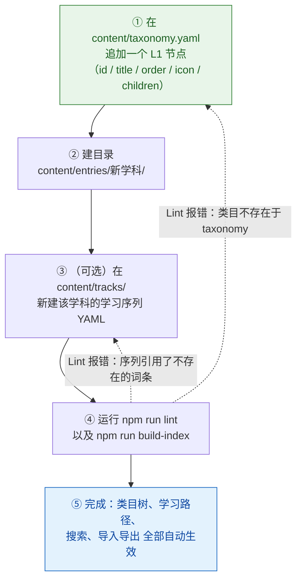

# PRD 补充文档 · 学习顺序模型与类目扩展机制

| 项目 | 内容 |
| --- | --- |
| 文档编号 | 01b-PRD补充 |
| 版本 | v1.0 |
| 撰写人 | 许清楚（产品经理） |
| 主文档 | [`01-PRD-知识学习站.md`](./01-PRD-知识学习站.md) |
| 关系 | 本文是主 PRD 的补充与修订。**冲突处以本文为准。** |

> ⚠️ **v2 修订提示（2026-09-07）**：用户决策 #9/#10/#11–#13 后，本文涉及"五大类目/金融 L1/排产/S-07/S-09"的表述已被取代。**凡冲突处以 `06-类目内容规划.md §7`（产品经理 v2 裁决）与 `02-架构设计 §18`（2000 万字容量裁决）为准。** 主要变更：① 根 L1 仍为 5 个，但**金融由 L1 降为经济学下 L2、心理学并入科学**（§7.10 taxonomy 骨架）；② `finance-core` Track 仅 `category: 金融`→`经济学/金融`，items/requires 不动（§7.11）；③ B0/B1 排产按 §7.6（金融 20→经济学 20、科学 20 切 5 给心理）；④ S-07 同期对照视图升 P0、加 S-07a 联动高亮（§7.3）；⑤ 顺序轴枚举收敛为封闭 4 值 `chronological/difficulty/dependency/school_then_chronological`（`thought-history` 归一为 chronological + 分组）；⑥ 规模按 2000 万字档（02 §18）。本文 v1 正文保留作对照，不再逐行改写。

---

## 0. 本次用户拍板结果汇总与主 PRD 修订

### 0.1 拍板结果

| # | 议题 | 用户决策 | 对主 PRD 的影响 |
| --- | --- | --- | --- |
| 1 | 移动端平台 | **Android 先行，iOS 二期** | §5.4 M-01~M-07 只针对 Android 排期；iOS 相关（签名、审核、Safe Area 之外的配置）延后。主 PRD §10-Q5 已关闭 |
| 2 | 内容编辑主路径 | **内容目录 = 普通文件夹，用 Obsidian / VS Code 编辑** | 主 PRD §5.2 **C-09「Web 端轻量编辑（File System Access API）」从 P0 移除，降级为不做**。内容写入一律不经过本应用。§10-Q1 已关闭 |
| 3 | 马列著作形态 | **原文全文 + AI 导读 + 难句注释**；AI 内容用 `> 📝 编者注` 引用块与原文字区分；front-matter 标记 `ai_annotated` | 与主 PRD §7.4 / §9.4 设计一致，转为正式规范。§10-Q2 已关闭 |
| 4 | 一期范围 | **五大类目（哲学 / 历史 / 科学 / 金融 / 政治理论）同时铺开**，而非"先做透马克思主义一支" | **推翻主 PRD §3.6 排产批次**，以本文 §7 的新排产为准 |
| 5 | 新增需求 | **每个类目要有「学习顺序」**；历史要分世界史 / 中国史两条线并按时间顺序编排 | 主 PRD 完全缺失这一维度 —— 即本文 §1~§5 的核心内容 |

### 0.2 主 PRD 的修订清单（供架构师对照）

| 位置 | 修订 |
| --- | --- |
| §3.6 一期内容排产建议 | ❌ 作废，替换为本文 §7 |
| §5.2 C-09 Web 端轻量编辑 | ❌ 移除（用户选择文件夹编辑，不在应用内做编辑器） |
| §5.4 M-01~M-07 | 范围限定为 Android；iOS 相关延后 |
| §9.5 front-matter 字段总表 | ➕ 新增 `sort_date` / `era` / `timeline` / `level` / `school` / `requires`（见本文 §6.1） |
| 新增 | ➕ 数据文件 `content/tracks/*.yaml`（学习序列定义，见本文 §6.2） |
| §10 Q1 / Q2 / Q5 | ✅ 已由用户拍板关闭 |

---

## 1. 「学习顺序」概念定义

### 1.1 主 PRD 缺了什么

主 PRD 只设计了**分类树**，它回答的是 **"这个知识点放在哪儿"**——是一个空间上的归属问题。

但用户新提出的诉求是 **"我按什么次序学"**——是一个时间/逻辑上的先后问题。

**这是两个完全不同、且互相无法推导的维度：**

- 分类树里相邻的两个词条（如《共产党宣言》和《国家与革命》），在学习上并不必然相邻；
- 学习上必须相邻的两个词条（如"现值"→"DCF 估值"），在分类树里可能相隔很远（金融基础 vs 权益市场）。

> ⚠️ **不能试图用分类树表达顺序**（比如把分类节点编号成"01-货币、02-利率…"）。原因：
> 1. 一个词条可能属于多个顺序（"剩余价值"既在"马政经入门"，也在"《资本论》精读"）；
> 2. 分类是多对多的（一个词条挂多个类目），编号会打架；
> 3. 分类体系会重构，顺序也会调整，绑在一起则改一个必动另一个。

### 1.2 核心定义

> **`Track`（学习序列）**：一条**挂在某个类目节点上的有序词条列表**，定义了"在这个领域里，按什么次序读"。

关键性质：

| 性质 | 说明 |
| --- | --- |
| **顺序不属于词条，属于 Track** | 同一个词条可以同时出现在多条 Track 的不同位置；也可以不在任何 Track 里（自由词条，靠分类和搜索找到） |
| **Track 挂在类目节点上** | 可以挂 L1（如"历史"）、L2（如"历史/中国史"）、L3（如"政治理论/马克思主义/经典著作"）。一个节点可挂 0..n 条 |
| **顺序是叠加层，不是强制约束** | 词条不必入序列；入序列不影响它仍可被分类浏览和搜索 |
| **跨类目可复用** | 一条 Track 可以引用任何词条，不受它挂载的类目限制（如"近代史"Track 可引用"工业革命"这个科学类词条） |

### 1.3 二维定位模型



**一个词条的位置 =（分类坐标，序列坐标）二元组**

| 词条 | 分类坐标（空间） | 序列坐标（次序） |
| --- | --- | --- |
| 康乾盛世 | 历史 / 中国史 / 明清 | `history-china` 第 C10-04 位 |
| 鸦片战争 | 历史 / 中国史 / 明清 | `history-china` 第 C10-07 位，**同时**在 `history-world` 第 W07-05 位（交叉条目） |
| 工业革命 | 历史 / 世界史 / 革命时代 | `history-world` 第 W06-08 位，**同时**被 `science-modern` 引用 |
| 剩余价值 | 政治理论 / 马克思主义 / 马政经 | `marxism-econ-101` 第 4 位 + `das-kapital-reading` 第 21 位 |

### 1.4 数据关系



| 实体 | 说明 |
| --- | --- |
| `Category` | 分类节点（主 PRD §9.2 `taxonomy.yaml`） |
| `Track` | 学习序列。字段：`id / title / category / order_mode / timeline / items[]` |
| `TrackItem` | 序列中的一项。字段：`order / entry / section? / sort_date? / era? / requires[]? / note?` |
| `Entry` | 词条（主 PRD §9.3/9.4） |

### 1.5 ★ 边界约束（用户已明确拒绝，务必遵守）

| 禁止 | 说明 |
| --- | --- |
| ❌ 已学 / 未学 / 已完成 状态 | 不得给词条或 TrackItem 加 `learned` / `completed` 字段 |
| ❌ 完成度百分比、进度条、进度环 | 序列下方不得出现"已完成 32%"这类视觉元素 |
| ❌ 打卡、连续学习天数、学习时长统计 | 主 PRD §1.4 已排除 |
| ❌ 自动"下一课未读"跳转 | 下一课按钮只按序列次序走，不跳过任何条目 |

| 允许 | 说明 |
| --- | --- |
| ✅ **序列位置指示** | 显示"第 47 / 126 条"——这是**坐标**，不是进度。仅文字，不做进度条 |
| ✅ **续读（P0 保留）** | 记住"上次读到《资本论》第一卷第三章 32%"。这是**阅读位置**，不是学习完成度 |
| ✅ 收藏 / 书签 | 用户主动标记，非系统判定 |

> 📌 一句话给架构师：**顺序只用来"排列和导航"，不用来"衡量"。** 数据模型里不得存在任何表示"用户学到哪儿了"的字段。

---

## 2. 五大学科的学习顺序策略

### 2.1 策略总表

| 学科 | 策略名 | `order_mode` 枚举 | 排序依据字段 | 序列内是否分组 | 为什么这么做 |
| --- | --- | --- | --- | --- | --- |
| **历史** | 双轨编年序 | `chronological` | `sort_date`（年，**公元前为负数**） | 是（按时代分期 W01–W10 / C01–C13） | 历史的意义就是因果链，必须按时间读；中外各成一条叙事线 |
| **哲学** | 思想史时序 | `chronological` | `sort_date`（人物生卒年或著作成书年） | 是（按西方/中国/流派分组） | 哲学是"后人回应前人"，不按年代读会听不懂（不读康德读不懂黑格尔） |
| **科学** | 分支 + 难度递进 | `difficulty` | `level`（1–5）+ 分支内 `order` | 是（先按分支分卷，再按难度升级） | 科学有硬前置依赖，跳级必然看不懂；但分支之间相对独立，可并行 |
| **金融** | 知识依赖序 | `dependency` | `order`（1.1 / 1.2 / 2.1…）+ `requires[]` | 是（按层级 1→4 分卷） | 金融概念层层嵌套（不懂现值就不懂 DCF，不懂 DCF 就不懂期权），是最强依赖的学科 |
| **政治理论** | 流派 + 时序 | `school_then_chronological` | `school` + `sort_date` | 是（先分流派，派内按年代） | 政治理论以"流派论战"为主干，派内又有发展脉络 |

> **对架构师的硬约束**：`order_mode` 是可配置枚举，**渲染器按枚举值决定显示什么**（时间标签 / 难度徽标 / 依赖序号 / 流派+年代），**代码中不得出现 `if (学科 === '历史')` 之类的分支**。否则加新学科就要改代码，违反 §5 的扩展机制。

### 2.2 历史 · 双轨编年序（`chronological`）

**主序列 A：世界史时间线**（`history-world`）

| # | 词条 | 年代 | 一句话 |
| --- | --- | --- | --- |
| W01-01 | 苏美尔城邦 | 前 3500 | 两河流域最早的城市文明 |
| W02-01 | 雅典民主制 | 前 508 | 克里斯提尼改革，西方民主源头 |
| W02-02 | 伯罗奔尼撒战争 | 前 431 | 雅典与斯巴达的霸权之战，修昔底德陷阱原型 |
| W02-03 | 罗马帝国建立 | 前 27 | 从共和国到帝制 |
| W03-01 | 伊斯兰教兴起 | 610 | 阿拉伯帝国成形 |
| W03-02 | 蒙古西征 | 1235 | 欧亚大陆第一次被打通 |
| W04-01 | 马丁·路德宗教改革 | 1517 | 基督教世界分裂 |
| W06-01 | 英国光荣革命 | 1688 | 君主立宪奠基 |
| W06-02 | 法国大革命 | 1789 | 现代政治的分水岭 |
| W06-03 | 工业革命 | 1760 | 生产力跃迁，后面所有事件的物质基础 |

**主序列 B：中国史时间线**（`history-china`）

| # | 词条 | 年代 | 一句话 |
| --- | --- | --- | --- |
| C04-03 | 百家争鸣 | 前 475 | 中国思想的源头 |
| C05-01 | 秦始皇统一六国 | 前 221 | 郡县制与中央集权确立 |
| C05-05 | 汉武帝与独尊儒术 | 前 134 | 此后两千年意识形态底色 |
| C07-03 | 贞观之治 | 627 | 唐代盛世样板 |
| C07-06 | 安史之乱 | 755 | 由盛转衰的拐点 |
| C08-05 | 王安石变法 | 1069 | 士大夫政治与改革的高峰 |
| C10-07 | 郑和下西洋 | 1405 | 与大航海同时代的另一条航路 |
| C10-14 | 鸦片战争 | 1840 | 近代史开端（**与世界史 W07 同期，双线交叉点**） |
| C11-04 | 五四运动 | 1919 | — |
| C11-09 | 抗日战争 | 1937 | **与世界史 W08 同期，双线交叉点** |

### 2.3 哲学 · 思想史时序（`chronological`）

**子序列：西方哲学史主线**（`philosophy-west-main`）

| # | 词条 | 年代 | 为什么在这个位置 |
| --- | --- | --- | --- |
| 1 | 泰勒斯与本原问题 | 前 585 | 西方哲学第一问："万物由什么构成" |
| 2 | 苏格拉底 | 前 430 | 转向伦理与认识自我 |
| 3 | 柏拉图与理念论 | 前 380 | 回应苏格拉底，开出形而上学传统 |
| 4 | 亚里士多德 | 前 335 | 批判柏拉图，开出经验与逻辑传统 |
| 5 | 奥古斯丁 | 426 | 哲学与神学合流 |
| 6 | 托马斯·阿奎那 | 1265 | 亚里士多德重新进入欧洲 |
| 7 | 笛卡尔 | 1637 | "我思故我在"，近代认识论转向 |
| 8 | 休谟 | 1739 | 怀疑因果性，把经验主义推到极致 |
| 9 | 康德 | 1781 | 原话："休谟把我从独断论的迷梦中惊醒"——**不读休谟读不懂康德** |
| 10 | 黑格尔 | 1807 | 回应康德，德国古典哲学顶峰 |
| 11 | 马克思 | 1845 | 颠倒黑格尔，见 `政治理论/马克思主义` |
| 12 | 维特根斯坦 | 1921 | 语言转向 |

> 第 8→9 条是这个序列存在的最大理由：**哲学序列的价值就是保证"前人→后人"的因果链不断。**
> 中国哲学史另建 `philosophy-china-main` 序列（先秦诸子 → 汉唐经学 → 宋明理学 → 近代新儒家），机制与历史双轨完全相同。

### 2.4 科学 · 分支 + 难度递进（`difficulty`）

**子序列：数学主线**（`science-math-main`）

| # | 词条 | `level` | 为什么在这个位置 |
| --- | --- | --- | --- |
| 1 | 集合与数系 | 1 | 一切数学的语言 |
| 2 | 函数与方程 | 1 | 中学基础，无需前置 |
| 3 | 向量与矩阵 | 2 | 需要 1 |
| 4 | 极限与连续 | 2 | 微积分的入口 |
| 5 | 导数与微分 | 3 | 需要 4 |
| 6 | 积分 | 3 | 需要 5 |
| 7 | 概率论基础 | 3 | 需要 6（连续分布需要积分） |
| 8 | 微分方程 | 4 | 需要 6 |
| 9 | 实分析 | 5 | 回头严格化 4–6，需要成熟度高 |

排序规则：**先按 `level` 升序，`level` 相同则按分支内 `order`**。UI 上显示难度徽标（★★★☆☆）而非时间。

> 物理、化学、计算机等分支各自独立成序列，可按兴趣并行推进——这是与金融（强依赖，只能单线）最大的区别。

### 2.5 金融 · 知识依赖序（`dependency`）

**主序列：金融核心路径**（`finance-core`）

| # | 词条 | `order` | `requires` | 为什么必须在这个位置 |
| --- | --- | --- | --- | --- |
| 1 | 货币与货币制度 | 1.1 | — | 一切金融的起点 |
| 2 | 利率与现值 | 1.2 | 1.1 | 现值 = 所有估值的地基 |
| 3 | 风险与收益 | 1.3 | 1.2 | 需要方差/期望概念 |
| 4 | 财务报表基础 | 1.4 | — | 与 1.2 并行可读 |
| 5 | DCF 估值 | 2.1 | 1.2, 1.4 | 现值 + 报表 = 估值 |
| 6 | 债券与久期 | 2.2 | 1.2 | 债券本质是现金流折现 |
| 7 | CAPM 与资产定价 | 3.1 | 1.3, 2.1 | 需要风险度量 + 估值 |
| 8 | 期权与 Black-Scholes | 4.1 | 3.1, 2.2 | 无套利定价需要 CAPM + 债券知识 |

**这是五个学科里依赖最强的一个，必须单线推进。** UI 上需显示前置依赖提示：

```
┌─────────────────────────────────┐
│  期权与 Black-Scholes      4.1  │
│  ⚠ 前置：CAPM 与资产定价 (3.1)   │
│          债券与久期 (2.2)        │
│  ─────────────────────────────  │
│  [ 先读：CAPM 与资产定价 → ]     │
└─────────────────────────────────┘
```

### 2.6 政治理论 · 流派 + 时序（`school_then_chronological`）

**主序列：政治思想主线**（`politics-thought-main`）

| # | 词条 | 流派 | 年代 | 为什么在这个位置 |
| --- | --- | --- | --- | --- |
| 1 | 柏拉图《理想国》 | 古典 | 前 375 | 西方政治哲学的原型问题 |
| 2 | 亚里士多德《政治学》 | 古典 | 前 335 | 从理想国转向经验政体比较 |
| 3 | 马基雅维利《君主论》 | 近代 | 1513 | 政治与道德分离，近代开端 |
| 4 | 霍布斯《利维坦》 | 近代 | 1651 | 社会契约论第一版（绝对主权） |
| 5 | 洛克《政府论》 | 自由主义 | 1689 | 社会契约论第二版（有限政府）→ 自由主义开端 |
| 6 | 卢梭《社会契约论》 | 共和主义 | 1762 | 人民主权，通向法国大革命 |
| 7 | 马克思《共产党宣言》 | 马克思主义 | 1848 | 对自由主义的根本批判 |
| 8 | 罗尔斯《正义论》 | 当代自由主义 | 1971 | 复兴规范政治哲学，回应功利主义 |

排序规则：**先按 `school` 分组（古典 → 近代 → 自由主义 → 共和主义 → 马克思主义 → 当代），组内按 `sort_date`**。UI 上显示为"卷"（流派）+"条"（年代）。

---

## 3. ★ 历史类目完整展开：世界史 / 中国史双时间线

### 3.1 世界史时间线（`history-world`）

10 个时代分期（L2），每个分期下 3–8 个 L3 专题，**词条严格按年代编号**。

| 分期编号 | L2 时代分期 | 时间范围 | L3 专题 | 代表词条（严格按时间先后） |
| --- | --- | --- | --- | --- |
| **W01** | 史前与文明的兴起 | 前 3500 – 前 500 | 人类起源与史前 / 两河流域 / 古埃及 / 古印度 / 爱琴文明 | ① 苏美尔城邦(前3500) ② 汉谟拉比法典(前1776) ③ 古埃及王国(前3100) ④ 金字塔与来世观 ⑤ 印度河流域文明(前2600) ⑥ 吠陀时代(前1500) ⑦ 克里特-迈锡尼文明(前1600) |
| **W02** | 古典时代：希腊与罗马 | 前 800 – 476 | 希腊城邦 / 希波战争 / 希腊化 / 罗马共和国 / 罗马帝国 / 基督教兴起 | ① 希腊城邦与殖民(前800) ② 雅典民主制(前508) ③ 希波战争(前499) ④ 伯里克利与黄金时代(前461) ⑤ 伯罗奔尼撒战争(前431) ⑥ 亚历山大大帝(前336) ⑦ 布匿战争(前264) ⑧ 凯撒与罗马内战(前49) ⑨ 罗马帝国建立(前27) ⑩ 基督教兴起(30) ⑪ 罗马分裂(395) ⑫ 西罗马灭亡(476) |
| **W03** | 中世纪世界 | 476 – 1453 | 拜占庭 / 伊斯兰世界 / 西欧封建 / 十字军 / 蒙古 / 东亚 | ① 查士丁尼与《民法大全》(529) ② 伊斯兰教兴起(610) ③ 阿拉伯帝国扩张(632) ④ 查理曼帝国(800) ⑤ 十字军东征(1096) ⑥ 大宪章(1215) ⑦ 蒙古西征(1235) ⑧ 黑死病(1347) ⑨ 百年战争(1337) ⑩ 君士坦丁堡陷落(1453) |
| **W04** | 文艺复兴与宗教改革 | 14C – 16C | 意大利文艺复兴 / 北方文艺复兴 / 宗教改革 / 科学革命开端 | ① 但丁与《神曲》(1321) ② 文艺复兴运动(14C) ③ 古登堡活字印刷(1450) ④ 马丁·路德宗教改革(1517) ⑤ 哥白尼日心说(1543) ⑥ 特兰托会议与反宗教改革(1545) |
| **W05** | 大航海与早期全球化 | 15C – 17C | 地理大发现 / 殖民与奴隶贸易 / 白银流通 / 物种交换 | ① 郑和下西洋(1405) ② 哥伦布抵达美洲(1492) ③ 麦哲伦环球航行(1519) ④ 三角贸易与奴隶制(16C) ⑤ 价格革命(16C) ⑥ 东印度公司(1600) ⑦ 哥伦布大交换 |
| **W06** | 革命时代 | 17C – 18C | 科学革命 / 启蒙运动 / 英国革命 / 美国独立 / 法国大革命 / 工业革命 | ① 科学革命与牛顿《原理》(1687) ② 英国光荣革命(1688) ③ 洛克《政府论》(1689) ④ 启蒙运动与伏尔泰、卢梭(18C) ⑤ 工业革命开端(1760) ⑥ 瓦特改良蒸汽机(1769) ⑦ 美国独立战争(1775) ⑧ 法国大革命(1789) |
| **W07** | 帝国主义与民族主义 | 19C | 拿破仑与维也纳体系 / 工业革命扩散 / 民族统一 / 殖民瓜分 / 第二次工业革命 | ① 拿破仑战争(1803) ② 维也纳会议与体系(1815) ③ 拉丁美洲独立运动(1810) ④ 1848 年革命 ⑤ 鸦片战争(1840)〔**双线交叉**〕 ⑥ 美国内战(1861) ⑦ 意大利统一(1861) ⑧ 德意志统一(1871) ⑨ 明治维新(1868) ⑩ 柏林会议瓜分非洲(1884) ⑪ 第二次工业革命(1870) |
| **W08** | 世界大战与革命 | 1900 – 1945 | 一战 / 俄国革命 / 凡尔赛体系 / 大萧条 / 法西斯 / 二战 | ① 萨拉热窝事件(1914) ② 第一次世界大战(1914) ③ 十月革命(1917) ④ 凡尔赛条约(1919) ⑤ 大萧条(1929) ⑥ 罗斯福新政(1933) ⑦ 纳粹上台(1933) ⑧ 抗日战争(1937)〔**双线交叉**〕 ⑨ 第二次世界大战爆发(1939) ⑩ 珍珠港与美国参战(1941) ⑪ 诺曼底登陆(1944) ⑫ 雅尔塔会议与联合国(1945) |
| **W09** | 冷战 | 1945 – 1991 | 冷战起源 / 两大阵营 / 局部战争 / 第三世界 / 科技竞赛 / 冷战终结 | ① 铁幕演说(1946) ② 马歇尔计划(1947) ③ 北约成立(1949) ④ 朝鲜战争(1950) ⑤ 太空竞赛(1957) ⑥ 古巴导弹危机(1962) ⑦ 越南战争(1955) ⑧ 布拉格之春(1968) ⑨ 苏联入侵阿富汗(1979) ⑩ 戈尔巴乔夫改革(1985) ⑪ 柏林墙倒塌(1989) ⑫ 苏联解体(1991) |
| **W10** | 当代世界 | 1991 – 今 | 全球化 / 地区冲突 / 新兴经济体 / 信息革命 / 全球性挑战 | ① 欧盟成立(1993) ② WTO 成立(1995) ③ 互联网与信息革命(1990s) ④ 9·11 事件(2001) ⑤ 中国加入 WTO(2001) ⑥ 伊拉克战争(2003) ⑦ 2008 年全球金融危机 ⑧ 阿拉伯之春(2010) ⑨ 英国脱欧(2016) ⑩ 新冠疫情(2019) ⑪ 俄乌冲突(2022) |

### 3.2 中国史时间线（`history-china`）

13 个朝代/时期分期（L2），**词条严格按年代编号**。

| 分期编号 | L2 时期 | 时间范围 | L3 专题 | 代表词条（严格按时间先后） |
| --- | --- | --- | --- | --- |
| **C01** | 史前与传说时代 | — 前 2070 | 旧石器 / 新石器文化 / 传说时代 | ① 元谋人北京人 ② 仰韶文化(前5000) ③ 龙山文化(前2500) ④ 三皇五帝传说 |
| **C02** | 夏商 | 前 2070 – 前 1046 | 夏 / 二里头 / 商 / 甲骨与青铜 | ① 夏朝与世袭制确立(前2070) ② 二里头遗址 ③ 商汤灭夏(前1600) ④ 殷墟与甲骨文(前1300) ⑤ 青铜文明与礼器 |
| **C03** | 西周 | 前 1046 – 前 771 | 封建 / 宗法 / 礼乐 | ① 武王伐纣(前1046) ② 分封制 ③ 宗法制与嫡长子继承 ④ 礼乐制度 ⑤ 国人暴动(前841) ⑥ 平王东迁(前770) |
| **C04** | 春秋战国 | 前 770 – 前 221 | 春秋霸政 / 战国七雄 / 百家争鸣 / 变法 / 秦统一 | ① 春秋五霸(前770) ② 铁器牛耕与井田制瓦解 ③ 百家争鸣(前475) ④ 孔子与儒家(前551) ⑤ 老子与道家 ⑥ 商鞅变法(前356) ⑦ 战国七雄 ⑧ 秦统一六国(前221) |
| **C05** | 秦汉 | 前 221 – 220 | 秦制 / 楚汉 / 西汉 / 新莽 / 东汉 | ① 秦始皇与中央集权(前221) ② 郡县制与书同文 ③ 焚书坑儒(前213) ④ 楚汉之争(前206) ⑤ 文景之治(前180) ⑥ 汉武帝与独尊儒术(前134) ⑦ 丝绸之路(前138) ⑧ 王莽改制(9) ⑨ 光武中兴(25) ⑩ 黄巾起义(184) |
| **C06** | 三国两晋南北朝 | 220 – 589 | 三国 / 两晋 / 十六国 / 南北朝 | ① 赤壁之战与三国鼎立(208) ② 西晋统一(280) ③ 八王之乱(291) ④ 永嘉南渡(311) ⑤ 淝水之战(383) ⑥ 北魏孝文帝改革(494) ⑦ 南朝与门阀政治 ⑧ 隋统一(589) |
| **C07** | 隋唐 | 581 – 907 | 隋 / 唐初 / 盛唐 / 中晚唐 | ① 隋朝与大运河(605) ② 科举制的确立 ③ 贞观之治(627) ④ 武则天称帝(690) ⑤ 开元盛世(713) ⑥ 安史之乱(755) ⑦ 藩镇割据 ⑧ 黄巢起义(875) |
| **C08** | 五代十国与宋辽金元 | 907 – 1368 | 五代 / 北宋 / 辽夏金 / 南宋 / 元 | ① 五代十国(907) ② 陈桥兵变与北宋建立(960) ③ 澶渊之盟(1005) ④ 王安石变法(1069) ⑤ 靖康之变(1127) ⑥ 岳飞抗金(1140) ⑦ 南宋与海上贸易 ⑧ 成吉思汗统一蒙古(1206) ⑨ 元朝建立与行省制(1271) |
| **C09** | 明 | 1368 – 1644 | 明初 / 中叶 / 晚明 | ① 朱元璋建明与废丞相(1368) ② 靖难之役(1399) ③ 郑和下西洋(1405) ④ 土木堡之变(1449) ⑤ 张居正改革(1573) ⑥ 东林党争 ⑦ 明末农民战争与李自成(1628) |
| **C10** | 清（前期至中衰） | 1636 – 1840 | 入关 / 康乾 / 制度 / 中衰 | ① 清军入关(1644) ② 康乾盛世(1681) ③ 摊丁入亩与地丁银 ④ 军机处与君主集权(1729) ⑤ 文字狱与文化政策 ⑥ 闭关锁国与广州十三行 ⑦ 白莲教起义(1796) |
| **C11** | 近代：晚清变局 | 1840 – 1912 | 鸦片战争 / 太平天国 / 洋务 / 甲午 / 维新 / 新政 | ① **鸦片战争(1840)**〔**双线交叉**〕 ② 太平天国(1851) ③ 洋务运动(1861) ④ 甲午战争与《马关条约》(1894) ⑤ 戊戌变法(1898) ⑥ 义和团与八国联军(1900) ⑦ 清末新政与预备立宪(1901) |
| **C12** | 中华民国 | 1912 – 1949 | 辛亥革命 / 北洋 / 新文化 / 国民革命 / 抗战 / 解放战争 | ① 辛亥革命(1911) ② 袁世凯与北洋政府(1912) ③ 新文化运动(1915) ④ 五四运动(1919) ⑤ 中国共产党成立(1921) ⑥ 北伐战争(1926) ⑦ 南昌起义与土地革命(1927) ⑧ 长征(1934) ⑨ 西安事变(1936) ⑩ **抗日战争(1937)**〔**双线交叉**〕 ⑪ 解放战争(1946) |
| **C13** | 中华人民共和国 | 1949 – 今 | 建国初期 / 建设探索 / 改革开放 / 新时代 | ① 开国大典(1949) ② 抗美援朝(1950) ③ 一五计划与工业化(1953) ④ 改革开放(1978) ⑤ 香港澳门回归(1997) ⑥ 加入 WTO(2001) ⑦ 脱贫攻坚(2020) |

### 3.3 两条时间线在 UI 上如何并存

#### 四个候选方案

| 方案 | 描述 | 优点 | 缺点 | 结论 |
| --- | --- | --- | --- | --- |
| **A. 并列双轨时间轴** | 同一屏上下两条轨，共用一条横向时间刻度（世界史在上 / 中国史在下） | **历史学习最有价值的视角**："1840 年鸦片战争时，英国已完成工业革命"——同期对照是学历史的杀手锏 | 手机窄屏（375–430px）每轨只剩 ~180px，放不下朝代标签；横向滚动距离长 | ✅ **桌面端采用** |
| **B. Tab / 分段控件切换** | 顶部 `[世界史] [中国史] [对照]`，一次只显示一条 | 手机友好；实现简单；叙事连续性好 | 失去同期对照 | ✅ **移动端默认** |
| **C. 混合单轨（按年代把中外事件混排）** | 一条轨，1840 鸦片战争 → 1848 欧洲革命 → 1851 太平天国… | 能对照 | 叙事断裂，一会儿中国一会儿欧洲，读起来像流水账，两条线都学不好 | ❌ 否决 |
| **D. 下拉选择当前时间线** | 顶部下拉切换 | 同 B，但更省空间 | 切换成本高，用户不易发现另一条线存在 | ❌ 否决（不如 B 直观） |

#### ★ 推荐：**B（移动端） + A（桌面宽屏），读同一份数据**

```
                 一份数据（每条词条带 timeline + sort_date）
                              │
              ┌───────────────┴───────────────┐
              ▼                               ▼
    ┌──────────────────┐          ┌────────────────────────┐
    │ 移动端（< 768px） │          │ 桌面端（≥ 1024px）      │
    │ Segmented Control│          │ 双轨并列时间轴          │
    │ 世界史│中国史│对照│          │ 世界史 ═══════════════ │
    │ 单轨纵向时间轴    │          │ 中国史 ═══════════════ │
    └──────────────────┘          │ 共享刻度 + 对照连接线   │
                                  └────────────────────────┘
```

**推荐理由（4 条）**

1. **屏幕宽度决定形态，不是偏好决定**：手机 390px 放两条横向时间轴，每条 180px，连"鸦片战争"四个字都放不下——物理上不可行，必须切换。
2. **桌面双轨对照是历史学习的核心价值**：孤立地知道"1840 年鸦片战争"和"1840 年英国完成工业革命"是两条知识；把它们对齐在同一条时间刻度上，才产生"为什么打不过"的洞察。**这是本应用相对纸质书的最大增值点，成本却很低**（同一份数据的第二种渲染）。
3. **零数据冗余**：两条线不是两套内容，而是每条词条上的 `timeline` 字段（`world` / `china` / 两者）+ `sort_date`。切换与并列都只是渲染层的事，**内容不需要重复录入**。
4. **交叉词条是特性不是 bug**：鸦片战争标 `timeline: [china, world]`，二战、抗日战争、蒙古西征同理。在双轨视图上它们会出现在两条轨并用竖线连接——**这些连接点恰恰是最值得学的地方**。

#### 桌面端双轨对照视图草图

```
┌──────────────────────────────────────────────────────────────────────────────┐
│  历史 › 时间线              [ 世界史 | 中国史 | 对照 ✓ ]      刻度：[世纪][年代] │
├──────────────────────────────────────────────────────────────────────────────┤
│    1600      1700       1775      1800      1840      1898      1911     1949 │
│      ┃         ┃          ┃         ┃         ┃         ┃         ┃       ┃  │
│世界史 ══════════╋══════════╋═════════╋═════════╋═════════╋═════════╋═══════╋═ │
│   ○东印度公司  ○光荣革命  ○美国独立 ○法国大革命 ○工业革命成熟 ○日俄战争        │
│       1600        1688       1775      1789       1840       1905             │
│      ┊         ┊          ┊         ┊         ║         ┊         ┊       ┊  │
│      ┊         ┊          ┊         ┊    ┈┈┈┈╫┈┈┈┈ 对照连接线 ┈┈┈         ┊  │
│      ┊         ┊          ┊         ┊         ║         ┊         ┊       ┊  │
│中国史 ══════════╋══════════╋═════════╋═════════╋═════════╋═════════╋═══════╋═ │
│   ○清军入关   ○康乾盛世   ○白莲教起义        ●鸦片战争  ○戊戌变法 ○辛亥革命    │
│       1644        1681         1796            1840        1898      1911      │
├──────────────────────────────────────────────────────────────────────────────┤
│  点击任一节点 → 右侧打开词条；点击连接线 → 并排显示两条词条                     │
└──────────────────────────────────────────────────────────────────────────────┘
```

---

## 4. 顺序的 UI 表达方式

### 4.1 四种候选与取舍

| 方式 | 适用 | 取舍 |
| --- | --- | --- |
| ① 编号列表（01 / 02 / 03…） | 所有学科、所有屏幕 | ✅ **通用底座**，任何序列都能用；缺点是单纯，无信息量 |
| ② 时间轴视图（横向/纵向带刻度） | 历史、哲学史等 `chronological` 序列 | ✅ **历史类默认**；让"隔了 300 年"和"隔了 3 年"在视觉上有区别 |
| ③ 上一课 / 下一课 按钮 | 阅读页底部 | ✅ **解决"读完这个读什么"**，是顺序价值最高的一处落地 |
| ④ 章节式分组目录（卷/阶段折叠） | 序列 > 20 条时 | ✅ 防止长序列变成一堵墙；历史按"分期"、金融按"层级"、政治按"流派"分组 |

> 不采用：进度条、完成勾选框、百分比（见 §1.5 边界约束）。

### 4.2 推荐组合

| 位置 | 表达 | 优先级 |
| --- | --- | --- |
| **序列列表页** | **分组折叠的编号列表**（底座）+ **时间轴视图**（`chronological` 序列可切换，历史类默认时间轴） | P0（列表）/ P1（时间轴切换） |
| **词条阅读页底部** | **「← 上一课 / 下一课 →」双按钮** + 序列位置文字"第 47 / 126 条" | **P0** |
| **Web 端类目树下方** | 「学习路径」可折叠区，列出当前类目下所有 Track，点击进入序列页 | P1 |
| **长序列（> 20 条）** | 按 `era` / `level` / `school` 自动分组为"卷"，默认折叠到当前所在卷 | P0 |
| **依赖型序列（金融）** | 词条页顶部显示"⚠ 前置：XXX"，点击跳转 | P1 |

### 4.3 手机端 · 序列列表页（时间轴视图）

```
┌─────────────────────────────────┐
│ ‹ 历史                      [≡] │   ← [≡] 唤起全局类目抽屉
├─────────────────────────────────┤
│ [ 世界史 ]  [ 中国史 ]  [ 对照 ] │   ← Segmented Control
├─────────────────────────────────┤
│ ▾ C08 五代十国与宋辽金元 907–1368│   ← 阶段分组（可折叠）
│   ┃ ○── 40. 陈桥兵变       960  │
│   ┃ ○── 41. 澶渊之盟      1005  │
│   ┃ ○── 42. 王安石变法    1069  │
│   ┃ ○── 43. 靖康之变      1127  │
│   ┃ ○── 44. 岳飞抗金      1140  │
│   ┃ ○── 45. 元朝建立      1271  │
│                                 │
│ ▸ C09 明              1368–1644 │
│ ▾ C10 清（前期）      1636–1840 │   ← 当前所在卷，默认展开
│   ┃ ○── 46. 清军入关     1644   │
│   ┃ ○── 47. 康乾盛世     1681   │
│   ┃ ○── 48. 军机处       1729   │
│   ┃ ○── 49. 闭关锁国     1757   │
│ ▸ C11 近代：晚清变局  1840–1912 │
│ ▸ C12 中华民国        1912–1949 │
├─────────────────────────────────┤
│ [ 类目 ]    最近    我的         │
└─────────────────────────────────┘
```

### 4.4 手机端 · 阅读页底部的顺序导航

```
┌─────────────────────────────────┐
│ ‹ 历史 › 中国史 › 明清     [☰][A]│
├─────────────────────────────────┤
│  康乾盛世                        │
│  中国史时间线 · 第 47 / 126 条   │   ← 位置指示（非进度，无进度条）
│  清（前期） 1636–1840            │
│                                 │
│  康乾盛世是清朝康熙、雍正、乾隆  │
│  三帝在位期间……                  │
│                                 │
│  ┈┈┈┈┈┈┈┈┈┈┈┈┈┈┈┈┈┈┈┈┈┈┈┈┈┈┈┈  │
│                                 │
│  ┌─────────────┬─────────────┐  │
│  │ ← 清军入关   │  军机处 →   │  │   ← 上一课 / 下一课（按序列次序，
│  │   第 46 条   │   第 48 条   │  │      不跳过任何条目）
│  └─────────────┴─────────────┘  │
└─────────────────────────────────┘
```

### 4.5 Web 端 · 类目树下方的「学习路径」区

```
┌──────────────┬──────────────────────┬────────────────────────┐
│ 类目树        │ 学习路径              │ 正文                    │
│ ▸ 哲学        │ ─────────────────────│                        │
│ ▾ 历史        │ 📈 中国史时间线  126条 │ 康乾盛世                │
│   ▾ 中国史    │    按朝代先后，从夏商  │                        │
│     ▸ 明清    │    到当代            │ 清（前期）1636–1840     │
│   ▾ 世界史    │    [ 开始阅读 ]       │                        │
│     ▸ 冷战    │ ─────────────────────│ 康乾盛世是……            │
│ ▸ 科学        │ 📈 世界史时间线  132条 │                        │
│ ▸ 金融        │    从两河文明到当代    │                        │
│ ▾ 政治理论    │ ─────────────────────│ [← 清军入关][军机处 →]  │
│   ▾ 马克思主义│ 📈 马克思主义入门 24条 │                        │
└──────────────┴──────────────────────┴────────────────────────┘
```

---

## 5. 类目可扩展机制

> 用户原话：**"目前我只想到这几个类目，但不代表以后没有其他的"**

### 5.1 目标

> **新增一个 L1 学科 = 改配置 + 加内容目录，零代码改动。**

### 5.2 标准流程（5 步，目标 < 30 分钟，不含内容生产）



**工作量拆解**

| 步骤 | 耗时 | 是否需要开发 |
| --- | --- | --- |
| ① 编辑 `taxonomy.yaml` | 10–20 分钟（构思 L2/L3 的时间） | ❌ 否，纯文本 |
| ② 建目录 | 10 秒 | ❌ 否 |
| ③ 编排学习序列（可选） | 20–40 分钟 | ❌ 否 |
| ④ 跑 Lint + 构建索引 | < 1 分钟 | ❌ 否（脚本已有） |
| ⑤ 验证 | 5 分钟 | ❌ 否 |
| **合计** | **< 1 小时，其中开发工作量 = 0** | |

### 5.3 对架构师的硬约束（保证"零代码改动"能成立）

| # | 约束 | 反例（禁止） |
| --- | --- | --- |
| 1 | 类目树**必须 100% 由 `taxonomy.yaml` 驱动** | ❌ 代码里硬编码学科数组、❌ `if (category === '哲学')` |
| 2 | `order_mode` 必须是**可配置枚举**，渲染器按枚举值决定显示形态 | ❌ 为"历史"单独写一个时间轴组件、为"金融"单独写依赖组件 |
| 3 | 时间线/序列数量**不固定**，由 `tracks/` 目录决定 | ❌ 假设"只有世界史和中国史两条"、❌ 假设"每个学科只有一条序列" |
| 4 | 学科图标走配置字段 `icon` | ❌ 代码里写 `switch(学科) case '哲学': return '🏛'` |
| 5 | 词条类型 `type` 走配置扩展（若未来加新类型） | ❌ 渲染时枚举固定 5 种类型特判 |
| 6 | 所有"学科特有"的行为差异，必须表达为**数据字段**而非代码分支 | ❌ 在组件里判断学科名决定布局 |

**自检清单**（每次加新学科时跑一遍，全部为"是"才算机制有效）

- [ ] 未修改任何 `.ts` / `.tsx` 文件？
- [ ] 新类目在 Web 左栏树和手机端下钻列表中自动出现？
- [ ] 新序列在「学习路径」区自动出现，且按 `order_mode` 正确渲染（时间标签 / 难度 / 依赖 / 流派）？
- [ ] 新词条可被全文搜索命中？
- [ ] 导出 zip 自动包含新学科？导入到手机后自动出现？
- [ ] Lint 全绿（无断链、无缺来源、无类目不存在的引用）？

### 5.4 未来很可能想加的候选学科（扩展性验证样例）

下面 5 个学科各给出 L2 骨架草案。**它们同时也是架构师的扩展机制测试用例**：如果这 5 套骨架能在不改代码的前提下直接跑通，扩展机制就算通过。

| 候选学科 | 建议 `order_mode` | L2 骨架草案（每个 L2 后附 L3 示例） |
| --- | --- | --- |
| **📖 文学** | `chronological`（文学史时序）+ `genre`（体裁，用于专题序列） | ① 文学理论（文学性·叙事学·接受理论）<br/>② 中国古典文学（先秦诗文·汉赋·唐诗·宋词·元曲·明清小说）<br/>③ 中国现当代文学（鲁迅·茅盾·沈从文·当代小说）<br/>④ 西方文学（古典·中世纪·文艺复兴·古典主义·浪漫主义·现实主义·现代主义·后现代）<br/>⑤ 东方文学（日本文学·印度文学·阿拉伯文学）<br/>⑥ 文学体裁（诗歌·小说·戏剧·散文·非虚构）<br/>⑦ 文学批评与流派（新批评·结构主义·女性主义批评·后殖民批评） |
| **🧠 心理学** | `difficulty`（先总论后分支，分支内难度递进） | ① 心理学总论与研究方法（实验设计·统计·伦理）<br/>② 生理与神经心理学（神经元·脑区·神经递质）<br/>③ 认知心理学（注意·记忆·语言·决策·问题解决）<br/>④ 发展心理学（皮亚杰·依恋·毕生发展）<br/>⑤ 社会心理学（从众·服从·态度·群体·偏见）<br/>⑥ 人格心理学（特质理论·精神分析·人本主义）<br/>⑦ 临床与变态心理学（焦虑·抑郁·精神分裂·治疗流派）<br/>⑧ 应用心理学（教育·工业组织·消费·健康） |
| **⚖️ 法律** | `dependency`（法理 → 部门法 → 程序法） | ① 法理学（法的概念·法律渊源·法律效力·法律解释）<br/>② 法律史与法系（中华法系·大陆法系·英美法系）<br/>③ 宪法与行政法（基本权利·国家机构·行政行为）<br/>④ 民法（总则·物权·合同·侵权·婚姻家庭·继承）<br/>⑤ 刑法（犯罪构成·刑罚·分则罪名）<br/>⑥ 商法与经济法（公司·证券·破产·竞争法）<br/>⑦ 诉讼法（民事诉讼·刑事诉讼·证据规则）<br/>⑧ 国际法（国际公法·国际私法·国际经济法） |
| **🎨 艺术** | `chronological`（艺术史时序）+ `genre`（门类） | ① 艺术理论与美学（与哲学/美学类目交叉）<br/>② 美术（绘画·雕塑·版画·书法）<br/>③ 建筑（中国古建·西方古典·现代主义·当代）<br/>④ 音乐（乐理·西方古典·中国民族音乐·流行音乐）<br/>⑤ 戏剧戏曲（话剧·京剧·地方戏）<br/>⑥ 电影与摄影（电影语言·电影史·类型片）<br/>⑦ 设计（平面·工业·服装·交互）<br/>⑧ 艺术史分期（文艺复兴·巴洛克·印象派·现代·当代） |
| **📊 经济学** | `difficulty` + `dependency`（微观 → 宏观 → 计量 → 应用） | ① 经济学原理·微观（供需·弹性·消费者理论·厂商理论·市场结构·博弈论）<br/>② 经济学原理·宏观（国民收入核算·IS-LM·AD-AS·增长理论·失业与通胀）<br/>③ 经济思想史（重商主义·古典·边际革命·凯恩斯·货币主义·新古典·新凯恩斯）<br/>④ 计量经济学（回归·因果推断·时间序列·面板数据）<br/>⑤ 产业组织与规制（垄断·反垄断·网络效应）<br/>⑥ 劳动与人口经济学（人力资本·歧视·老龄化）<br/>⑦ 公共财政（税收·政府支出·社会保障）<br/>⑧ 国际经济学（贸易理论·汇率·国际金融）<br/>⑨ 发展经济学与行为经济学 |

**其他可能候选**（若用户后续提出，同样适用上述流程）：教育学、社会学、宗教学、军事学、语言学、传播学、医学与健康、地理学、体育。

> 💡 **观察**：这 5 个候选学科的 `order_mode` 全部落在已定义的 4 个枚举内（`chronological` / `difficulty` / `dependency` / `school_then_chronological`）。**这是扩展机制可行性的关键证据**——如果某个未来学科需要第 5 种排序模式，那就说明枚举设计得不够抽象，架构师应优先考虑"用现有模式 + 分组字段表达"，而不是加代码分支。

---

## 6. 数据规范补充

### 6.1 词条 front-matter 新增字段

| 字段 | 类型 | 必填 | 适用 | 说明 |
| --- | --- | --- | --- | --- |
| `sort_date` | number | ⬜ | 参与 `chronological` 序列的词条 | 排序用年代。**公元前为负数**：前 221 → `-221`；公元 1840 → `1840`。跨年代（如"文艺复兴 14–16C"）取**起始年** |
| `date_label` | string | ⬜ | 同上 | 显示用的年代文本（"前 221"、"1840"、"14–16 世纪"），用于 UI，`sort_date` 只用于排序 |
| `era` | string | ⬜ | 参与分组序列的词条 | 所属分期/卷，用于序列分组折叠。值需与 `Track.era_labels` 对应 |
| `timeline` | string[] | ⬜ | 历史类 | `world` / `china` / 两者。用于双时间线渲染与交叉连接 |
| `level` | int 1–5 | ⬜ | 参与 `difficulty` 序列 | 难度等级，UI 显示为星级徽标 |
| `school` | string | ⬜ | 参与 `school_then_chronological` 序列 | 流派名（"自由主义" / "马克思主义" / "古典"…） |
| `requires` | string[] | ⬜ | 参与 `dependency` 序列 | 前置词条 slug 列表，用于显示"⚠ 前置：XXX" |

> 这些字段**只在词条参与某条序列时才需要**；纯自由词条（如"某个冷门人物"）可以全部留空，靠分类和搜索找到即可。

### 6.2 学习序列文件 `content/tracks/*.yaml`

**示例 A：中国史时间线（编年序）**

```yaml
# content/tracks/history-china.yaml
id: history-china
title: 中国史时间线
category: 历史/中国史
order_mode: chronological
timeline: china
description: >
  按朝代先后编排的中国通史学习路径，从夏商到当代共 13 个分期。
  与世界史时间线共用同一套词条，交叉条目（如鸦片战争、抗日战争）
  在两条线上都会出现。

# 分期标签（用于 UI 分组折叠）
era_labels:
  C01: 史前与传说时代
  C02: 夏商
  C03: 西周
  C04: 春秋战国
  C05: 秦汉
  C06: 三国两晋南北朝
  C07: 隋唐
  C08: 五代十国与宋辽金元
  C09: 明
  C10: 清（前期）
  C11: 近代：晚清变局
  C12: 中华民国
  C13: 中华人民共和国

items:
  - order: C01-01
    entry: prehistory-china
    sort_date: -5000
    date_label: 约前 5000
    era: C01
    note: 新石器文化，非王朝，作为背景铺垫
  - order: C02-01
    entry: xia-dynasty
    sort_date: -2070
    date_label: 前 2070
    era: C02
  - order: C02-03
    entry: shang-dynasty
    sort_date: -1600
    date_label: 前 1600
    era: C02
  # … 中略 …
  - order: C10-04
    entry: kangqian-prosperity
    sort_date: 1681
    date_label: 1681
    era: C10
    note: 康乾盛世，与世界史 W05 同期
  # … 中略 …
  - order: C11-01
    entry: opium-war
    sort_date: 1840
    date_label: 1840
    era: C11
    cross_timeline: history-world/W07-05   # 双线交叉连接点
```

**示例 B：金融核心路径（依赖序）**

```yaml
# content/tracks/finance-core.yaml
id: finance-core
title: 金融核心路径
category: 金融
order_mode: dependency
description: >
  金融是依赖最强的学科，建议单线推进。每条标注前置依赖，
  未读前置时在阅读页顶部显示提示。

era_labels:
  L1: 第一层 · 基础工具
  L2: 第二层 · 估值
  L3: 第三层 · 定价理论
  L4: 第四层 · 衍生品

items:
  - order: "1.1"
    entry: money-and-monetary-system
    era: L1
    requires: []
  - order: "1.2"
    entry: interest-rate-and-present-value
    era: L1
    requires: [money-and-monetary-system]
  - order: "1.3"
    entry: risk-and-return
    era: L1
    requires: [interest-rate-and-present-value]
  - order: "1.4"
    entry: financial-statements-basics
    era: L1
    requires: []
  - order: "2.1"
    entry: dcf-valuation
    era: L2
    requires: [interest-rate-and-present-value, financial-statements-basics]
  - order: "2.2"
    entry: bonds-and-duration
    era: L2
    requires: [interest-rate-and-present-value]
  - order: "3.1"
    entry: capm
    era: L3
    requires: [risk-and-return, dcf-valuation]
  - order: "4.1"
    entry: options-and-black-scholes
    era: L4
    requires: [capm, bonds-and-duration]
```

**示例 C：马克思主义经典著作精读（著作内章节序列）**

```yaml
# content/tracks/marxism-classics-reading.yaml
id: marxism-classics-reading
title: 马克思主义经典著作精读
category: 政治理论/马克思主义/马克思主义经典著作
order_mode: chronological
description: 按成书年代编排的原著精读路径，每条指向整本著作。

items:
  - order: "01"
    entry: theses-on-feuerbach        # 关于费尔巴哈的提纲
    sort_date: 1845
    note: 最短的一篇（1500 字），含"人的本质"与"改变世界"两个核心命题，适合作为起点
  - order: "02"
    entry: german-ideology            # 德意志意识形态
    sort_date: 1846
  - order: "03"
    entry: manifesto-of-communist-party  # 共产党宣言
    sort_date: 1848
  - order: "04"
    entry: wage-labour-and-capital    # 雇佣劳动与资本
    sort_date: 1849
  - order: "05"
    entry: critique-of-gotha-programme  # 哥达纲领批判
    sort_date: 1875
  - order: "06"
    entry: anti-duhring               # 反杜林论
    sort_date: 1878
  - order: "07"
    entry: das-kapital                # 资本论（三卷）
    sort_date: 1867
    note: 最难，建议放在最后。内部另有 das-kapital-reading 子序列按卷篇章展开
  - order: "08"
    entry: state-and-revolution       # 国家与革命（列宁）
    sort_date: 1917
```

> 注意：`TrackItem` 也可以指向**词条内的某个章节**（`section` 字段），例如让"《资本论》第一卷第一篇第一章"作为序列中的一项——这样"精读路径"可以精确到章。

### 6.3 目录结构更新

```
content/
├── taxonomy.yaml                 ← 类目体系（含未来新增学科）
├── entries/                      ← 词条内容
│   ├── 哲学/
│   ├── 历史/
│   ├── 科学/
│   ├── 金融/
│   └── 政治理论/
└── tracks/                       ← 【新增】学习序列定义
    ├── history-world.yaml
    ├── history-china.yaml
    ├── philosophy-west-main.yaml
    ├── philosophy-china-main.yaml
    ├── science-math-main.yaml
    ├── finance-core.yaml
    ├── politics-thought-main.yaml
    └── marxism-classics-reading.yaml
```

---

## 7. 一期排产建议（v2 · 五类目并行铺开）

> ❌ 作废：主 PRD §3.6 的"先做透马克思主义一支"排产。
> ✅ 本节为新的排产方案。

### 7.1 排产原则（3 条）

| # | 原则 | 说明 |
| --- | --- | --- |
| P1 | **横向铺开优先于纵向做深** | 每个学科先做出一条"能从头读到尾的完整学习路径"（20–25 条），让用户任一类目都能立刻开始学。**绝不允许出现"政治理论 200 条、其他 0 条"** |
| P2 | **以"路径可走通"为验收标准，而非"词条数达标"** | 一批做完的判据是：五条学习路径都能从头点到尾、上一课/下一课不断链、Lint 全绿。词条数只是副产品 |
| P3 | **保留一个深度样板，但放在 B2 而非 B1** | 《资本论》第一卷是技术风险点（3 层 TOC + 手机渲染 + 续读），必须做，但要等 B0/B1 把工具链跑顺再啃；也不能晚于 B2，否则架构问题暴露太迟 |

### 7.2 批次计划

| 批次 | 目标 | 内容 | 规模 | 验收标准 |
| --- | --- | --- | --- | --- |
| **B0**<br/>骨架验证 | 跑通全链路 | 每学科 3 条（共 15 条）+ 《共产党宣言》整本 + 2 条 Track（中国史前 10 条 / 金融前 5 条） | ~20 词条<br/>~8 万字 | ① Web + Android 都能渲染；② 序列前后导航可用；③ 导出 zip → 手机导入成功 |
| **B1**<br/>五线并开 | 每学科一条"入门路径" | 哲学 20 / 历史 20（世界史 10 + 中国史 10）/ 科学 20 / 金融 20 / 政治理论 20 = **100 条**，含 5 条 Track 编排 | ~100 词条<br/>~30 万字 | ① 五条路径各自从头到尾可点通，无断链；② 历史双时间线可切换；③ 手机冷启动 ≤ 2s；④ Lint 全绿 |
| **B2**<br/>路径延伸<br/>+ 深度样板 | 每学科路径延伸到 40 条；**《资本论》第一卷整本录入** | +100 词条 + 1 部大著作（3 卷 25 篇按原文结构切分） | ~110 词条<br/>~60 万字<br/>（含资本论 ~50 万字） | ① 《资本论》3 层 TOC 在手机上可展开可跳转；② 单章 15k 字打开 ≤ 800ms、滚动 60fps；③ 续读按章生效；④ 来源与版本标注齐全 |
| **B3**<br/>补齐与交叉 | 每学科 50–60 条；补齐交叉词条；去重与审校 | +100 词条 + 交叉引用整理（如"工业革命""二战"同时进世界史与中国史） | ~110 词条<br/>~40 万字 | ① 质量报告：断链 0、无来源 0、疑似重复已处理；② 搜索在 500 词条 + 1 万章节下响应 ≤ 300ms |
| **B4**<br/>打磨 | 搜索优化、排版、性能、第二批著作 | 视 B2 结果决定第二批整本著作（如《反杜林论》《国富论》） | — | ① 可日常使用；② Android 侧载装机并连续使用一周无阻断问题 |

**一期总量：约 300 词条 / 约 150 万字**（与主 PRD §10-Q11 推荐一致）

### 7.3 为什么这样排（4 条理由）

1. **B1 结束就能用**：第 1 批交付后，五个学科各有一条 20 课的学习路径，用户**当天就能在手机上按顺序学起来**。如果按原方案先做透马克思主义，用户要等到第 2–3 批才能用另外四个学科。
2. **B1 的 100 条足以验证所有排序模式**：编年序（历史双轨）、思想史时序（哲学）、难度递进（科学）、依赖序（金融）、流派+时序（政治理论）——五种模式全部实测一遍，架构问题一次性暴露，而不是等做完 300 条才发现时间轴组件只支持单一序列。
3. **B0 先跑通"跨端搬运"闭环**：导出 zip → 传到手机 → 导入 → 可读，这条链路如果不通，后面生产再多内容也送不到手机上。这是一期**最大的流程风险**，必须在 20 条内容时就验证，而不是 300 条时。
4. **每批 ~100 条是"AI 生成 + 人工审校"的可持续量**：按主 PRD §7.5 的分级审校策略（公版原文批量快速通过、AI 综述 high 置信度抽样 30%），100 条约需 4–6 小时人工。若一批做到 300 条，审校必然烂尾，反而拖慢整体进度。

### 7.4 各批次内容分配的细化（B1 示例）

| 学科 | B1 的 20 条如何选 | 说明 |
| --- | --- | --- |
| 哲学 | 西方哲学史主线 12 条（泰勒斯→维特根斯坦）+ 中国哲学史主线 8 条（孔孟老庄→宋明理学） | 主线取"最粗的那条线"，宁可少而连贯，不要多而零散 |
| 历史 | 世界史时间线 10 条（W01–W08 各取 1–2 个里程碑）+ 中国史时间线 10 条（C02–C13 各取 1 个里程碑） | 先搭时间轴骨架，B3 再填肉 |
| 科学 | 数学主线 8 条（level 1–3）+ 物理主线 7 条（经典力学→量子）+ 计算机主线 5 条 | 三条分支并行，体现"分支 + 难度"策略 |
| 金融 | 严格按 `finance-core` 前 20 条（单线不跳级） | 依赖序必须连续，不能跳 |
| 政治理论 | 政治思想主线 8 条 + 马克思主义入门 12 条（含《共产党宣言》整本） | 马克思主义仍是重点，但不再是唯一 |

---

## 8. 由此产生的新增/变更功能需求

> 优先级沿用主 PRD §5 的定义。以下为**相对于主 PRD 的新增条目**，主 PRD 已有条目不变（除 §0.2 所列修订）。

| ID | 功能 | 优先级 | 说明 |
| --- | --- | --- | --- |
| **S-01** | Track 数据模型与 `content/tracks/*.yaml` 解析 | **P0** | 学习序列的定义、校验、索引 |
| **S-02** | 序列列表页（分组折叠的编号列表） | **P0** | 按 `era` / `level` / `school` 分组，默认展开当前所在组 |
| **S-03** | 阅读页「上一课 / 下一课」导航 | **P0** | 按序列次序，不跳过；显示序列位置"第 47 / 126 条"（**非进度条**） |
| **S-04** | 类目节点下的「学习路径」入口 | **P0** | 类目页顶部显示该节点下所有 Track |
| **S-05** | 历史双时间线：移动端 Segmented Control 切换 | **P0** | 世界史 / 中国史 / 对照 |
| **S-06** | 词条 front-matter 新增字段与 Lint 规则 | **P0** | `sort_date`（含公元前负数）/ `date_label` / `era` / `timeline` / `level` / `school` / `requires` |
| **S-07** | 桌面端双轨对照时间轴 | P1 | 共享时间刻度 + 交叉连接线 |
| **S-08** | 时间轴视图切换（序列列表页） | P1 | `chronological` 序列可在"列表 / 时间轴"两种视图间切 |
| **S-09** | 依赖提示（金融类） | P1 | 词条页顶部显示"⚠ 前置：XXX"，点击跳转 |
| **S-10** | 交叉时间线连接线点击 → 并排双词条 | P2 | 桌面端双轨视图的增强 |
| **S-11** | Track 的导入导出（随内容包一起） | **P0** | Track YAML 必须进 zip 包，否则手机端看不到顺序 |

> ⚠️ **S-11 容易被漏**：主 PRD §8 的数据包结构里没有 `tracks/`。**必须补上**，否则电脑上排好的学习顺序到了手机上全部丢失，本文 §1–§4 的设计在手机端等于白做。

**数据包结构修订**（主 PRD §8.1 更新）

```
knowledge-bundle-YYYYMMDD-HHmm.zip
├── bundle.json
├── content/
│   ├── taxonomy.yaml
│   ├── tracks/            ← 【新增】学习序列
│   └── entries/
├── index/
│   ├── categories.json
│   ├── entries.json
│   ├── tracks.json        ← 【新增】
│   └── search-index.bin
└── userdata.json
```

---

## 9. 新增待确认问题

| # | 问题 | 选项 | 我的推荐 | 理由 |
| --- | --- | --- | --- | --- |
| **Q13** | **历史双轨之外，还有哪些学科需要"多条并行序列"？**（哲学分中西、科学分分支，都已按多序列设计） | A. 只有历史做双轨，其他学科各一条主线<br/>B. 历史双轨 + 哲学中西双线 + 科学多分支并行<br/>C. 所有学科都允许多序列，由内容编排决定 | **C** | 机制成本相同（都是 `tracks/` 下的多个 yaml），限制数量反而要加代码判断。内容上先只做 A/B 的量，但机制开放 |
| **Q14** | **交叉词条（鸦片战争、二战等同时在两条时间线）在"对照视图"外，是否要在单轨视图里也显示"同期还有：XXX"？** | A. 只在对照视图显示<br/>B. 单轨视图底部也提示"同期世界史：工业革命"<br/>C. 不提示 | **B** | 手机上没有对照视图，这条提示是用户获得"同期对照"洞察的唯一途径，价值很高；实现成本低（查另一条 Track 中 `sort_date` 相近的项） |
| **Q15** | **学习序列由谁编排？**（AI 自动排 or 人工定） | A. AI 按类目自动生成初版序列，人工调整<br/>B. 完全人工编排<br/>C. 按 `sort_date` 自动排序，无需单独编排 | **A** | 300 条手工排序不现实；但纯自动（C）无法处理"这篇太难往后放"这类判断。AI 出初版 + 人工调序是最优解 |
| **Q16** | **「上一课/下一课」在词条属于多条序列时，按哪条走？** | A. 按用户进入词条时所走的那条序列（记住入口）<br/>B. 按该词条的主序列（配置 `primary_track`）<br/>C. 让用户手动选 | **A + B 兜底** | 记住入口最符合直觉（从中国史时间线点进鸦片战争，下一课就该是戊戌变法）；无入口记录时（如搜索进入）回退到 `primary_track` |

---

**文档结束** · 下一步：请用户回答 Q13–Q16 后，与已拍板的 Q1/Q2/Q5 一并交架构师输出系统设计。
