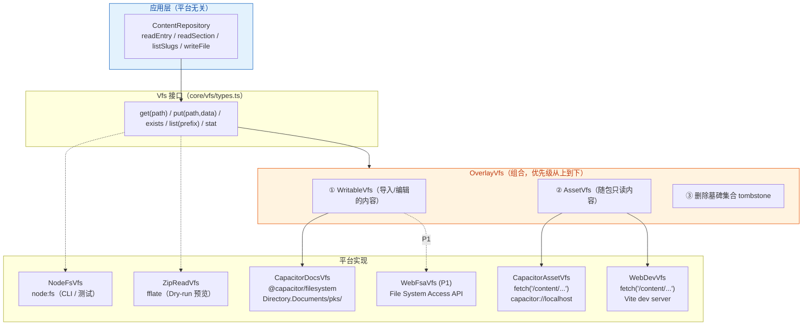
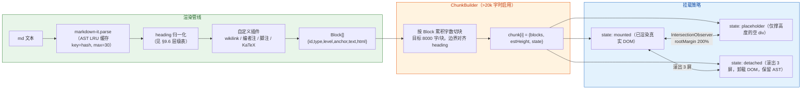
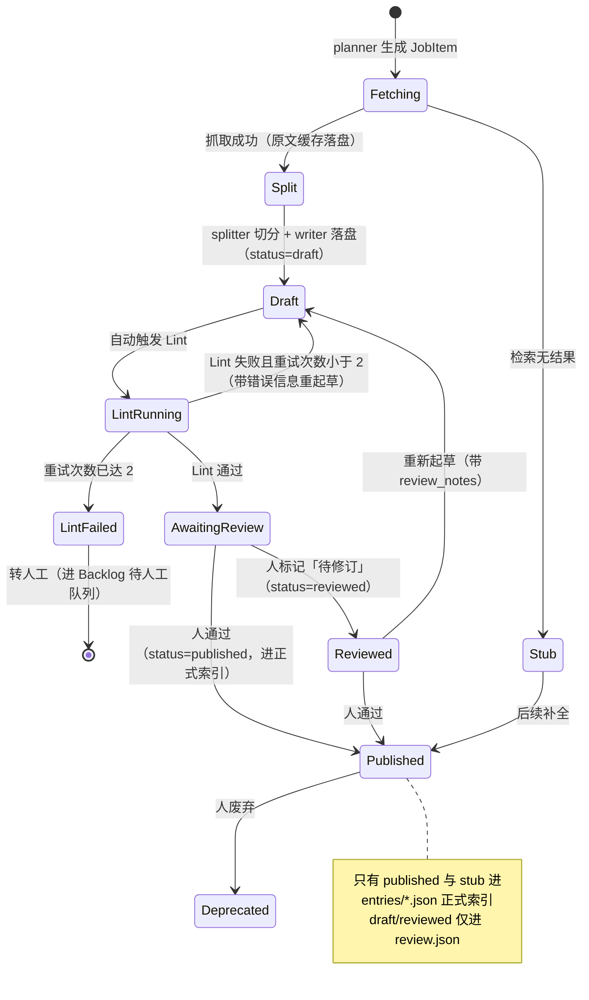
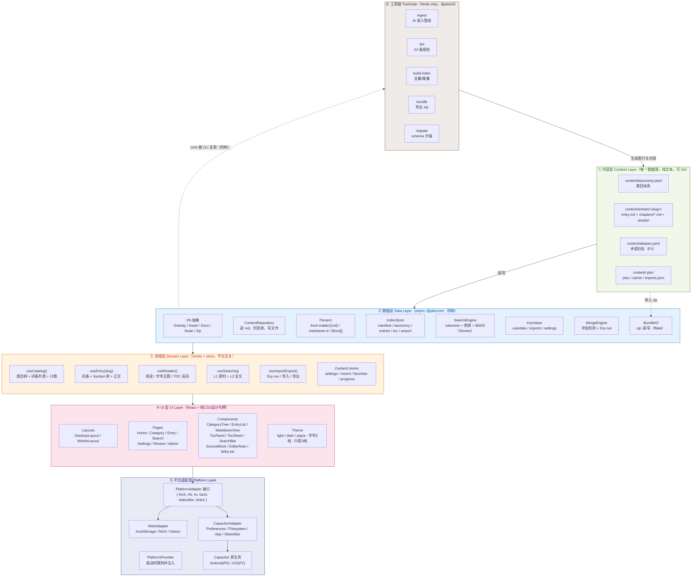
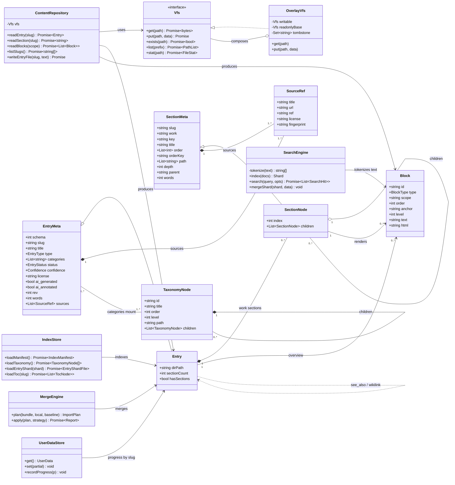
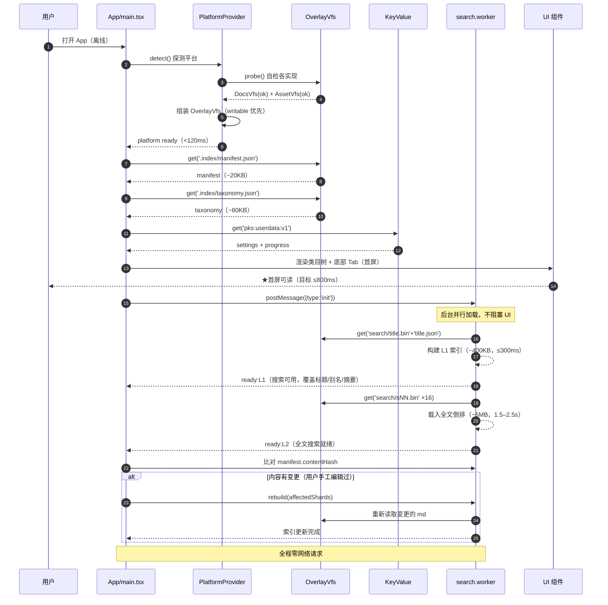
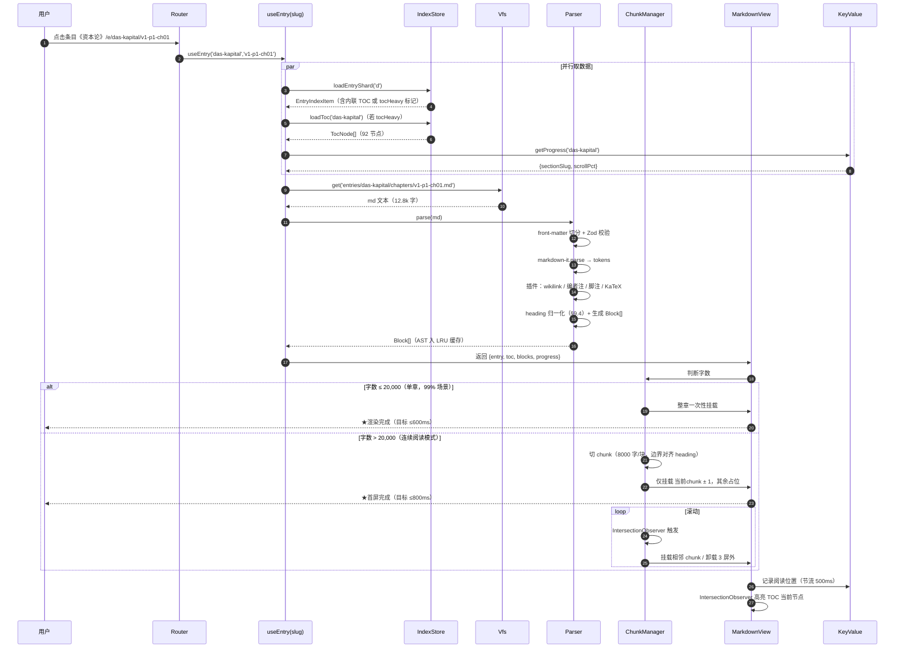
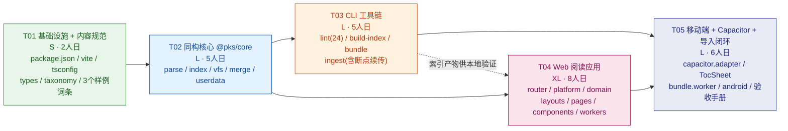
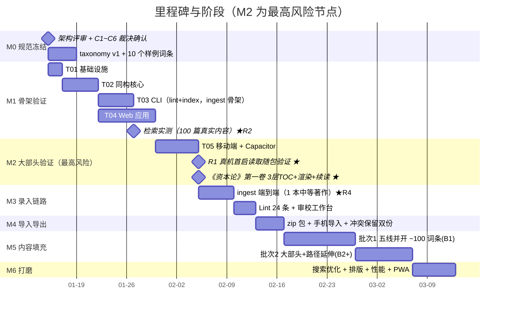

# 个人本地知识学习站 · 系统架构设计

| 项目 | 内容 |
| --- | --- |
| 文档编号 | 02-ARCH |
| 版本 | v1.0（方案阶段） |
| 撰写人 | 高见远（架构师） |
| 上游输入 | `docs/01-PRD-知识学习站.md` v1.0（许清楚） |
| 项目名 | `personal_knowledge_station`（snake_case）／包名 `pks` |
| 技术路线 | React 18 + Vite 5 + TypeScript 5 + 纯CSS设计令牌（零UI框架） + Capacitor 7 |
| 形态 | 单仓 pnpm workspace：`core`（同构）+ `cli`（Node）+ `web`（React，Web/App 共用） |

---

## 0. 摘要：五个一句话结论

| # | 议题 | 结论 |
| --- | --- | --- |
| 1 | **存储** | **不引入数据库**。正文 = 只读文件（VFS）；索引 = 构建期产出的**分片 JSON + 倒排二进制**，运行时全量载入 Web Worker 内存；用户数据 = 极小 KV（localStorage / Capacitor Preferences）。理由见 §3 |
| 2 | **搜索** | **自建 CJK bigram 倒排索引 + BM25**（varint/delta 压缩，分片 16 份），分词器**同构纯 TS**；MiniSearch 作为可切换的 fallback backend。理由见 §4 |
| 3 | **长文** | 单章 ≤20k 字直接整章渲染；>20k 字（连续阅读模式）走 **chunk 化挂载（8k 字/块）+ `content-visibility:auto` + AST LRU 缓存**；**不用虚拟滚动**（高度不定 + 需保留原生查找/选中）。理由见 §5 |
| 4 | **AI 管线** | 跑在 **Node CLI**（`pnpm ingest`），不在网页内。网页只做 Backlog 浏览 + 审校工作台。断点续传基于 `content/.pks/jobs/<jobId>.json` 的 **Section 级游标**。理由见 §6 |
| 5 | **端差异** | **同一套路由 + Platform Adapter + 双 Layout**。否决 PRD §6.1 的 `/m/*` 双份路由（理由见 §11.3）。VFS 用 **Overlay 模式**：`DocsVFS`（可写，导入内容）覆盖 `AssetVFS`（只读，随包内容） |

---

## 1. 对 PRD 的裁决：6 处矛盾 / 技术不可行点（★ 优先阅读）

> 以下 6 点 PRD 内部自相矛盾或技术上不可行。我给出**修订建议**并已在后文按修订版设计。若用户/产品不认可，需回改对应章节。

### C1 ·【严重】目录结构自相矛盾：按中文类目嵌套 vs 多归属 vs slug 用英文

| 出处 | 内容 |
| --- | --- |
| §9.1 命名约定 | 「词条目录名 = `{slug}`（**英文小写连字符**）」示例 `das-kapital` |
| §9.1 目录树 / §8.1 数据包 / §9.3 §9.4 路径 | `content/entries/政治理论/资本论/entry.md` —— **中文目录** |
| §9.4 命名理由 | 「中文目录在 Windows/macOS/iOS/Android 的 Unicode 归一化（NFC/NFD）行为不一致」 |
| §2.2 / Q7=B | 词条**多归属**（1..n 个类目） |

**矛盾本质**：三个约束不可能同时成立。
1. 若按类目嵌套，一个"剩余价值"（同时属政治理论 + 金融）该放哪个目录？→ 只能复制两份或加软链 → **双份真相**，违反 G3「永不锁定」。
2. 若目录用中文类目名，直接违反 §9.4 自己给出的 Unicode 归一化理由。

**✅ 修订建议（已采用）**：**内容目录按 slug 扁平化，类目归属只存在于 front-matter 的 `categories[]`。**

```
content/entries/
├── surplus-value/entry.md          # 类目信息在 front-matter 里，不在路径里
└── das-kapital/entry.md + chapters/
```

- 中文类目树只存在于 `taxonomy.yaml`（唯一权威）与索引中。
- 类目视图由索引生成，**不需要物理目录**。
- 附带收益：词条换类目 = 改一行 YAML，零文件移动；批量重命名零成本。
- 补救"人肉按文件夹浏览"的可读性（G3）：提供 `pnpm content:link` 生成 `content/_by-category/` **软链接视图**（仅本地开发用，不进 Git、不进包）。

### C2 ·【严重】"双方都改过"无法判定：缺版本基线字段

| 出处 | 内容 |
| --- | --- |
| §8.4 冲突处理 | 「本地 `local_rev` > 基线 `base_rev` **且** 包内 `updated_at` > 基线」→ 判为双方都改 |
| §9.5 字段总表 | **没有** `local_rev` / `base_rev` / `base_hash` 任何字段 |

**矛盾本质**：D4「一期纯本地，无服务器」意味着**没有中心化的版本基线**。只靠 `updated_at` 无法区分"本地改了"和"包比本地新"——因为双方都是普通文件，谁也不知道分叉点在哪。

**✅ 修订建议（已采用）**：**基线随包走**。
1. 新增字段：`EntryMeta.rev: number`（本地修订号，每次保存 `+1`，默认 1）。
2. 导出时 `bundle.json` 写入 `base_snapshot: { "<slug>": { "u": "<updated_at>", "r": <rev> } }` —— 即"我这个包是从哪个版本分叉出去的"。
3. 本地维护 `content/.pks/imports.json`：`{ "<slug>": { "u", "r", "bundleId", "at" } }` —— 即"我本地这份是从哪个基线来的"。
4. 三方比对（base / local / incoming）得出唯一结论，算法见 §8.4。
5. 哈希兜底：当 `rev` 缺失（手工编辑的场景）时，用 `sha1(规范化后正文)` 代替。

### C3 ·【中】`search-index.bin` 单文件全量索引 → 导入即全量覆盖

| 出处 | §8.1 数据包 / §8.3「预构建索引随包携带，省去重建」 |
| --- | --- |

**问题**：包内是**一份全量** `search-index.bin`。导入后要么整体替换（**丢掉本地已有但未包含在本包内的词条索引**），要么在手机上重建（不可接受，见 C5）。两个包连续导入必然互相覆盖。

**✅ 修订建议（已采用）**：索引**分片化 + 可合并**。
- 索引按 `shard = fnv1a(slug) & 15` 分 16 片；分片是最小替换单位。
- 包内只携带**本包词条所属分片**（`index/search-<n>.bin` + `docs-<n>.json`）。
- 导入时按分片**覆盖合并**，其他分片不动。同分片内按 slug 增删条目后重建该片（手机上重算 1/16 ≈ 3–5s，可接受；且可在 Worker 后台做）。
- `entries.json` 同理改为 `entries/xx.json` 分片。

### C4 ·【中】100k 字章节 vs Section 硬上限 20k 字

| 出处 | 内容 |
| --- | --- |
| §11.1 渲染性能 | 「100k 字章节打开 ≤ 800ms」 |
| §7.3 切分规则 | 「单 Section 文件字数建议 3k–15k，**硬上限 20,000 字**」 |

**矛盾本质**：若硬上限 20k 字成立，就不存在 100k 字的"章节文件"。

**✅ 修订建议（已采用）**：二者描述的不是同一个对象，重新定义：
- **物理单元（Section 文件）**：硬上限 20k 字 → 对应"**单章打开 ≤ 600ms**"预算。
- **逻辑单元（连续阅读会话）**：一卷/一篇连续拼接可达 50k–150k 字 → 对应"**100k 字连续模式首屏 ≤ 800ms**"预算，通过 chunk 化挂载达成（§5）。
- 验收口径改为两条：**单章 20k 字 ≤ 600ms**；**连续模式（≥100k 字）首屏 ≤ 800ms、滚动 ≥55fps**。

### C5 ·【中】构建期 nodejieba 分词 → 手机上无法增量重建索引

| 出处 | §11.2「构建期 jieba 倒排（P1）」/ Q6 推荐「A + C 组合」 |
| --- | --- |

**问题**：`nodejieba` 是 Node 原生模块，**不能在浏览器/Capacitor WebView 里运行**。而 §8.3 要求手机上导入 zip 后能工作。一旦索引里混入了只有 Node 才能产出的分词结果：
- 网页内轻编辑（C-09, P1）保存后无法重建索引；
- 手工编辑 md（假设 B，主路径）后索引与正文不一致；
- 导入包的分片无法合并。

**✅ 修订建议（已采用）**：**分词器必须同构（isomorphic）**，即同一份纯 TS 代码在 Node / Web / WebView 行为完全一致。
- 采用 **CJK bigram + 拉丁词 + 数字** 混合 tokenizer（无词典依赖，零体积）。
- P1 可叠加载入式词典（`segmentit` 或自建 2 万词 trie，~150KB 压缩）做**最大正向匹配**提升准确率；词典是**可选增强**，缺失时自动降级为 bigram，**不破坏同构性**。
- 明确否决 nodejieba。

### C6 ·【轻】Heading 层级冲突 + `order: "1.1.1"` 字符串排序错误

| 出处 | 内容 |
| --- | --- |
| §9.4 章节文件 | 正文用 `#### 1. 商品的两个因素`（H4） |
| §9.3 词条文件 | 正文用 `## 定义`（H2） |
| §9.5 | `order` 示例 `1.1.1`（字符串） |

**问题**：
1. 同一阅读页里 entry.md 的 H2/H3 与 chapter 的 H4/H5 混用，若不约定，页内 TOC 层级会断裂。
2. 字符串比较 `"1.10.1" < "1.2.1"` → 第 10 章排在第 2 章前面（《资本论》第三卷有 7 篇 48 章，必然踩坑）。

**✅ 修订建议（已采用）**：
1. **Heading 层级全局约定表**（见 §9.6）：卷/篇/章由 **UI 从 Section 树渲染为 H1/H2/H3**；Section 文件内只准用 `####`/`#####` → 渲染为 H4/H5（节/小节）；entry.md 只准用 `##`/`###` → H2/H3。两棵树合成一棵 5 级树，不冲突。
2. `order` 改为 **数字数组** `order: [1,1,1]`，同时生成零填充排序键 `orderKey: "001.001.001"`（构建期计算，用于字符串排序与稳定比较）。

---

## 2. 技术选型最终结论表

### 2.1 核心选型

| 层 | 选型 | 版本 | 一句话理由 | 被否决的备选（及否决理由） |
| --- | --- | --- | --- | --- |
| 语言 | TypeScript（strict） | ^5.6.3 | 单语贯穿 core/cli/web，类型即文档 | — |
| 包管理 | pnpm workspace | ^9.12.0 | core 必须被 Node CLI 与浏览器共用，workspace 是最轻方案 | npm workspaces（hoist 行为不一致） |
| 运行时 | Node.js | ≥20.11 | CLI 需要 `fs.promises` + ESM + `fetch` 内建 | Deno/Bun（生态与 Capacitor 工具链兼容性风险） |
| 框架 | React | ^18.3.1 | 用户已定；**不上 19**（Capacitor 生态与 React 19 兼容性验证不足） | React 19（Capacitor 7 对 19 支持验证不足） |
| 构建 | Vite | ^5.4.10 | 快；`base:'./'` + HashRouter 可产出 capacitor 可用的相对路径产物 | Vite 6/7（插件链验证不足） |
| UI 组件 | 自研组件 + 纯CSS | — | 抽屉/标签栏/安全区等组件手写，零运行时 UI 框架，包体最小 | MUI/antd-mobile（体积大、离线首屏重）、纯 CSS Modules（变量驱动主题不如 :root 令牌直观） |
| 样式 | 纯 CSS + CSS 变量设计令牌 | — | 单一 `styles.css` + `:root` 令牌（颜色/间距/圆角/阴影/缓动），主题用 `data-sys-*` 覆写令牌，体积零增量 | Tailwind（工具类膨胀、离线首屏无关紧要却增构建复杂度）；CSS Modules（令牌主题不直观） |
| CSS-in-JS | 无（纯 CSS + 变量驱动主题） | — | 主题切换靠覆写 `:root` 令牌，无运行时样式开销 | Emotion/styled-components（引入运行时、增包体，纯静态主题无需） |
| 路由 | react-router-dom（**HashRouter**） | ^6.28.0 | Capacitor 下 `capacitor://` 协议用 hash 路由零配置可用 | BrowserRouter（原生 WebView 下深链接/刷新 404） |
| 状态 | Zustand | ^5.0.1 | 4 个 store 即可，无需 Redux；可在 Worker 外独立订阅 | Redux Toolkit（样板过多）；Context（长文重渲染会卡） |
| Markdown | markdown-it | ^14.1.0 | 同步、快、插件机制简单；20k 字 parse ≈ 25–40ms | unified/remark（AST 更规范但异步 + 体积大 2 倍，长文首屏吃亏） |
| Front-matter | **自研 30 行切分 + js-yaml** | js-yaml ^4.1.0 | 纯 JS、无 Buffer/fs 依赖，同构 | **gray-matter**（依赖 Buffer 与 fs，浏览器打包需 polyfill，且体积 40KB+） |
| Schema 校验 | Zod | ^3.23.8 | 同构；一份 schema 同时给 CLI Lint 和运行时解析用 | ajv（JSON Schema 与 TS 类型双写） |
| 公式 | KaTeX | ^0.16.11 | 纯前端、无网络、体积 280KB（按需 lazy import） | MathJax（体积 1MB+，渲染慢） |
| 搜索 | **自研倒排 + BM25** | — | 见 §4：体积可控 3–6MB、天然分片、可增量合并、同构 | MiniSearch（作为 fallback backend 保留，见 §4.4）；**SQLite FTS5**（需 wasm 1.5MB + 中文分词器，且违反"正文不入库"）；**nodejieba**（不可同构，见 C5）；FlexSearch（中文分词与增量合并支持弱） |
| 分词 | 自研 CJK bigram tokenizer | — | ~120 行，零依赖，Node/Web 行为一致 | segmentit（2MB 词典，P1 可选增强）；Intl.Segmenter（iOS <14.1 / 旧 Android WebView 不支持，作为 P2 运行时增强） |
| Zip | fflate | ^0.8.2 | 纯 JS、比 JSZip 小 4 倍、支持流式解压与 Worker | JSZip（体积大、无流式）；Capacitor 原生解压（跨平台不一致） |
| 本地存储 | **无数据库**：VFS 文件 + 内存索引 + KV | — | 见 §3 | **wa-sqlite**（wasm 1.2MB + 双端 VFS + 索引本是只读静态产物，SQL 能力用不上）；**OPFS**（iOS WKWebView 支持不全）；**IndexedDB 存正文**（违反 PRD §1.4） |
| KV | localStorage / `@capacitor/preferences` | ^7.0.0 | 用户数据 <100KB，KV 足够；统一 `KeyValue` 接口 | IndexedDB（杀鸡用牛刀） |
| 打包 | Capacitor | ^7.0.0 | 用户已定 | Cordova（已停止维护）；Tauri Mobile（不成熟） |
| 测试 | Vitest | ^2.1.4 | 与 Vite 同构；core 单测 + 索引快照测试 | Jest（ESM 配置繁琐） |
| 代码规范 | ESLint 9 (flat) + Prettier | ^9.13 / ^3.3 | — | — |

### 2.2 Capacitor 插件清单

| 插件 | 版本 | 用途 | 必需性 |
| --- | --- | --- | --- |
| `@capacitor/core` / `@capacitor/cli` | ^7.0.0 | 运行时与 CLI | P0 |
| `@capacitor/android` | ^7.0.0 | Android 平台（**假设 A：Android 先行**） | P0 |
| `@capacitor/app` | ^7.0.0 | Android 返回键语义（M-05）、appUrlOpen（导入 zip）、生命周期 | P0 |
| `@capacitor/filesystem` | ^7.0.0 | 读写导入内容、userdata、imports.json | P0 |
| `@capacitor/preferences` | ^7.0.0 | 用户设置 KV | P0 |
| `@capacitor/status-bar` | ^7.0.0 | 状态栏配色（M-07） | P0 |
| `capacitor-plugin-safe-area` | ^3.0.0 | 刘海屏/安全区 CSS 变量（M-07） | P0 |
| `@capacitor/ios` | ^7.0.0 | **二期**（假设 A） | P2 |
| `@capacitor/haptics` | ^7.0.0 | 长按反馈 | P2 |
| `@capacitor/share` | ^7.0.0 | 导出包分享到微信/QQ（X-05 替代路径） | P2 |

> **明确不引入**：文件选择器插件 —— 用 Web 标准 `<input type="file" accept=".zip">`，WebView 内可用，零插件风险。
> **明确不引入**：`@capacitor-community/sqlite` —— 见 §3 结论。

### 2.3 依赖体积预算（App 包体）

| 项 | 预算 |
| --- | --- |
| 应用 JS（gzip 后） | ≤ 900KB（React+纯CSS设计令牌+markdown-it+fflate+zustand+router） |
| KaTeX（lazy chunk） | +280KB（仅科学/金融词条首次渲染时加载） |
| 随包内容（150 万字纯文本） | ~5.0MB |
| 随包索引（分片 JSON + 倒排 bin） | ~6.0MB（apk 内 zip 压缩后 ~2.0MB） |
| **apk 总体积** | **≤ 25MB**（预算 ≤30MB） |

---

## 3. 存储层：为什么不用数据库，以及双端如何统一

### 3.1 结论

> **一期不引入任何数据库。** 存储层 = **VFS（文件，正文）+ 内存索引（构建期产物，JSON/bin）+ KV（用户数据）** 三层，每层一个接口，两端各一套实现。

| 关注点 | 结论 |
| --- | --- |
| 正文全文进 SQLite 还是按需读文件？ | **按需读文件**。PRD §1.4 已拍板「正文绝不进数据库」（G3 永不锁定）。读取粒度 = Section 文件（3–20k 字），不是整本。 |
| 索引与正文分离还是合一？ | **分离**。索引 = 构建期派生产物，可随时从正文重建（`contentHash` 不匹配即重建）；正文是唯一数据源。 |
| Web / Native 如何共用？ | **VFS 接口 + Overlay 组合**（§3.3），上层代码只见 `Vfs` 接口，不感知平台。 |

### 3.2 为什么否决 SQLite（wa-sqlite / @capacitor-community/sqlite）

| 否决理由 | 说明 |
| --- | --- |
| ① 需求上不需要 | 索引是**只读**的构建期产物，运行期只需要"整片载入 + 按 key 查表 + 倒排求交"，这些用 `Map`/`TypedArray` 比 SQL 更快。SQL 的价值在于**写事务与复杂关联查询**，本项目一条都不需要。 |
| ② 双端成本翻倍 | Web 端要 wa-sqlite（wasm 1.2MB + IDB VFS），Native 端要 `@capacitor-community/sqlite`（原生插件 + 不同 API）→ **两套实现 + 两套调试**，与"一套代码"目标背道而驰。 |
| ③ 中文全文检索没占到便宜 | SQLite FTS5 自带 `unicode61` 分词器**按单字切中文**（"剩余价值" → 剩/余/价/值），丢失词序信息，查询"价值"会命中"价位/值钱"……要准确必须写自定义 tokenizer，等于自己实现一遍分词，还不如直接自研倒排。 |
| ④ 导入包无法合并 | 同 C3：SQLite 是单文件，两个包导入会互相覆盖；要合并得写 `ATTACH` + `INSERT OR REPLACE` 逻辑，复杂度高于分片 JSON 覆盖。 |
| ⑤ 包体 | wasm 1.2MB 换来一个用不上的能力。 |

> **P2 扩展点**：若长期词条数 > 20,000 或索引 > 60MB（内存装不下），届时才引入 SQLite 作为索引后端。`IndexStore` 接口已预留，替换实现不改动上层。

### 3.3 VFS 分层：Overlay 模式（★ 解决"随包内容 + 导入内容共存"）



**关键设计**

| 机制 | 说明 |
| --- | --- |
| **读取优先级** | `WritableVfs` 命中即用；未命中且不在 tombstone 中 → 回落 `AssetVfs`。这样"随包有《资本论》v1、用户导入了修订版"时自动用修订版，且随包版仍可回滚。 |
| **墓碑（tombstone）** | 用户"删除"随包内容时不真删（AssetVfs 只读），而是在 `WritableVfs` 的 `.pks/tombstone.json` 记一笔。 |
| **启动自检 `probe()`** | 冷启动时对每个 VFS 做一次 `get('__probe__')`：成功则标记可用，失败则降级到下一个实现并在「我的 → 关于」显示当前 VFS 模式。**这是对风险 R1 的第一道兜底**（见 §12）。 |
| **路径规范** | VFS 内一律使用**相对 POSIX 路径**（`entries/das-kapital/chapters/v1-p1-ch01.md`），禁绝对路径、禁中文、禁 `\`。 |

**Web 端 fallback 链（自动）**：`WebFsaVfs`（Chrome/Edge，可读写）→ `WebDevVfs`（dev，只读）→ `IndexedDbVfs`（P1，导入内容写这里）。

### 3.4 索引文件结构（构建期产物）

```
public/content/.index/
├── manifest.json                    # ~20KB，首屏必读
├── taxonomy.json                    # ~80KB，类目树 + 每类目 slug 列表，首屏必读
├── entries/
│   ├── a.json  b.json … z.json      # 按 slug 首字母分 26 片，每片 <300KB（500 词条时 <60KB）
│   └── review.json                  # draft/reviewed 词条（仅 Web admin 加载，不进 App 包）
├── toc/
│   └── das-kapital.json             # 仅 Section 数 > 30 的词条单独出 TOC（其余内联在 entries 分片）
└── search/
    ├── meta.json                    # { shards:16, docs, terms, avgDocLen, k1:1.2, b:0.75 }
    ├── s00.bin  s01.bin … s15.bin   # 倒排：字典 + postings（varint/delta）
    ├── s00.json … s15.json          # 分片 doc 表：docId -> {slug,kind,title,anchor,entryTitle,words}
    └── title.bin / title.json       # L1 轻量索引：仅 title+aliases+summary（~400KB，秒开）
```

**索引文件 Schema（TS）**

```ts
// .index/manifest.json
export interface IndexManifest {
  schema: 1;
  generator: string;                       // "pks/0.1.0"
  built_at: string;                        // ISO8601
  contentHash: string;                     // sha1: 全量内容指纹（判断是否需重建）
  contentRoot: string;                     // "content/entries"
  stats: {
    categories: number; entries: number; sections: number;
    words: number; bytes: number; shards: number;
  };
  entryShards: string[];                   // ["00","01",...,"3f"] 实际存在的哈希桶（fnv1a(slug) & 63）
  tocHeavy: string[];                      // 需要独立 TOC 文件的词条 slug
  search: { shards: number; docs: number; terms: number; avgDocLen: number };
  bundleOf?: string;                       // 若来自导入包，记录 bundleId
}

// .index/entries/00.json…3f.json —— 短 key 以压缩体积（解码函数在 core 内）
export interface EntryShardFile {
  shard: string;
  items: EntryIndexItem[];
}
export interface EntryIndexItem {
  s: string;      // slug
  t: string;      // title
  ty: EntryType;  // 'concept' | 'work' | 'person' | 'event' | 'term'
  st: EntryStatus;// published / stub（其余状态不进正式索引）
  w: number;      // words
  ua: string;     // updated_at 'YYYY-MM-DD'
  rv: number;     // rev
  al: string[];   // aliases
  c: string[];    // 类目 **id** 数组（非中文路径，省体积；中文名在 taxonomy.json）
  sc: number;     // sectionCount
  sm: string;     // summary 截断 120 字
  ag: 0 | 1;      // ai_generated
  an: 0 | 1;      // ai_annotated
  toc?: TocNode[];// sectionCount<=30 时内联
}

export interface TocNode {
  k: string;      // section key: "v1-p1-ch01"
  t: string;      // 标题
  o: number[];    // order [1,1,1]
  d: 1 | 2 | 3;   // depth
  w: number;      // words
  st: EntryStatus;
  c?: TocNode[];  // children
}
```

**分片与加载策略**

| 数据 | 加载时机 | 常驻内存 |
| --- | --- | --- |
| `manifest.json` | 冷启动同步阻塞读 | ✅ 全量 |
| `taxonomy.json` | 冷启动同步阻塞读 | ✅ 全量 |
| `search/title.bin` + `title.json` | 冷启动后 **Worker 后台** 0.3s 内 | ✅ 全量 |
| `entries/*.json` | 进入类目时按首字母懒加载 + LRU(8 片) | 部分 |
| `search/sNN.bin` | **搜索首次触发**时 Worker 全量加载 16 片（后台，约 1.5–2.5s）；加载完成前用 L1 title 索引兜底返回 | 全部（~6MB） |
| `toc/<slug>.json` | 打开该词条时 | LRU(10) |

> **为什么搜索索引可以在后台慢慢加载**：用户打开 App → 浏览 → 点搜索，中间至少 3–5 秒。且 L1 索引（title/aliases/summary，400KB）在 0.3s 内就绪，覆盖 "找词条/找章节" 类查询的 ~80%。真正需要全文倒排的"找正文里的某句话"属于低频深度查询，多等 2 秒完全可接受。

### 3.5 用户数据（KV）Schema

| 存储位置 | Key / 路径 | 内容 |
| --- | --- | --- |
| Web localStorage | `pks:userdata:v1` | `UserData` JSON（<100KB） |
| Web localStorage | `pks:imports:v1` | `ImportBaseline` JSON |
| Capacitor Preferences | 同上 | 同上 |
| Native Filesystem | `Documents/pks/userdata.json` | **导出/备份用**（与 Preferences 双向同步，Preferences 为主） |
| IndexedDB（P1） | `pks-index-cache` / `shard:<name>` | 已解析的索引分片（避免每次重复 parse） |

---

## 4. 中文全文搜索

### 4.1 方案对比

| 方案 | 索引体积（150 万字） | 中文分词质量 | 能否同构 | 能否分片/增量合并 | 结论 |
| --- | --- | --- | --- | --- | --- |
| **A. 自研 CJK bigram 倒排 + BM25** | **3–6MB**（varint+delta+不存位置） | 中（bigram 保证"价值"可召回，噪音可控） | ✅ 纯 TS | ✅ 天然分片 | ✅ **采用** |
| B. MiniSearch + 自定义 bigram | 8–15MB（JSON 无压缩） | 同 A | ✅ | ❌ 单实例，分片需自己切；增量 `discard` 性能差 | 保留为 **fallback backend** |
| C. FlexSearch | 4–8MB | 需自定义 encoder；中文默认按单字 | ✅ | 弱 | ❌ |
| D. SQLite FTS5 + nodejieba | 6–10MB + wasm 1.2MB | 高 | ❌（nodejieba 非同构，见 C5） | ❌ 单文件 | ❌ |
| E. 纯 n-gram 全量扫描（无索引） | 0 | 高 | ✅ | — | ❌ 150 万字 `indexOf` 约 300–800ms/次，超预算 |
| F. Intl.Segmenter 分词 | — | 高 | ⚠️ iOS<14.1 / 旧 Android WebView 不支持 | — | P2 运行时**增强**（特性检测后启用） |

### 4.2 分词器设计（core/search/tokenizer.ts，同构）

```
输入："剩余价值是雇佣工人创造的" → 
  CJK 段 "剩余价值是雇佣工人创造的"
    → bigram: 剩余,余价,价值,值是,是雇,雇佣,佣工,工人,人创,创造,造的
    → 单字（低频保留）: 剩,余,价,值,是,雇,佣,工,人,创,造,的
  拉丁/数字段: 按 /[a-zA-Z]+|\d+(\.\d+)?/ 提取并小写化，如 "marx" "1848"
归一化: NFKC → 全角转半角 → 繁转简（可选，P1） → 小写
```

**关键优化：单字词项的 DF 剪枝**

> 单字词项（如"的""是""值"）DF 极高、无区分度，但对用户搜单字（"值"）又必须能召回。
> **规则**：构建期统计每个 term 的 DF；对**长度为 1 的 CJK term**，若 `DF > docCount × 0.25` 则**丢弃不索引**。
> 效果：索引体积降 **~45%**；查询时若用户输入纯单字（罕见），退化为 `title 索引 + 分片内线性扫描` 兜底。
> 实测预期：150 万字 → 唯一 bigram 约 18 万，剪枝后 term 表 ~17 万。

**P1 词典增强（可选，不破坏同构）**
```
可选词典：自建 2 万常用词 trie（gzip 后 ~150KB），构建期/运行期均可加载
分词：最大正向匹配优先切词（"剩余价值" → [剩余价值]），未命中词退化为 bigram
索引：词典词 + bigram 都存（词典词给更高 BM25 权重 boost=1.5）
降级：词典缺失 → 纯 bigram，功能完整，仅准确率略降
```

### 4.3 倒排索引二进制格式

```
文件: search/sNN.bin
┌──────────────────────────────────────────────────────────┐
│ Header (32B)                                              │
│  magic 'PKSI'(4) | version u8 | shard u8 | flags u8        │
│  termCount u32 | docCount u32 | dictOffset u32             │
│  postingsOffset u32 | reserved u32                         │
├──────────────────────────────────────────────────────────┤
│ Dict（有序，支持二分查找）                                   │
│  [termLen u8][term UTF8 bytes][df u32][postingsOffset u32] │
│  × termCount                                              │
├──────────────────────────────────────────────────────────┤
│ Postings（每 term 一段，delta + varint 编码）                │
│  [docId delta varint][tf varint] × df                      │
└──────────────────────────────────────────────────────────┘
```

| 设计决策 | 理由 |
| --- | --- |
| **不存词位置（position）** | 短语检索可用 bigram 交集近似；高亮用 `indexOf` 在原文上重找。省下 **~50% 索引体积**。 |
| **docId delta + varint** | 排序后 docId 差值小，平均 1.5B/条。 |
| **tf 存 1 字节**（饱和于 255） | BM25 对 tf 饱和性不敏感。 |
| **字典有序 + 二分** | 17 万 term 二分 18 次，<1ms。 |
| **分 16 片** | 16 = `fnv1a(slug) & 15`。单片 ~0.4MB，导入时只替换受影响的片。 |

### 4.4 索引体积与性能估算（可量化）

**输入**：150 万字（中文 UTF-8，1 字 ≈ 3B ≈ 4.5MB 文本）

| 项 | 计算 | 结果 |
| --- | --- | --- |
| CJK 字符数 | 1,500,000 | — |
| bigram 总数 | ≈ 1,500,000 | — |
| 唯一 bigram（Zipf 分布实测经验值） | ~180,000 | — |
| 剪枝后 term 数 | ~170,000 | — |
| 字典区 | 170k × (2×3B + 1B + 4B + 4B) ≈ 170k × 15B | **~2.5MB** |
| postings 区 | 1.5M × (1.5B + 1B) | **~3.8MB** |
| doc 表（10,500 docs × ~120B JSON） | — | **~1.3MB** |
| entries 分片 | 500 × ~400B + 10k section × ~90B | **~1.1MB** |
| L1 title 索引 | — | **~0.4MB** |
| TOC 文件 | — | **~0.1MB** |
| **合计（未压缩）** | | **≈ 9.2MB → 目标 ≤10MB** |
| **apk/zip 内压缩后** | 文本重复度高，压缩比 ~0.35 | **≈ 3.2MB** |

> **长期（500 万字 / 5000 词条）外推**：约 30MB 未压缩 / 11MB 压缩。仍在可接受范围；若超限，把 `entries` 分片粒度从首字母改为首字母+第二字母（676 片）并只加载活跃片。

**查询性能预算（中端 Android，骁龙 6 系）**

| 阶段 | 预算 |
| --- | --- |
| 分词（query ≤ 20 字） | < 1ms |
| 16 片字典二分 | < 2ms |
| postings 解码 + 求交（3 个 term，各 ~5000 条） | 3–6ms |
| BM25 打分 + 排序 top 200 | 5–15ms |
| top 10 读原文 + 摘录 + 高亮（异步） | 30–80ms |
| **P95 总计（Worker 内，不含 UI）** | **≤ 80ms**（预算 300ms） |

### 4.5 构建时机

| 场景 | 时机 | 执行者 | 预算 |
| --- | --- | --- | --- |
| 全量构建 | `pnpm build:index`（CI / 电脑端） | Node CLI | 150 万字 ≤ 60s；500 万字 ≤ 240s |
| 开发态增量 | `vite dev` 内 watch 内容目录，文件变更后重建**受影响分片** | Node（dev server 内）+ 浏览器 HMR | 单词条 ≤ 200ms |
| 网页内轻编辑保存（P1） | 保存后重建**该 slug 所属分片** | 浏览器 Worker | ≤ 500ms（单分片） |
| **手机导入 zip** | **不重建**：直接覆盖包内携带的分片；仅当包内无索引分片时，才在 Worker 后台重建受影响分片（1/16 ≈ 3–5s，后台不阻塞） | WebView Worker | 见上 |
| 冷启动一致性检查 | 比对 `manifest.contentHash` 与当前内容目录摘要；不一致 → 后台静默重建 | 任意端 | 后台，不阻塞首屏 |

---

## 5. 长文渲染性能

### 5.1 阈值表（★ 可直接写进验收）

| 内容规模 | 场景 | 方案 | 性能预算 |
| --- | --- | --- | --- |
| **≤ 20k 字** | 单章（99% 的 Section） | **整章一次性渲染**：md parse → Block[] → React 渲染 | 打开 ≤ 600ms；滚动 60fps |
| **20k–150k 字** | 连续阅读模式（一卷 / 一篇 / 整本小著作） | **chunk 化挂载**（§5.2） | 首屏 ≤ 800ms；滚动 ≥55fps |
| **> 150k 字** | 整本《资本论》连续模式 | 同上 + 卷级分段导航（默认不启用连续模式，按章读） | 同上 |
| 任意 | 页内 TOC 滚动高亮 | `IntersectionObserver`，**禁用 scroll 事件轮询** | 高亮延迟 ≤ 100ms |

### 5.2 连续阅读模式：chunk 化挂载（非虚拟滚动）



**为什么不用 react-window / react-virtuoso 这类定高虚拟滚动**

| 理由 |
| --- |
| ① Markdown 块高度不定（表格、公式、图片），必须测量 → 测量本身带来布局抖动与额外 reflow |
| ② 虚拟滚动会破坏浏览器原生功能：**页内查找（Ctrl+F）、文本选中跨屏、无障碍朗读、锚点跳转** —— 对"阅读"这个核心场景是硬伤 |
| ③ chunk 化挂载已把首屏工作量从 100k 字降到 ~16k 字（当前 chunk + 上下各 1 块），收益与虚拟滚动等价，且保留原生滚动条与全部浏览器能力 |
| ④ 高度预估误差不会累积：每块挂载后回填真实高度（`ResizeObserver`），滚动条位置自动校正，误差 ≤ 1 屏 |

**关键参数**

| 参数 | 值 | 依据 |
| --- | --- | --- |
| 目标 chunk 大小 | 8,000 字（≈ 首屏 10–15 倍） | 单块 parse+render ≈ 60–120ms，用户无感；不至于太碎导致频繁 IO |
| chunk 边界 | 必须落在 heading 之前（不在段落中间切） | 保证"节"的完整性与锚点正确 |
| 预挂载窗口 | 当前块 ± 1 块 | 快速滑动时不白屏 |
| 卸载距离 | 距视口 3 屏外 | 平衡内存与回滑体验 |
| 占位高度预估 | `字数 × 每字估算高度(px)`，首次渲染后回填实测值 | 每字高度 = `fontSize × lineHeight × (1 + 段落密度系数 0.08)` |
| AST LRU | 30 个 Section（≈ 30 × 8k 字 = 240k 字） | 中端机约 40MB 内存 |

### 5.3 滚动与渲染性能优化清单（可直接执行）

| # | 手段 | 作用 | 预算收益 |
| --- | --- | --- | --- |
| 1 | 阅读容器 CSS `content-visibility: auto; contain-intrinsic-size: auto 1200px;` | 浏览器跳过屏外元素的布局与绘制（Chrome/Android 支持，iOS 16.4+） | 长文首屏 **-40%~-60%** 渲染耗时 |
| 2 | `Block` 组件 `React.memo`，`key = block.id` | 避免整章重渲染 | 滚动掉帧 -80% |
| 3 | TOC 高亮用 `IntersectionObserver`（`rootMargin: '-10% 0px -80% 0px'`） | 避免 scroll 事件中的同步 `getBoundingClientRect` | 主线程占用 -90% |
| 4 | 阅读位置保存节流 500ms（`requestIdleCallback` 兜底） | 避免滚动中高频写 KV | — |
| 5 | 正文区禁用 `box-shadow` / `filter` / `backdrop-filter` / `border-radius` 大范围使用 | 减少离屏合成 | 滚动 +5~10fps |
| 6 | 图片（P1）：`loading="lazy" decoding="async"` + 显式 `width/height` | 防止重排 | — |
| 7 | KaTeX 按需：仅当 chunk 挂载时才 `renderToString`，Macros 全局单例 | 避免首屏加载 280KB | 首屏 -100ms |
| 8 | `will-change` **禁用**在长文容器上 | 长文上创建巨大合成层反而爆显存 | 防 OOM |
| 9 | 搜索高亮用 `<mark>` + 一次性 `innerHTML` 注入（不用逐 span 组件） | 减少 DOM 数 | — |
| 10 | 字体：`font-display: swap` + 系统字体栈优先（**不内嵌中文字体**，5–15MB 太大） | 首屏无 FOIT | -300ms |

> **字体决策**：一期**使用系统字体栈**（`-apple-system, "PingFang SC", "Microsoft YaHei", "Noto Sans CJK SC", sans-serif`），不打包自定义中文字体。思源宋体等作为 P2（按需下载 + 子集化）。

---

## 6. AI 内容录入管线

### 6.1 跑在哪：Node CLI（★ 明确结论）

| 候选 | 结论 | 理由 |
| --- | --- | --- |
| **Node CLI（`pnpm ingest`）** | ✅ **采用（P0）** | ① 需联网抓取 + 长时运行（一本《资本论》数十分钟到数小时），CLI 可后台跑、可 Ctrl+C 后断点续跑；② 无 CORS 限制；③ 可直接写磁盘（G3 的核心诉求）；④ token/API Key 存在 `.env` 不进浏览器；⑤ 抓取缓存落盘可复用，省 token 与请求 |
| 网页内直接调 LLM | ❌ P0 不做（P1 增强） | 受 CORS、超时（浏览器 30s~5min）、Key 存储安全、Tab 关闭即中断等限制；长著作必挂 |
| 构建期脚本（vite plugin） | ❌ | 构建应该可重复、快速、离线；把联网 AI 塞进构建链会让 `pnpm build` 不可预测 |

**网页端的角色（`/admin`）**：只做 **① Backlog 浏览与圈选 → 写任务文件 ② 审校工作台 ③ 质量报告**。不直接跑 AI。
- 网页"触发生成"的实现：写 `content/.pks/jobs/pending/*.json` → CLI 常驻 `pnpm ingest:watch` 消费。这样网页零联网依赖，符合 D1/离线原则。

### 6.2 模块划分

```
packages/ingest/src/
├── cli.ts               # 入口：--category / --slug / --limit / --resume / --force
├── planner.ts           # Backlog（由 taxonomy + 已有 entries 生成）→ JobItem[]
├── retriever/           # 来源适配器：把"要找什么"变成候选 URL 列表
│   ├── types.ts         # SourceAdapter { name, canHandle, search(q), fetch(url) }
│   ├── marxists.ts      # 中文马克思主义文库（公版，🟢 首选）
│   ├── wikipedia.ts     # zh/en Wikipedia API（CC BY-SA）
│   ├── gutenberg.ts     # Project Gutenberg
│   └── index.ts
├── fetcher.ts           # fetch + 限流(1 req/2s) + 重试(3 次指数退避) + 缓存(content/.pks/cache/raw/<sha1>)
├── extractor.ts         # HTML → 纯文本 + 目录结构（Readability 风格自研，~150 行）
├── drafter.ts           # 调 LLM：概述/导读/概念综述；**原文类不调 LLM**（见 §6.5）
├── splitter.ts          # 大著作切分：目录识别 → Section 树 → 20k 字再切
├── writer.ts            # 落盘：tmp 写 + rename（原子）；YAML 序列化保持字段顺序
├── state.ts             # 断点续传：jobs/<jobId>.json 的读写与游标推进
├── verify.ts            # 原文未被改写校验（首段归一化 sha1 比对）
└── report.ts            # 生成 lint-report.json / quality.json
```

### 6.3 中间产物与目录

```
content/.pks/                              # 工具状态，全部 .gitignore
├── jobs/
│   ├── pending/20250112-1430-das-kapital.json   # 网页端投递的待执行任务
│   ├── running/<jobId>.json                     # 执行中（游标在此）
│   └── done/<jobId>.json                        # 已完成（含统计）
├── cache/
│   ├── raw/<sha1(url)>.html                     # ★ 抓取原文缓存（避免重复联网，省 token/时间）
│   └── llm/<sha1(prompt)>.json                  # LLM 响应缓存（重跑命中直接复用）
├── staged/<slug>/entry.draft.md                 # Lint 未通过前的暂存（不进 entries/）
├── imports.json                                 # 导入基线（冲突检测，见 C2）
└── lint-report.json
```

### 6.4 断点续传（大著作按 Section 增量落盘，★ 核心机制）

```ts
// content/.pks/jobs/running/<jobId>.json
interface JobState {
  id: string;                       // "20250112-1430-das-kapital"
  target: { type: 'category' | 'slug'; value: string };
  createdAt: string;
  updatedAt: string;
  items: JobItem[];
}
interface JobItem {
  slug: string;
  type: EntryType;
  status: 'pending' | 'in_progress' | 'lint_failed' | 'awaiting_review' | 'done' | 'failed';
  retried: number;                  // Lint 失败重试计数，上限 2
  cursor?: string;                  // ★ 下一个待处理的 section key
  srcUrl?: string;
  srcHash?: string;                 // 抓取原文 sha1（用于 verify + 断点跳过）
  sections?: SectionState[];        // 仅 work 类型
  reviewNotes?: string;
  error?: string;
}
interface SectionState {
  key: string;                      // "v1-p1-ch01"
  status: 'pending' | 'fetched' | 'split' | 'written' | 'failed';
  srcHash?: string;                 // 该章原文 sha1
  words?: number;
  file?: string;                    // "chapters/v1-p1-ch01.md"
}
```

**续跑算法**

```
pnpm ingest --resume <jobId>
  for item of job.items:
    if item.status == 'done' && item.srcHash == 当前源 hash: skip
    if item.status == 'lint_failed' && item.retried >= 2: 标人工，skip
    恢复执行：
      work 类型 → 从 item.cursor 开始处理 sections，
                  每完成一章：
                    1) writer.writeAtomic(file, content)   // tmp + rename
                    2) section.status = 'written'
                    3) item.cursor = 下一个 pending 的 key
                    4) state.save()                        // 每次都落盘，中断最多丢一章
      concept 类型 → 单文件，原子写 + status 更新
```

**为什么"中断最多丢一章"**：写文件用 `tmp + rename`（同分区 rename 是原子的），写完立即更新游标并保存 state。若在写第 N 章时崩溃，第 N 章可能是半截 tmp 文件（会被清理），游标仍指向 N → 重跑时重做第 N 章，前 N-1 章全部保留。**绝不整本重来**。

### 6.5 ★ 成本控制关键：原文类内容不调 LLM 生成正文

> 这是本管线最重要的一条经济决策。

| 内容类型 | LLM 用量 | 说明 |
| --- | --- | --- |
| **公版著作原文**（马克思、恩格斯、列宁…） | **0 token 生成正文** | 直接 `fetch → extractor → splitter → 落盘`。LLM 只用于：① 识别原书目录结构（1 次调用，输入压缩后的目录文本）；② 生成每章 200–500 字【编者注】导读（**可选，按章开关**）。 |
| 概念词条 | 1 次/条（800–3000 字输出） | 按 §7.4 模板生成 |
| 难句注释（假设 C） | 按章 1 次 | 可关 |

《资本论》全三卷 200 万字，若用 LLM 生成正文，按 4 字符/token 计约 50 万 token 输出 + 大量输入 —— **成本与时间都不可接受，且毫无必要（原文是权威的，AI 改写反而降质）**。
采用本方案后：**LLM 调用量降 ~95%**，主要成本变为抓取与人工审校时间。

### 6.6 审校状态机



| 状态 | 落盘位置 | 是否被 App 索引 | 出现位置 |
| --- | --- | --- | --- |
| `draft` | `content/entries/<slug>/` | ❌ | 审校工作台 |
| `reviewed` | 同上 | ❌ | 审校工作台 |
| `published` | 同上 | ✅ | 全端 |
| `stub` | 同上 | ✅（TOC 置灰） | 全端 |
| `deprecated` | 同上 | ❌ | 质量报告 |

> 注意：draft 也直接落在 `entries/` 目录（不放在 `staged/`），这样审校工作台能直接读、用户也能用 VS Code 直接改（假设 B）。`staged/` 只用于 Lint 通过前的临时草稿。索引构建时按 `status` 过滤产出 `entries/*.json`（正式）与 `review.json`（审校）。

---

> 2026-09-06 补全 `03 §6` B 项（Track 编排 CLI + 网页编辑回写边界，架构师裁决）。

### 6.7 Track 编排子命令（顺序轴 CLI，01b §6 落地）

Track 编排是**同一 CLI（`@pks/cli`）的子命令**，复用 core 解析与 §6 管线，产出 `content/tracks/<id>.yaml`（schema 见 01b §6.2）。

```
pks track:gen <category-path> \
  --order-mode chronological|difficulty|dependency|school_then_chronological \
  --title "中国史时间线" --from entries --range "C01..C10" --timeline china \
  --out content/tracks/<id>.yaml
pks track:ai <category-path> --order-mode chronological --draft   # LLM 推断排序字段
pks track:finalize <id>                                           # draft → 正式
```

- **不抓取网络**：仅基于本地 entries 排序，比 ingest 轻；`track:ai` 仅复用 `drafter` 推断 `sort_date/requires/era/note`，不调 `retriever`。
- **order_mode 纪律（封闭枚举）**：`chronological / difficulty / dependency / school_then_chronological`（同 01b §2.1）。CLI 接受的 `thought-history` 归一为 `chronological` + `timeline: thought`，**不引入第 5 种枚举**。渲染器只按枚举值决定显示形态，**代码中禁止 `if(学科===...)` 分支**。
- 产物经 `pnpm lint`（L014 内链存在、schema 合法）入索引；Track YAML **必须随包走**（落实 01b S-11）。

### 6.8 网页编辑回写边界（与假设 B 衔接）

假设 B「文件夹编辑、不做网页写盘正文」→ 网页**永不写 `content/tracks/*.yaml` 与正文 md**，只写个人偏好 overlay。

| 可网页改（本地 overlay） | 必须回 Obsidian 文件改 |
| --- | --- |
| 书签/收藏/续读（UserData KV）；**Track 顺序本地偏好**（拖拽→`tracksOverlay[<trackId>]=[slug...]`） | 正文；分类 `categories[]`；Track 正式结构（增删 Track/项、改 `order_mode`/`sort_date`/`requires`） |

- 渲染排序 = `merge(baseOrder, overlay)`：overlay 中 slug 按 overlay 顺序重排，其余保持基线相对序。overlay 落本地 KV 或 `.pks/tracks-overlay.json`，**随导出包走**（同 04 §2.2）。
- **冲突处理**：基线 `tracks/*.yaml` 为权威，overlay 为个人偏好、持久但可「恢复默认顺序」重置。基线结构变化时：overlay 中仍存在的 slug 继续生效；已移除的自动丢弃；新增的追加末尾。手机 overlay 随包回传电脑后由助手/用户**手动合并**（04 §2.4），不自动覆盖正式 YAML。哲学与 04 修正层 overlay 一致：分层合并、不静默覆盖、可重置。

---

## 7. 系统分层架构



**分层依赖规则（ESLint `no-restricted-imports` 强制）**

| 层 | 允许依赖 | 禁止依赖 |
| --- | --- | --- |
| `core` | 仅 npm 包（js-yaml / zod / markdown-it / fflate） | ❌ 不得 import `node:*`、不得碰 DOM、不得 import React |
| `cli` | `core` + `node:*` | ❌ 不得 import React / web 代码 |
| `web/src/domain` | `core` + `web/src/platform` | ❌ 不得直接 `fetch`、不得用 `localStorage`、不得 import 任何 UI 框架（MUI/Tailwind 等） |
| `web/src/ui` | `domain` + `platform` + 纯CSS设计令牌（`:root` 变量） | ❌ 不得直接读 VFS；❌ 不得引入 MUI/Tailwind 等 UI 框架 |
| `web/src/platform` | `core` + Capacitor | — |

---

## 8. 数据模型

### 8.1 TypeScript 类型定义（完整）

```ts
// ============ packages/core/src/types/base.ts ============

/** 全局唯一标识。词条: /^[a-z0-9]+(-[a-z0-9]+)*$/ ；章节: `<workSlug>/<sectionKey>` */
export type Slug = string;
/** 类目路径，中文斜杠分隔，如 "政治理论/马克思主义/马克思主义经典著作" */
export type CategoryPath = string;
/** ISO 日期 'YYYY-MM-DD' */
export type IsoDate = string;

export type EntryType = 'concept' | 'work' | 'person' | 'event' | 'term';
export type EntryStatus = 'draft' | 'reviewed' | 'published' | 'stub' | 'deprecated';
export type Confidence = 'high' | 'medium' | 'low';
export type License =
  | 'public-domain' | 'CC-BY-SA-4.0' | 'CC-BY-4.0'
  | 'ai-generated' | 'fair-use-quote' | 'unknown';

// ============ 类目 ============

export interface CategoryNode {
  id: string;               // 英文 id: "marxism-classics"
  title: string;            // 中文: "马克思主义经典著作"
  order: number;
  level: 1 | 2 | 3;
  path: CategoryPath;       // 拼接后的完整中文路径
  children: CategoryNode[];
  /** 仅本类目直属词条数（published + stub） */
  entryCount: number;
  /** 含所有子孙类目的词条数（"含子类"开关用） */
  entryCountDeep: number;
}

export interface TaxonomyFile {
  version: 1;
  updated_at: IsoDate;
  categories: TaxonomyRawNode[];
}
export interface TaxonomyRawNode {
  id: string; title: string; order: number; children?: TaxonomyRawNode[];
}

// ============ 来源 ============

export interface SourceRef {
  title: string;
  url?: string;             // 外链来源
  ref?: string;             // 内链来源 "entry://das-kapital/v1-p3"
  license: License | string;
  fetched_at?: IsoDate;
  fingerprint?: string;     // "sha1:8f2a9c..." 来源内容指纹（重复检测）
  edition?: string;         // 版本说明
}

// ============ 词条 ============

/** entry.md 的 YAML front-matter（写入 Schema） */
export interface EntryMeta {
  schema: 1;                          // ★ 新增：schema 版本，用于 migrate
  slug: Slug;
  title: string;
  subtitle?: string;
  original_title?: string;
  aliases?: string[];
  type: EntryType;
  /** 1..n，每一项必须存在于 taxonomy */
  categories: CategoryPath[];
  tags?: string[];
  summary: string;                    // 80–300 字
  status: EntryStatus;
  confidence: Confidence;
  license: License | string;
  ai_generated: boolean;
  ai_annotated?: boolean;             // 含「📝 编者注」块时必须为 true
  created_at: IsoDate;
  updated_at: IsoDate;
  /** ★ 新增：本地修订号，每次保存 +1，冲突检测基线（见 C2） */
  rev: number;
  words?: number;                     // 构建期回填
  sources: SourceRef[];               // 至少 1 条
  see_also?: Slug[];
  review_notes?: string;

  // ---- work 专用 ----
  author?: string;
  editor?: string;
  structure?: { levels: string[]; total_sections: number; total_words: number };
  source_edition?: { base: string; online?: string; license: string; note?: string };

  // ---- person 专用 ----
  birth?: string; death?: string;
  // ---- event 专用 ----
  date?: string; location?: string;
}

/** 运行期词条对象 = 元数据 + 派生信息 */
export interface Entry extends EntryMeta {
  dirPath: string;                    // "entries/das-kapital"
  entryFile: string;                  // "entries/das-kapital/entry.md"
  sectionCount: number;
  hasSections: boolean;
  cover?: string;                     // P1
}

// ============ 篇目 / 章节 ============

/** chapters/*.md 的 YAML front-matter */
export interface SectionMeta {
  slug: string;                       // "das-kapital/v1-p1-ch01"（全局唯一）
  work: Slug;                         // 所属词条 slug
  key: string;                        // "v1-p1-ch01"（= 文件名去扩展名）
  title: string;                      // "第一章 商品"
  /** ★ 修订 C6：数字数组，不用 "1.1.1" 字符串 */
  order: number[];                    // [1, 1, 1]
  /** ★ 构建期生成：零填充排序键 "001.001.001"，字符串比较即有序 */
  orderKey?: string;
  path: string[];                     // ["第一卷 资本的生产过程","第一篇 商品和货币","第一章 商品"]
  depth: 1 | 2 | 3;
  parent?: string;                    // 父 Section 的 slug（顶层为 undefined）
  status: EntryStatus;
  license: License | string;
  ai_generated: boolean;
  ai_annotated?: boolean;
  words?: number;                     // 构建期回填，硬上限 20000
  pages?: string;                     // "47–101"
  source_edition?: string;
  sources: SourceRef[];
  file: string;                       // "chapters/v1-p1-ch01.md"
}

/** 带子节点的树形 Section（TOC 渲染用） */
export interface SectionNode extends SectionMeta {
  index: number;                      // 同级序号（1-based）
  children: SectionNode[];
}

// ============ 正文块（运行期 AST 单元，不落盘、不进索引） ============

export type BlockType =
  | 'heading' | 'paragraph' | 'quote' | 'list' | 'table'
  | 'code' | 'math' | 'hr' | 'footnote' | 'editor-note' | 'image';

export interface Block {
  /** 文件内唯一："b12"；全局 id = `${scope}:${id}` */
  id: string;
  type: BlockType;
  /** 所属 scope：词条 slug 或 sectionSlug */
  scope: string;
  order: number;
  /** heading 锚点（slugify(标题)，中文保留） */
  anchor?: string;
  /** 归一化后的 heading 层级 1..6（见 §9.6） */
  level?: number;
  /** 去标记纯文本：搜索高亮、摘要、字数统计用 */
  text: string;
  /** 渲染后 HTML 字符串 */
  html: string;
  meta?: {
    noteKind?: 'ai-editor' | 'warning' | 'source-conflict' | 'tip';
    lang?: string;
    caption?: string;
    links?: WikiLinkRef[];
  };
}

export interface WikiLinkRef {
  target: Slug;                       // "das-kapital"
  label?: string;                     // "资本论"
  section?: string;                   // "v1-p1-ch01"
  /** 目标不存在 → 渲染为灰色虚线 + "尚未录入" */
  resolved: boolean;
}

// ============ 搜索 ============

export type SearchDocKind = 'entry' | 'section';
export interface SearchDoc {
  id: string;                          // "e:surplus-value" | "s:das-kapital/v1-p1-ch01"
  kind: SearchDocKind;
  slug: string;
  title: string;
  anchor?: string;
  entrySlug?: string;                  // section 所属词条
  entryTitle?: string;
  words: number;
}
export interface SearchHit {
  doc: SearchDoc;
  score: number;
  /** 命中片段（含 <mark>）；top 10 才异步生成 */
  excerpt?: string;
  matchedTerms: string[];
}
export interface SearchResultGroup {
  entry: { slug: string; title: string; type: EntryType };
  hits: SearchHit[];
  total: number;
}

// ============ 用户数据 ============

export interface ReadProgress {
  slug: Slug;
  sectionSlug?: string;
  blockId?: string;
  /** 0..1，用于列表页显示"读到 32%" */
  scrollPct: number;
  scrollY: number;
  totalWords: number;
  updatedAt: number;                   // epoch ms
}

export interface UserSettings {
  theme: 'light' | 'dark' | 'sepia';
  /** 1..5 档 */
  fontScale: 1 | 2 | 3 | 4 | 5;
  /** 1..3 档 */
  lineHeight: 1 | 2 | 3;
  fontFamily: 'sans' | 'serif';
  pageWidth: 'narrow' | 'medium' | 'wide';
  /** 连续阅读模式开关（>20k 字时生效） */
  continuousReading: boolean;
}

export interface UserData {
  schema: 1;
  settings: UserSettings;
  favorites: Slug[];
  recent: Array<{ slug: Slug; sectionSlug?: string; at: number }>;   // 最多 50
  progress: Record<Slug, ReadProgress>;
  bookmarks?: Array<{ id: string; slug: Slug; sectionSlug?: string; blockId: string; text: string; at: number }>; // P1
}

// ============ 导入 / 导出 ============

export interface BundleManifest {
  format: 'pks-bundle';
  version: 1;
  generator: string;                   // "personal_knowledge_station/0.1.0"
  created_at: string;                  // ISO8601
  scope: { type: 'all' | 'category' | 'selection'; value?: string };
  stats: { entries: number; sections: number; words: number; bytes: number };
  checksum: string;                    // "sha256:..." 全包校验
  /** ★ 基线快照（C2）：导出时每个词条的 (updated_at, rev) */
  base_snapshot: Record<Slug, { u: IsoDate; r: number }>;
  /** 本包包含的索引分片编号 */
  index_shards: number[];
  includes_userdata: boolean;
}

export type ImportAction =
  | 'add'            // 本地没有 → 新增
  | 'update'         // 本地没改，包更新 → 直接取新
  | 'keep'           // 本地改了，包没改 → 保留本地
  | 'conflict'       // 双方都改 → 默认保留双份
  | 'conflict-source'// 同名不同源
  | 'skip';          // 内容一致

export interface ImportPlanItem {
  slug: Slug;
  action: ImportAction;
  title: string;
  localRev?: number;
  incomingRev?: number;
  bytes: number;
  /** 保留双份时生成的新 slug 或文件名 */
  conflictAs?: string;
}
export interface ImportPlan {
  bundleId: string;
  items: ImportPlanItem[];
  summary: { add: number; update: number; keep: number; conflict: number; skip: number; bytes: number };
  strategy: 'keep-both' | 'overwrite' | 'skip-conflicts';
}
```

### 8.2 类图（Mermaid）



---

## 9. 目录结构

### 9.1 ① 内容库目录规范（`content/`，可独立 Git）

> ★ 与 PRD §9.1 的差异：**扁平化，按 slug 而非按中文类目嵌套**。理由见 C1。

```
content/                                     # 内容根（可作为独立 git 仓库）
├── README.md                                # 手写说明：目录怎么放、字段什么意思
├── taxonomy.yaml                            # ★ 类目体系（唯一权威，中文）
├── aliases.yaml                             # 术语别名表（P1 自动内链用）
├── _by-category/                            # 软链接视图（脚本生成，.gitignore，仅开发用）
│   └── 政治理论/马克思主义/经典著作/das-kapital -> ../../../entries/das-kapital
├── entries/                                 # ★ 扁平：一个 slug 一个目录
│   ├── surplus-value/                       # 【concept】小词条
│   │   ├── entry.md                         # front-matter + 概述正文
│   │   └── assets/                          # P1 图片（可选）
│   ├── karl-marx/                           # 【person】人物词条
│   │   └── entry.md
│   ├── communist-manifesto/                 # 【work】小著作（4 章）
│   │   ├── entry.md
│   │   └── chapters/
│   │       ├── ch01.md  ch02.md  ch03.md  ch04.md
│   └── das-kapital/                         # 【work】大著作（3 卷 92 章）
│       ├── entry.md                         # 词条本体：概述/概要/版本/阅读建议/自动目录
│       ├── chapters/                        # 物理拆分单元，单文件 ≤ 20k 字
│       │   ├── v1-p1-ch01.md                # 第一卷·第一篇·第一章 商品
│       │   ├── v1-p1-ch02.md
│       │   ├── …
│       │   └── v3-p7-ch48.md
│       ├── meta.yaml                        # 可选：>50 章时显式声明 Section 树（省遍历）
│       └── assets/                          # P1 图片
└── .pks/                                    # 工具状态（.gitignore 全部）
    ├── jobs/{pending,running,done}/
    ├── cache/{raw,llm}/
    ├── staged/
    ├── imports.json                         # 导入基线（C2 冲突检测）
    └── lint-report.json
```

**命名约定（Lint 强制）**

| 对象 | 规则 | 正则 / 示例 |
| --- | --- | --- |
| 词条目录 | 英文小写连字符 = slug | `/^[a-z0-9]+(-[a-z0-9]+)*$/` → `das-kapital` |
| 词条正文 | 固定 `entry.md` | — |
| 章节文件 | `<层级代号>-<短名>.md`；层级代号 = 卷 v{n} / 篇 p{n} / 章 ch{n} | `v1-p1-ch01.md` |
| 章节 slug | `<workSlug>/<key>` | `das-kapital/v1-p1-ch01` |
| 类目路径 | 中文，斜杠分隔，必须存在于 `taxonomy.yaml` | `政治理论/马克思主义/马克思主义经典著作` |
| 资源文件 | `assets/<kebab-name>.<ext>`（P1，WebP 优先） | `assets/marx-portrait.webp` |

### 9.2 ② 代码仓库目录结构

```
personal-knowledge-station/
├── package.json                             # pnpm workspace 根；scripts 聚合
├── pnpm-workspace.yaml                      # packages: ['packages/*']
├── tsconfig.base.json                       # strict, paths 别名
├── .eslintrc.cjs / .prettierrc / .gitignore
├── .env.example                             # LLM_API_KEY / 抓取 UA 等（仅 CLI 用）
│
├── packages/
│   ├── core/                                # ★ 同构核心：不得依赖 node:* 与 DOM
│   │   ├── src/types/                       # 全部 TS 类型（§8.1）
│   │   ├── src/parse/                       # frontmatter.ts / markdown.ts / blocks.ts
│   │   │                                    #   / wikilink.ts / slugify.ts / words.ts
│   │   ├── src/vfs/                         # types.ts / overlay.ts / asset.ts / docs.ts
│   │   │                                    #   / node.ts / zip.ts / probe.ts
│   │   ├── src/index/                       # tokenizer.ts / inverted.ts / bm25.ts
│   │   │                                    #   / shards.ts / builder.ts / manifest.ts
│   │   ├── src/merge/                       # conflict.ts / bundle.ts / dryrun.ts
│   │   ├── src/userdata/                    # schema.ts / progress.ts / migrate.ts
│   │   ├── src/util/                        # hash.ts / fnv1a.ts / varint.ts / lru.ts
│   │   └── test/                            # Vitest 单测（索引快照、冲突算法、分词）
│   │
│   └── cli/                                 # Node-only 工具链
│       ├── src/index.ts                     # 命令分发
│       ├── src/commands/                    # lint.ts / build-index.ts / bundle.ts
│       │                                    #   / export.ts / import.ts / migrate.ts
│       │                                    #   / serve-bundle.ts（X-05 局域网传输）
│       ├── src/ingest/                      # AI 录入管线（§6.2 全部模块）
│       ├── src/lint/rules/                  # 24 条规则，一文件一规则
│       └── src/watch/                       # dev 态内容目录 watch → 增量重建
│
├── apps/reader/                             # React 应用（Web + Capacitor 共用）
│   ├── index.html
│   ├── vite.config.ts                       # base:'./'，worker 打包，content 别名
│   ├── tailwind.config.ts / postcss.config.js
│   ├── capacitor.config.ts                  # appId/webDir/android 配置
│   ├── android/                             # Capacitor 生成的原生工程（入库）
│   ├── public/
│   │   └── content/                         # ★ 构建期拷贝：taxonomy + entries + .index
│   └── src/
│       ├── main.tsx / App.tsx
│       ├── router.tsx                       # HashRouter，单一路由表
│       ├── platform/                        # ★ 平台适配层
│       │   ├── types.ts                     # PlatformAdapter 接口
│       │   ├── detect.ts                    # 运行时探测
│       │   ├── web.adapter.ts
│       │   ├── capacitor.adapter.ts
│       │   └── PlatformProvider.tsx
│       ├── domain/                          # 领域 hooks（平台无关）
│       │   ├── useCatalog.ts / useEntry.ts / useReader.ts
│       │   ├── useSearch.ts / useImportExport.ts
│       │   └── stores/                      # settings / recent / favorites / progress
│       ├── ui/
│       │   ├── layouts/                     # DesktopLayout / MobileLayout
│       │   ├── pages/                       # Home / Category / Entry / Search
│       │   │                                #   / Settings / Review / Admin
│       │   ├── components/
│       │   │   ├── catalog/                 # CategoryTree / CategoryCards / Breadcrumbs
│       │   │   ├── entry/                   # EntryList / EntryCard / TypeBadge
│       │   │   ├── reader/                  # MarkdownView / BlockRenderer / TocPanel
│       │   │   │                            #   / TocSheet / ChunkManager / SourceBlock
│       │   │   ├── search/                  # SearchBar / ResultGroups / Highlight
│       │   │   ├── import/                  # ImportWizard / DryRunPreview / ConflictRow
│       │   │   └── common/                  # BottomTabs / SafeArea / Empty / ErrorBoundary
│       │   └── theme/                       # themes.ts / typography.ts / tokens.ts
│       ├── workers/
│       │   ├── search.worker.ts             # 索引加载 + 查询（不阻塞 UI）
│       │   └── bundle.worker.ts             # zip 解压 + Dry-run 计划
│       └── styles/global.css
│
├── docs/                                    # 01-PRD / 02-架构设计 / 03-内容规范
└── scripts/
    ├── build-content.mjs                    # content/ → public/content/（拷贝 + 构建索引）
    └── smoke.mjs                            # 构建后冒烟检查
```

### 9.3 内容规范：完整示例

#### 示例 A：`type: concept`（`content/entries/surplus-value/entry.md`）

```markdown
---
schema: 1
slug: surplus-value
title: 剩余价值
aliases: [剩余价值论, Mehrwert]
type: concept
categories:
  - 政治理论/马克思主义/马克思主义政治经济学
  - 金融/政治经济学基础
tags: [马克思, 资本论, 核心概念]
summary: >-
  剩余价值是雇佣工人创造的、被资本家无偿占有的、超过劳动力价值的价值，
  是马克思主义政治经济学的核心范畴，揭示了资本主义剥削的秘密。
status: published
confidence: high
license: CC-BY-SA-4.0
ai_generated: true
ai_annotated: true
created_at: 2025-01-12
updated_at: 2025-01-12
rev: 3
words: 2140
sources:
  - title: 剩余价值 - 维基百科
    url: https://zh.wikipedia.org/wiki/剩余价值
    license: CC-BY-SA-4.0
    fetched_at: 2025-01-12
    fingerprint: sha1:3c1d9e77
  - title: 资本论 第一卷 第三篇 绝对剩余价值的生产
    ref: entry://das-kapital/v1-p3
    license: public-domain
    edition: 《马克思恩格斯全集》中文第2版 第44卷，人民出版社，2001
see_also: [das-kapital, labour-theory-of-value, variable-capital, absolute-surplus-value]
---

## 定义

**剩余价值**（Mehrwert）是雇佣工人所创造的并被资本家无偿占有的、超过劳动力
价值的那部分价值。[^1] 用公式表达：

$$m = W - (c + v)$$

其中 $W$ 是商品价值，$c$ 是不变资本，$v$ 是可变资本，$m$ 即剩余价值。

## 核心内容

### 1. 前提：劳动力成为商品

货币转化为资本的关键不是货币本身，而是**劳动力成为商品**。劳动力商品的特殊性
在于：它的使用价值（劳动）本身创造价值，而且能创造出大于它自身价值的价值。

### 2. 必要劳动时间与剩余劳动时间

| 部分 | 内容 | 对应价值 |
| --- | --- | --- |
| 必要劳动时间 | 再生产劳动力价值所需的时间 | 工资（$v$） |
| 剩余劳动时间 | 超出必要劳动的部分 | 剩余价值（$m$） |

> 举例：工人每天工作 12 小时，其中 6 小时创造的价值足以抵偿日工资，剩下
> 6 小时创造的价值被资本家无偿占有，即剩余劳动时间。

> 📝 **编者注（AI 生成，非原文）**：这里的"12 小时"是马克思时代的典型工作日
> 长度，现代已大幅缩短。理解要点不在具体数字，而在"必要/剩余"的划分逻辑。

### 3. 两种生产方式

- **绝对剩余价值**：延长工作日或提高劳动强度。见 [[absolute-surplus-value]]
- **相对剩余价值**：提高劳动生产率、降低劳动力价值。见 [[relative-surplus-value]]

## 常见误解

> ⚠️ **误解**：剩余价值 = 利润。
> **澄清**：利润是剩余价值的**转化形式**。在现象层面剩余价值表现为全部预付
> 资本的产物（利润），本质来源是工人的剩余劳动。这一转化在《[[das-kapital]]》
> 第三卷中详细分析。

## 与其他概念的关系

- [[labour-theory-of-value]] → 剩余价值理论的理论基础
- [[variable-capital]] → 只有可变资本才创造剩余价值
- [[rate-of-exploitation]] → 剩余价值率 $m' = m/v$

## 参见

[[das-kapital]] · [[capital-accumulation]] · [[organic-composition-of-capital]]

## 来源与许可

[^1]: 维基百科《剩余价值》，CC BY-SA 4.0，抓取于 2025-01-12。
本条目由 AI 综述生成，已人工审校（2025-01-12）。
```

#### 示例 B：`type: work`（`content/entries/das-kapital/entry.md`）

```markdown
---
schema: 1
slug: das-kapital
title: 资本论
subtitle: 政治经济学批判
original_title: Das Kapital. Kritik der politischen Ökonomie
aliases: [资本论, Kapital]
type: work
author: 卡尔·马克思
editor: 弗里德里希·恩格斯（整理第二、三卷）
categories:
  - 政治理论/马克思主义/马克思主义经典著作
tags: [马克思, 政治经济学, 经典著作, 整本录入]
summary: >-
  《资本论》是马克思毕生研究的集大成之作，共三卷。第一卷分析资本的生产过程
  （1867），第二、三卷由恩格斯整理遗稿于 1885、1894 年出版，分别讨论资本的
  流通过程与资本主义生产的总过程。
status: published
confidence: high
license: public-domain
ai_generated: false
ai_annotated: true
created_at: 2025-01-10
updated_at: 2025-01-12
rev: 7
structure:
  levels: [卷, 篇, 章]
  total_sections: 92
  total_words: 1980000
source_edition:
  base: 《马克思恩格斯全集》中文第2版，第44/45/46卷，人民出版社，2001–2003
  online: 中文马克思主义文库 https://www.marxists.org/chinese/
  license: public-domain
  note: 马克思逝世于 1883 年，作品已进入公有领域
sources:
  - title: 中文马克思主义文库 · 资本论
    url: https://www.marxists.org/chinese/marx-engels/
    license: public-domain
    fetched_at: 2025-01-10
    fingerprint: sha1:a91f2c04
  - title: 资本论 - 维基百科
    url: https://zh.wikipedia.org/wiki/资本论
    license: CC-BY-SA-4.0
    fetched_at: 2025-01-10
see_also: [communist-manifesto, surplus-value, marxism, karl-marx]
---

## 概述

《资本论》是卡尔·马克思花费四十年写成的主要著作，副标题"政治经济学批判"。
第一卷于 1867 年在汉堡出版；马克思逝世后，恩格斯将其遗稿整理为第二卷（1885）
和第三卷（1894）出版。

> 📝 **编者注（AI 生成，非原文）**：对初次阅读者，建议顺序是：先读第一卷
> 第一篇（商品与货币）建立基本概念 → 跳到第三、五篇（剩余价值生产）→ 再
> 回头读第七篇（资本积累）。第二卷的再生产图式较抽象，可第二轮再攻。

## 内容概要

- **第一卷 资本的生产过程**：从商品分析出发，揭示货币如何转化为资本，剩余
  价值如何被生产出来，以及资本积累的一般规律与原始积累的历史。
- **第二卷 资本的流通过程**：考察资本在循环中的形态变化、周转速度，以及社会
  总资本再生产的实现条件。
- **第三卷 资本主义生产的总过程**：剩余价值转化为利润、利润转化为平均利润、
  利润率趋向下降的规律，以及生息资本、地租和收入分配。

## 版本说明

本录入版以《马克思恩格斯全集》中文第 2 版为底本，章节编号与原文一致。文中
方括号 `[ ]` 内为原文所有；圆括号补充说明为编者所加。

## 阅读建议

| 读者类型 | 建议路径 |
| --- | --- |
| 首次阅读 | 一卷一篇 → 一卷三篇 → 一卷五篇 → 一卷七篇 |
| 有经济学基础 | 按原书顺序通读第一卷 |
| 研究性阅读 | 三卷全读 + 对照《剩余价值理论》（第四卷手稿） |

## 目录

<!--AUTOGEN-TOC: do not edit manually-->

## 来源与许可

底本：《马克思恩格斯全集》中文第2版。马克思逝世于 1883 年，本作品已进入公有
领域，可自由复制与传播。编者注部分由 AI 生成，已人工审校。
```

#### 示例 B2：章节文件（`content/entries/das-kapital/chapters/v1-p1-ch01.md`）

```markdown
---
slug: das-kapital/v1-p1-ch01
work: das-kapital
key: v1-p1-ch01
title: 第一章 商品
order: [1, 1, 1]
path: [第一卷 资本的生产过程, 第一篇 商品和货币, 第一章 商品]
depth: 3
parent: das-kapital/v1-p1
status: published
license: public-domain
ai_generated: false
ai_annotated: true
words: 12800
pages: 47–101
source_edition: 《马克思恩格斯全集》中文第2版 第44卷，人民出版社，2001
sources:
  - title: 资本论 第一卷 第一篇 第一章 商品
    url: https://www.marxists.org/chinese/marx-engels/23/001.htm
    license: public-domain
    fetched_at: 2025-01-10
    fingerprint: sha1:8f2a9c41
---

> 📝 **编者注（AI 生成，非原文）**：本章是全书的逻辑起点，也是公认最难读的
> 一章，尤其第三节"价值形式"。建议第一遍先跳过第三节的展开分析，读完第四节
> "商品的拜物教"后再回头。

#### 1. 商品的两个因素：使用价值和价值（价值实体，价值量）

商品首先是一个外界的对象，一个靠自己的属性来满足人的某种需要的物。这种需要
的性质如何，例如是由胃产生还是由幻想产生，是与问题无关的。这里的问题也不在于
物怎样来满足人的需要，是作为生活资料即消费品来直接满足，还是作为生产资料来
间接满足。

每一个有用物，如铁、纸等等，都可以从质和量两个角度来考察。每一种这样的物都是
许多属性的总和，因此可以在不同的方面有用。发现这些不同的方面，从而发现物的
多种使用方式，是历史的事情。[^ch1-1]

……（原文，不得改写）……

#### 2. 体现在商品中的劳动的二重性

……

#### 3. 价值形式或交换价值

……

#### 4. 商品的拜物教性质及其秘密

……

---

## 来源与许可

本章为《资本论》第一卷原文，马克思（1883 年逝世）作品，公有领域。
底本：《马克思恩格斯全集》中文第2版 第44卷，第 47–101 页，人民出版社，2001。
编者注为 AI 生成，已人工审校（2025-01-12）。

[^ch1-1]: 原编者脚注。
```

### 9.4 ★ Heading 层级全局约定表（修订 C6）

| 位置 | 允许使用的 Markdown 标题 | 渲染为 | 由谁渲染 | 进入哪个 TOC |
| --- | --- | --- | --- | --- |
| 词条标题 | 不写在 md 里 | `h1` | UI（取 front-matter `title`） | Section 树根 |
| 卷（Section depth=1） | 不写在 md 里 | `h2` | UI（取 Section `path[0]`） | Section 树 L1 |
| 篇（Section depth=2） | 不写在 md 里 | `h3` | UI（取 Section `path[1]`） | Section 树 L2 |
| 章（Section depth=3） | 不写在 md 里 | `h3`（与篇同级，用分隔符区分） | UI（取 Section `path[2]`） | Section 树 L3 |
| **entry.md 正文** | `##` / `###` | `h2` / `h3` | markdown-it | **页内 TOC** |
| **chapters/*.md 正文** | `####` / `#####` | `h4` / `h5` | markdown-it | **页内 TOC** |
| 任意位置 | `#`（H1） | — | ❌ **Lint 禁止**（L017） | — |

> 效果：Section 树（h1–h3，UI 渲染）与页内 TOC（h2–h5，md 渲染）在视觉上拼成一棵完整的 5 级大纲，互不冲突。
> 实现：`MarkdownView` 渲染时把 `h2/h3` 归为"词条级锚点"，`h4/h5` 归为"章节级锚点"，TOC 组件合并展示。

### 9.5 Lint 规则清单（24 条）

| ID | 级别 | 规则 | 自动修复 |
| --- | --- | --- | --- |
| L001 | error | front-matter 存在、可被 YAML 解析、通过 Zod schema | — |
| L002 | error | `slug` 匹配 `/^[a-z0-9]+(-[a-z0-9]+)*$/` 且全库唯一 | — |
| L003 | error | `title` 非空且 ≤ 60 字符 | — |
| L004 | error | `type` ∈ 枚举；`status`/`confidence`/`license` 合法 | — |
| L005 | error | `categories` ≥1 且每一项完整存在于 `taxonomy.yaml` | — |
| L006 | error | `summary` 存在且 80–300 字 | — |
| L007 | error | `sources` ≥1 条，每条含 `title` + (`url` \| `ref`) + `license` | — |
| L008 | error | `created_at` / `updated_at` / `rev` 存在且格式合法 | ✅ 补 `rev: 1` |
| L009 | error | 词条目录名 === `slug` | — |
| L010 | error | 章节文件 `slug` 必须以 `work + '/'` 开头且 `key` === 文件名 | — |
| L011 | error | 章节 `order` 为数字数组、长度 ≤3、同级不重复；`parent` 存在 | ✅ 重算 `orderKey` |
| L012 | error | **章节字数 ≤ 20,000**（硬） | ❌ 提示拆分位置 |
| L013 | warn | 章节字数 < 3,000（建议合并）或 > 15,000（建议再切） | — |
| L014 | error | `[[内链]]` 目标 slug 必须存在（或在 `aliases.yaml` 白名单） | — |
| L015 | error | `ai_annotated: true` ⟺ 正文中至少含一个 `> 📝` 编者注块（双向校验） | — |
| L016 | warn | 含 4 位年份 / 百分比 / 金额 / "根据……统计" 的段落，必须有脚注 `[^n]` 或紧邻 sources | — |
| L017 | error | 文件 UTF-8 无 BOM、LF 换行；禁止内嵌 HTML（白名单 `<br>`）；**禁止 H1** | ✅ 转 LF / 去 BOM |
| L018 | error | front-matter 不得出现未定义字段（防拼写错误静默失效） | ✅ 提示疑似拼写 |
| L019 | warn | `source.fingerprint` 在库内重复 → 疑似重复来源 | — |
| L020 | warn | 标题 + 首段 200 字相似度 > 0.85 → 疑似重复词条 | — |
| L021 | warn | 来源 URL 不可达（仅 CLI，构建期，带缓存 7 天） | — |
| L022 | error | work 词条 `structure.total_sections` 与实际偏差 > 5% | ✅ 回填 |
| L023 | warn | `status: stub` 但无 `sources` | — |
| L024 | warn | 概念词条正文 < 300 字 → "待扩充" | — |

**执行时机**：`pnpm lint`（全量，退出码非 0 阻断入库）/ `vite dev` watch（增量，仅 warn）/ Git pre-commit（husky，P2）。
**产物**：`content/.pks/lint-report.json` + 终端表格 + `/admin/quality` 页面可视化。

---

> 2026-09-06 补全 `03 §6` A 项（slug 规范 / 改名级联 / 派生浏览层，架构师裁决）。

### 9.6 ★ slug 命名规范与改名级联（C-12 落地）

**slug = 全库唯一标识符，默认不带学科前缀。** 物理目录恒为 `content/entries/<slug>/`（纯扁平）。

| 规则 | 规范 |
| --- | --- |
| 字符集 | 仅 `[a-z0-9]` + `-`（与 L002 一致）；禁 `_`、大写、中文路径 |
| 大小写 | 全小写 `kebab-case`；人名 `given-name-family-name`（`karl-marx`）/ 拼音（`mao-zedong`） |
| 语义前缀 | **可选、仅消歧用**：`pol-`/`fin-`/`phil-`/`hist-`/`sci-`；默认不加 |
| 唯一性 | 全库唯一（L002 硬拦）；重名时协商加语义前缀 |

**改名级联（呼应 PRD C-12）**：因 slug==目录名==`[[wikilink]]` 目标==`Track.items[].entry`==`sources[].ref`，改名是机械全局替换。提供 `pks rename <old> <new>`（复用 core 解析扫描 `content/`），级联更新：目录名、`entry.md` 的 `slug:`、`chapters/*.md` 的 `slug:`/`work:`、全库 `[[old]]` 内链、`see_also` 列表、`sources[].ref`、所有 `tracks/*.yaml` 的 `items[].entry`/`section`。随后 `pnpm lint` 复跑确认无断链（L014）。索引为派生产物，重建即更新。**这是 C1 扁平化「批量重命名零成本」的具体兑现。**

**类目映射权威源（否决目录前缀）**：类目→slug 映射由三层索引清单承载——`taxonomy.yaml`（类目定义）+ 各 entry `categories[]`（归属声明）+ 构建期 `taxonomy.json`（每类目 slug 列表）。**不采用目录名带学科前缀**（`phil-` 等），避免第二真相与未来改类目全量改名。slug 内语义前缀仅为冲突消歧例外。

### 9.7 派生浏览层：`_browse/` 影子导航树（升级 C1 的 `_by-category/` 软链接）

Obsidian 直接打开扁平 `entries/` 是一长串文件、无学科层级。采用**可再生的 `_browse/` wikilink 影子树**作为浏览层：

- `pnpm browse:gen` 读 `taxonomy.yaml` + 各 entry `categories[]`，为每个 L1/L2/L3 类目产出 `_browse/<path>/_index.md`，列出该类目下词条 `[[slug|title]]` + summary 一句话；类目间 `[[../_index|↑ 返回]]` 串成树。
- **边界**：`entries/` 是唯一权威源；`_browse/` 是可再生派生产物（`.gitignore`、不进包、不进正式索引）。在 `_browse/` 内新建/编辑 md 不被索引；CLI 只从 `entries/` 读。Lint 对 `_browse/` 整体豁免。
- 兜底：另提供 Dataview 查询（按 `categories[]` 聚合），但主方案为静态 wikilink 树（零插件依赖、跨平台稳）。

---

## 10. 关键流程时序图

### 10.1 ① 冷启动加载与索引构建



### 10.2 ② 打开一个词条到渲染完成



### 10.3 ③ AI 录入管线（《资本论》第一卷，含断点续传）

```mermaid
sequenceDiagram
    autonumber
    participant U as 用户（电脑）
    participant Web as /admin Backlog
    participant CLI as pnpm ingest (Node)
    participant Ret as Retriever
    participant Net as 来源站点
    participant Spl as Splitter
    participant Wri as Writer
    participant St as JobState
    participant Lnt as Lint
    participant BI as build-index

    U->>Web: 圈选 L3「马克思主义经典著作」→ 下达
    Web->>St: 写 .pks/jobs/pending/<id>.json
    U->>CLI: pnpm ingest --resume <id>

    CLI->>St: 读 job（items[]，含 cursor）
    loop 每个 JobItem（如 das-kapital）
        CLI->>Ret: search("资本论 第一卷")
        Ret->>Net: 白名单站点检索（🟢 marxists.org）
        Net-->>Ret: 候选 URL 列表
        Ret-->>CLI: 选最佳来源（public-domain 优先）

        CLI->>Net: GET 目录页（限流 1req/2s）
        Net-->>CLI: HTML
        CLI->>CLI: extractor → 目录结构 + 缓存 raw/<sha1>.html

        alt 公版原文（★不调 LLM 生成正文）
            CLI->>Spl: 按原书目录切 卷/篇/章
            Spl-->>CLI: SectionState[]（含 order/parent/path）
        else 概念词条
            CLI->>CLI: drafter → LLM（带 §7.4 模板 + review_notes）
            CLI-->>CLI: 缓存 llm/<sha1>.json
        end

        loop 每个 pending Section（断点在此）
            CLI->>Net: GET 章节正文
            Net-->>CLI: HTML
            CLI->>CLI: extractor → 纯文本
            alt 字数 > 20,000
                CLI->>Spl: 按小节再切（生成 ch01-a / ch01-b）
            end
            CLI->>Wri: writeAtomic(chapters/v1-p1-ch01.md)
            Wri->>Wri: 写 tmp → rename（原子）
            Wri-->>CLI: ok
            CLI->>St: section.status='written'; cursor=next; save()
            Note over CLI,St: ★中断最多丢一章，重跑不整本重来
        end

        CLI->>CLI: verify：首段 sha1 比对（是否疑似被改写）
        CLI->>Wri: writeAtomic(entry.md)（概述/版本/结构）
        CLI->>Lnt: lint(slug)
        alt Lint 通过
            Lnt-->>CLI: ok（status 保持 draft，等审校）
            CLI->>St: item.status='awaiting_review'
        else Lint 失败
            Lnt-->>CLI: errors
            CLI->>St: retried++ ; status='lint_failed'
            CLI->>CLI: retried<2 → 带错误重起草；≥2 → 转人工
        end
    end

    U->>Web: 审校工作台逐条过（公版原文：批量快速通过）
    Web->>Wri: status='published'（rev++）
    U->>CLI: pnpm build:index
    CLI->>BI: 扫描 entries/ → 分片索引（按 status 过滤）
    BI-->>CLI: .index/{manifest,taxonomy,entries/*,toc/*,search/*}
    Note over CLI,BI: 150 万字全量 ≤60s；增量单词条 ≤200ms
```

### 10.4 ④ 导入 zip 数据包（手机端）

```mermaid
sequenceDiagram
    autonumber
    participant U as 用户（手机）
    participant UI as 我的 → 导入数据包
    participant FS as 系统文件选择器
    participant BW as bundle.worker
    participant ME as MergeEngine
    participant Vfs as OverlayVfs(Docs)
    participant Idx as IndexStore
    participant KV as KeyValue

    U->>UI: 点击「导入数据包」
    UI->>FS: <input type="file" accept=".zip">
    FS-->>UI: File 对象（如 12MB）
    UI->>BW: postMessage({file})

    BW->>BW: fflate 流式解压
    BW->>BW: 校验 bundle.checksum（sha256）
    alt 校验失败
        BW-->>UI: ✗ 包已损坏，请重新传输
        UI-->>U: 提示重传，终止
    end

    BW->>BW: 解析 bundle.json（含 base_snapshot）
    BW->>BW: 构造 ZipReadVfs（只读，不落盘）
    BW->>ME: plan(bundle, local, imports.json)

    ME->>Vfs: 读本地每个 slug 的 (updated_at, rev)
    ME->>KV: 读 imports.json（上次导入的基线）
    ME->>ME: 三方比对 base / local / incoming
    Note over ME: base=包内快照, local=本地现状+上次基线,<br/>incoming=包内新版本

    ME-->>BW: ImportPlan{add:23, update:5, conflict:2, keep:1, skip:0}
    BW-->>UI: Dry-run 预览（不写任何文件）
    UI-->>U: 展示统计 + 冲突策略三选一

    U->>UI: 选择「保留两份（推荐）」→ 确认导入
    UI->>BW: apply(plan, 'keep-both')

    loop 每个 ImportPlanItem
        alt action = add / update / keep-both
            BW->>Vfs: put(entries/<slug>/entry.md)
            BW->>Vfs: put(entries/<slug>/chapters/*.md)
        else action = conflict
            BW->>Vfs: put(entries/<slug>.conflict-20250112/) ★保留双份
            BW->>Vfs: 写入提示标记（运行时显示"检测到本地修改版本"）
        else action = keep / skip
            BW->>BW: 不动
        end
    end

    BW->>Idx: 合并索引分片（覆盖包内 index_shards 对应片）
    alt 包内无索引分片
        BW->>BW: Worker 后台重建受影响分片（1/16 ≈ 3–5s）
    end
    BW->>Vfs: 更新 .pks/imports.json（新基线）
    BW-->>UI: 导入完成（新增 23 / 更新 5 / 冲突 2）
    UI-->>U: 结果页 + 「查看冲突项」入口
```



**冲突判定算法（三方比对，见 C2）**

```ts
function decide(slug: string, base?: Rev, local?: Rev, incoming: Rev): ImportAction {
  if (!local) return 'add';
  if (hashEq(local, incoming)) return 'skip';
  if (!base) return 'conflict-source';              // 本地有，包说是新增 → 同名不同源
  const localChanged  = local.rev   !== base.rev;
  const incomingChanged = incoming.rev !== base.rev;
  if (!localChanged &&  incomingChanged) return 'update';   // 只包改了 → 取新
  if ( localChanged && !incomingChanged) return 'keep';     // 只本地改了 → 保留
  return 'conflict';                                        // 双方都改 → 默认保留双份
}
```

---

## 11. 端差异抽象与平台适配

### 11.1 PlatformAdapter 接口

```ts
// apps/reader/src/platform/types.ts
export interface PlatformAdapter {
  kind: 'web' | 'capacitor-android' | 'capacitor-ios' | 'pwa';
  isNative: boolean;
  /** 主 VFS（可写层），可能为空（纯只读 Web） */
  writableVfs: Vfs | null;
  /** 只读基础 VFS（随包内容 / dev server） */
  baseVfs: Vfs;
  kv: KeyValue;
  /** Android 返回键：优先回退面包屑层级 */
  onBack(canGoBack: () => boolean): void;
  statusBar: { setStyle(theme: 'light' | 'dark'): void } | null;
  /** 导出 zip：Web 用 download，Native 用 Filesystem + 系统分享 */
  shareFile(data: Uint8Array, filename: string): Promise<void>;
  /** 顶部/底部安全区（px），Web 恒为 0 */
  insets: { top: number; bottom: number };
}
```

### 11.2 差异隔离清单

| 差异点 | Web | Capacitor | 隔离方式 |
| --- | --- | --- | --- |
| 布局 | `DesktopLayout`（≥768px 三/四栏） | `MobileLayout`（底部 3 Tab + 下钻） | `useBreakpoint()` + `platform.kind` 选 Layout |
| 类目导航 | 左侧常驻树（R-01） | L1 卡片墙 → 下钻 + 面包屑 + 全局类目抽屉（M-01~M-03） | `CategoryNav.tsx` 内部按平台分支 |
| 章节 TOC | 右侧固定栏 / 悬浮抽屉（R-04） | Bottom Sheet（M-03） | `TocPanel.tsx` vs `TocSheet.tsx` |
| 存储 | `fetch('/content/')` + localStorage（P1: FSA） | `fetch` 读随包 + `@capacitor/filesystem` 写 Documents | `OverlayVfs` |
| KV | localStorage | `@capacitor/preferences` | `KeyValue` 接口 |
| 返回键 | 浏览器后退 | `@capacitor/app` 的 `backButton` | `onBack()` |
| 安全区 | 0 | `capacitor-plugin-safe-area` → CSS 变量 | `insets` + `--safe-top/bottom` |
| 导出 | `<a download>` | Filesystem 写 + 系统分享面板 | `shareFile()` |
| 导入 | `<input type="file">` | 同（WebView 支持）+ `appUrlOpen`（从"打开方式"进入） | 统一 `pickZipFile()` |

### 11.3 ★ 与 PRD 的分歧：不用 `/m/*` 双份路由

PRD §6.1 为移动端列了独立路由（`/m/category`、`/m/read/:slug`）。**建议改为单一路由表 + 双 Layout**：

| 理由 |
| --- |
| ① 手机浏览器打开 Web 端时，若 URL 是 `/e/xxx`，也应当渲染移动布局 —— 按 URL 前缀区分会导致同一内容两个 URL，书签/分享/续读记录全部要维护双份 |
| ② 「最近阅读」存的是 `slug`，跨设备（电脑记的进度、手机继续读）不需要路由层做转换 |
| ③ 续读/面包屑/返回栈都是**状态**，不是路由。放在 `useNavigationStack()` 里比放 URL 里简单 |
| ④ 减少一半路由配置与测试成本 |

| 统一路由 | 桌面渲染 | 移动渲染 |
| --- | --- | --- |
| `/` | 首页（五大学科卡片 + 最近 + 搜索） | Tab1 类目（L1 卡片墙）+ 最近 |
| `/c/:path*` | 左栏树 + 中栏列表 | 下钻列表 + 面包屑（Tab1） |
| `/e/:slug` `/e/:slug/:section` | 三/四栏阅读 | 全屏沉浸阅读（独立页，隐藏 Tab） |
| `/s?q=` | 搜索结果页 | Tab 内搜索页 |
| `/settings` | 设置页 | Tab3 我的 → 设置 |
| `/review` `/admin/*` | 审校/管理（**移动端隐藏入口**） | 不可达（重定向到 `/`） |

---

## 12. 性能预算与风险清单

### 12.1 性能预算（可量化、可验收）

| # | 指标 | 目标 | 测量条件 |
| --- | --- | --- | --- |
| P1 | 手机冷启动 → 类目树可读 | **≤ 800ms** | 中端 Android（骁龙 6 系），内容随包 |
| P2 | 手机冷启动 → 任意词条可读 | **≤ 2000ms** | 同上（PRD G1） |
| P3 | L1 搜索索引就绪 | ≤ 300ms（后台） | 冷启动后 |
| P4 | L2 全文索引就绪 | ≤ 2500ms（后台，不阻塞） | 冷启动后 |
| P5 | 单章打开（≤20k 字） | **≤ 600ms** | 点击 → 首屏可见 |
| P6 | 连续模式首屏（≥100k 字） | **≤ 800ms** | chunk 化挂载后 |
| P7 | 滚动帧率 | **≥ 55fps**（中端）／60fps（旗舰） | 连续滚动 10s，`content-visibility` 开启 |
| P8 | 搜索响应 P95 | **≤ 300ms** | 500 词条 + 1 万章节；Worker 内 ≤80ms |
| P9 | 搜索 Top10 摘录+高亮 | ≤ 150ms（异步追加） | — |
| P10 | TOC 滚动高亮延迟 | ≤ 100ms | IntersectionObserver |
| P11 | 索引构建（Node 全量 150 万字） | ≤ 60s | CLI |
| P12 | 索引增量重建（单词条） | ≤ 200ms | dev watch / 网页编辑 |
| P13 | 导入 12MB zip（Dry-run 预览） | ≤ 3s | 手机 |
| P14 | 导入 12MB zip（完整应用） | ≤ 15s | 手机，含写文件 |
| P15 | 内存峰值（手机） | **≤ 250MB** | 含 6MB 索引 + 30 个 AST 缓存 |
| P16 | 索引体积（150 万字） | **≤ 10MB**（压缩后 ≤3.5MB） | — |
| P17 | 内容体积（150 万字纯文本） | ~5MB | — |
| P18 | apk 体积 | **≤ 30MB**（预算 ≤25MB） | 含内容 |
| P19 | 首屏 JS（gzip） | ≤ 900KB | 不含 KaTeX lazy chunk |
| P20 | 运行期网络请求数 | **0** | PRD §11.1 |

### 12.2 Top 5 技术风险与缓解

| # | 风险 | 概率/影响 | 缓解方案 | 触发验证点 |
| --- | --- | --- | --- | --- |
| **R1** | **Capacitor WebView 读取随包内容失败**（`capacitor://` 下 `fetch` 静态资源被 CORS/协议阻断）→ 打开 App 无内容 | 中 / **致命** | ① `OverlayVfs.probe()` 启动时自检，失败自动降级；② 降级路径 A：`@capacitor/filesystem` 从 `Directory.Documents` 读（首启由 App 原生层拷贝 assets → Documents，一次性 ~5s，进度条）；③ 降级路径 B：把随包内容打包成 zip 放 assets，首启解压到 Documents；④ 三种路径共用同一 `Vfs` 接口，上层零改动 | **M2 真机首启验证** |
| **R2** | **中文搜索精度不达标**（bigram 噪音导致误召回，或索引体积超预算） | 中 / 高 | ① L1/L2 两级索引，L1 覆盖 80% 查询；② bigram + 单字 DF 剪枝；③ 词典分词作为**可插拔增强**，M1 用 100 篇真实内容做检索实测（PRD Q6 要求），按 P@5 与体积决定是否启用；④ 保留 `MiniSearchBackend` 作为 fallback，通过 `SearchBackend` 接口一键切换 | **M1 检索实测** |
| **R3** | **大著作长文手机渲染卡顿 / OOM** | 中 / 高 | ① chunk 化挂载（8k 字/块）；② `content-visibility: auto`；③ AST LRU(30) 上限，超限强制卸载；④ 禁用 `will-change` 防合成层爆炸；⑤ 内存超 200MB 告警并自动收缩缓存；⑥ 默认**不**开启整本连续模式，按章读 | **M2《资本论》第一卷真机验证** |
| **R4** | **AI 录入成本/时长失控 + 幻觉**（200 万字） | **高** / 中 | ① **公版原文不调 LLM 生成正文**（§6.5），LLM 用量降 ~95%；② 抓取缓存 + LLM 响应缓存，重跑零成本；③ Section 级断点续传（§6.4），中断最多丢一章；④ 来源强制 + 数字/日期引用强制（L007/L016）；⑤ 原文未被改写校验（首段 sha1）；⑥ 分级审校（§7.5），精力集中在 AI 综述部分 | **M3 录入 1 本中等著作（约 20 万字）端到端** |
| **R5** | **内容规范中途变更导致大规模返工** | 中 / 高 | ① M0 冻结 schema 与目录规范；② `EntryMeta.schema` 版本字段 + `pnpm migrate` 脚本；③ **先跑 10 个真实词条（M1）再批量录入**；④ Lint 24 条规则前置，问题在入库前暴露；⑤ 索引是派生产物，schema 变更只需重建索引，正文零改动 | **M0 规范冻结 + M1 十词条验证** |

### 12.3 其他已识别风险（观察项）

| 风险 | 说明 | 处置 |
| --- | --- | --- |
| iOS 二期签名成本 | 假设 A：iOS 二期。若用户是 iPhone，**M-01~M-07 排期需重排** | ⚠️ 待用户确认（PRD §10.1-Q1） |
| Android WebView 版本碎片 | 国内厂商 WebView 内核版本不一，`content-visibility` 可能不生效 | 特性检测 + 降级为普通渲染（功能完整，仅性能略降） |
| `taxonomy.yaml` 类目后期扩展 | 类目从 5 涨到 9 时，底部 Tab 不受影响（只放功能域）；类目树下钻天然支持 | 已通过架构规避（PRD §6.3-C 方案） |
| 章节文件数过多（长期 5 万） | 单目录文件数过多在部分文件系统上变慢 | 长期方案：`chapters/` 下按卷分桶 `chapters/v1/...`；预留 `SectionMeta.file` 支持子目录 |

---

## 13. 任务分解（交付给工程师）

> **5 个阶段任务**，按依赖顺序执行。每个任务内的文件清单可直接开工。

### T01 · 仓库基础设施与内容规范冻结 【P0 · 复杂度 S · 预估 2 人日】

**依赖**：无
**目标**：pnpm workspace 可跑、`npm run dev` 出空白页、`content/` 规范文档化并被 10 个样例词条验证。

| 文件（相对路径） | 动作 | 说明 |
| --- | --- | --- |
| `package.json` | 新建 | workspace 根 + scripts 聚合 |
| `pnpm-workspace.yaml` | 新建 | `packages/*` |
| `tsconfig.base.json` | 新建 | strict + paths 别名 `@core/*` `@ui/*` |
| `.eslintrc.cjs` | 新建 | **含分层依赖规则**（§7 依赖表） |
| `.prettierrc` / `.gitignore` / `.editorconfig` | 新建 | LF、UTF-8 |
| `packages/core/package.json` / `tsconfig.json` / `src/index.ts` | 新建 | 空壳 |
| `packages/cli/package.json` / `src/index.ts` | 新建 | 空壳 |
| `apps/reader/package.json` | 新建 | deps 见 §2.1 |
| `apps/reader/vite.config.ts` | 新建 | `base:'./'`、`worker.format:'es'`、content 别名 |
| `apps/reader/tailwind.config.ts` / `postcss.config.js` | 新建 | 主题 token |
| `apps/reader/index.html` | 新建 | `viewport-fit=cover` |
| `apps/reader/src/main.tsx` / `App.tsx` | 新建 | 空白路由壳 |
| `apps/reader/src/styles/global.css` | 新建 | 安全区/排版变量 |
| `packages/core/src/types/*.ts` | 新建 | **§8.1 全部类型** |
| `content/taxonomy.yaml` | 新建 | PRD §3 五大 L1 + 马克思主义全支 |
| `content/aliases.yaml` | 新建 | 空模板 |
| `content/README.md` | 新建 | 目录规范 + 字段说明 |
| `content/entries/surplus-value/entry.md` | 新建 | **§9.3 示例 A 原样落盘** |
| `content/entries/das-kapital/entry.md` | 新建 | **§9.3 示例 B 原样落盘** |
| `content/entries/das-kapital/chapters/v1-p1-ch01.md` | 新建 | **§9.3 示例 B2 + 再补 2–3 章** |
| `docs/03-内容规范.md` | 新建 | 从 §9 抽出，供 AI 录入时作为 prompt 附件 |

**验收**：`pnpm i && pnpm dev` 空白页可开；`content/` 三个样例文件通过后续 T03 的 Lint（先手工核对）。

---

### T02 · 同构核心层 `@pks/core` 【P0 · 复杂度 L · 预估 5 人日】

**依赖**：T01
**目标**：解析、索引、搜索、VFS、冲突算法全部可用且有单测。**不依赖 DOM 与 `node:*`。**

| 文件（相对路径） | 说明 |
| --- | --- |
| `packages/core/src/parse/frontmatter.ts` | 自研 30 行切分 + `js-yaml` + Zod 校验 |
| `packages/core/src/parse/slugify.ts` | slug 生成/校验（中文标题 → 拼音/映射，含人工映射表） |
| `packages/core/src/parse/markdown.ts` | markdown-it 实例 + 插件装配 |
| `packages/core/src/parse/plugins/wikilink.ts` | `[[slug\|label]]` → 可点击/断链灰显 |
| `packages/core/src/parse/plugins/editor-note.ts` | `> 📝` → `<blockquote class="editor-note">` |
| `packages/core/src/parse/plugins/footnote.ts` | 脚注 + `⚠️ 来源分歧` 块 |
| `packages/core/src/parse/plugins/katex.ts` | 惰性公式渲染 |
| `packages/core/src/parse/blocks.ts` | tokens → `Block[]`（含 heading 归一化 §9.4） |
| `packages/core/src/parse/words.ts` | 中英文字数统计（中文按字，拉丁按词） |
| `packages/core/src/index/tokenizer.ts` | **CJK bigram + 拉丁词 + DF 剪枝**（§4.2） |
| `packages/core/src/index/inverted.ts` | 倒排构建 + varint/delta 编解码 |
| `packages/core/src/index/bm25.ts` | BM25 打分 + 求交 + topK |
| `packages/core/src/index/shards.ts` | `fnv1a(slug) & 15` 分片 + 合并 |
| `packages/core/src/index/builder.ts` | 扫描 VFS → 产出 manifest/taxonomy/entries/toc/search |
| `packages/core/src/index/manifest.ts` | `contentHash` 计算与一致性检查 |
| `packages/core/src/vfs/types.ts` | `Vfs` 接口 |
| `packages/core/src/vfs/overlay.ts` | Overlay + tombstone |
| `packages/core/src/vfs/asset.ts` / `docs.ts` | fetch 只读 / Capacitor Filesystem 读写 |
| `packages/core/src/vfs/node.ts` / `zip.ts` | Node fs（CLI）/ fflate 只读（Dry-run） |
| `packages/core/src/vfs/probe.ts` | 启动自检与降级链 |
| `packages/core/src/merge/conflict.ts` | **三方比对算法**（§10.4） |
| `packages/core/src/merge/bundle.ts` | bundle.json 读写 + checksum |
| `packages/core/src/merge/dryrun.ts` | 生成 `ImportPlan` |
| `packages/core/src/userdata/schema.ts` / `migrate.ts` | UserData + 版本迁移 |
| `packages/core/src/util/{hash,fnv1a,varint,lru}.ts` | 工具 |
| `packages/core/test/*.test.ts` | 分词快照、倒排编解码、BM25、冲突算法、Block 归一化 |

**验收**：`pnpm -F @pks/core test` 全绿；用 T01 的 3 个样例文件跑通"VFS → 解析 → 建索引 → 搜索'剩余价值'命中"的集成测试。

---

### T03 · CLI 工具链（lint / build-index / bundle / ingest）【P0 · 复杂度 L · 预估 5 人日】

**依赖**：T02
**目标**：`pnpm lint` / `pnpm build:index` / `pnpm bundle` 可用；`pnpm ingest` 能跑通一本中等著作（含断点续传）。

| 文件（相对路径） | 说明 |
| --- | --- |
| `packages/cli/src/index.ts` | 命令分发（commander） |
| `packages/cli/src/commands/lint.ts` | 24 条规则装配 + 报告输出 |
| `packages/cli/src/lint/rules/L001..L024.ts` | **一文件一规则**（§9.5） |
| `packages/cli/src/lint/reporter.ts` | 终端表格 + `lint-report.json` |
| `packages/cli/src/commands/build-index.ts` | 全量 / `--slug` 增量 |
| `packages/cli/src/commands/bundle.ts` | 导出 zip（全量/按类目/自选） |
| `packages/cli/src/commands/import-bundle.ts` | CLI 侧导入（电脑端验证用） |
| `packages/cli/src/commands/migrate.ts` | schema 升级 |
| `packages/cli/src/commands/serve-bundle.ts` | X-05 局域网传输（扫码下载） |
| `packages/cli/src/watch/index.ts` | dev 态 watch → 增量重建 + HMR 推送 |
| `packages/cli/src/ingest/cli.ts` | `ingest --category/--slug/--resume/--force` |
| `packages/cli/src/ingest/planner.ts` | Backlog 生成 |
| `packages/cli/src/ingest/retriever/{types,marxists,wikipedia,gutenberg,index}.ts` | 来源适配器 |
| `packages/cli/src/ingest/fetcher.ts` | 限流 + 重试 + `cache/raw/` |
| `packages/cli/src/ingest/extractor.ts` | HTML → 纯文本 + 目录 |
| `packages/cli/src/ingest/drafter.ts` | LLM 调用 + `cache/llm/` |
| `packages/cli/src/ingest/splitter.ts` | 目录 → Section 树 → 20k 字再切 |
| `packages/cli/src/ingest/writer.ts` | **原子写**（tmp + rename） |
| `packages/cli/src/ingest/state.ts` | JobState 读写与游标推进 |
| `packages/cli/src/ingest/verify.ts` | 原文 hash 校验 |
| `scripts/build-content.mjs` | `content/` → `public/content/` + 调 build-index |

**验收**：`pnpm lint` 对 T01 样例零 error；`pnpm build:index` 产出 §3.4 全部文件；`pnpm ingest --slug communist-manifesto` 跑通并在中途 Ctrl+C 后 `--resume` 能续跑。

---

### T04 · Web 阅读应用（路由 / 布局 / 页面 / 组件）【P0 · 复杂度 XL · 预估 8 人日】

**依赖**：T02（T03 可并行）
**目标**：电脑端 Web 全流程可用（导航 → 列表 → 阅读 → 搜索 → 续读 → 设置 → 审校工作台）。

| 文件（相对路径） | 说明 |
| --- | --- |
| `apps/reader/src/router.tsx` | HashRouter，**单一路由表**（§11.3） |
| `apps/reader/src/platform/{types,detect,web.adapter,capacitor.adapter,PlatformProvider}.tsx` | 平台适配层 |
| `apps/reader/src/domain/useCatalog.ts` | 类目树 + 词条列表 + 计数（含"含子类"开关） |
| `apps/reader/src/domain/useEntry.ts` | 词条 + TOC + 正文 + 进度恢复 |
| `apps/reader/src/domain/useReader.ts` | 字号/主题/行距/TOC 高亮/续读 |
| `apps/reader/src/domain/useSearch.ts` | L1 即时 + L2 全文（Worker 通信） |
| `apps/reader/src/domain/useImportExport.ts` | Dry-run + 导入 + 导出 |
| `apps/reader/src/domain/stores/{settings,recent,favorites,progress}.ts` | Zustand |
| `apps/reader/src/ui/layouts/DesktopLayout.tsx` | 三/四栏 + 响应式（§6.2） |
| `apps/reader/src/ui/layouts/MobileLayout.tsx` | 底部 3 Tab + 下钻栈 |
| `apps/reader/src/ui/pages/{Home,Category,Entry,Search,Settings,Review,Admin}.tsx` | 页面 |
| `apps/reader/src/ui/components/catalog/{CategoryTree,CategoryCards,Breadcrumbs,GlobalCategoryDrawer}.tsx` | 导航组件 |
| `apps/reader/src/ui/components/entry/{EntryList,EntryCard,TypeBadge,ProgressBar}.tsx` | 列表组件 |
| `apps/reader/src/ui/components/reader/{MarkdownView,BlockRenderer,ChunkManager,TocPanel,TocSheet,SourceBlock,WikiLink,EditorNote}.tsx` | **阅读核心**（§5） |
| `apps/reader/src/ui/components/search/{SearchBar,ResultGroups,Highlight}.tsx` | 搜索 |
| `apps/reader/src/ui/components/import/{ImportWizard,DryRunPreview,ConflictRow,ExportDialog}.tsx` | 导入导出 |
| `apps/reader/src/ui/components/common/{BottomTabs,SafeArea,Empty,ErrorBoundary,Loading}.tsx` | 通用 |
| `apps/reader/src/ui/theme/{themes,typography,tokens}.ts` | 日/夜/纸色 + 字号 5 档 + 行距 3 档 |
| `apps/reader/src/workers/search.worker.ts` | 索引加载 + 查询（§4） |
| `apps/reader/src/workers/bundle.worker.ts` | zip 解压 + Dry-run |

**验收**：`pnpm dev` 下用 T01 样例 + T03 索引跑通 US-1~US-9、US-16；单章 20k 字打开 ≤600ms（桌面 Chrome 更宽松，重点看移动端）。

---

### T05 · 移动端适配 + Capacitor 打包 + 导入闭环 + 性能验收 【P0 · 复杂度 L · 预估 6 人日】

**依赖**：T03、T04
**目标**：Android apk 装完即用；zip 导入闭环可用；**M2 用《资本论》第一卷真机验收通过**。

| 文件（相对路径） | 说明 |
| --- | --- |
| `apps/reader/capacitor.config.ts` | appId / webDir / android 配置 |
| `apps/reader/src/platform/capacitor.adapter.ts` | 补全：Filesystem / Preferences / App / StatusBar / SafeArea |
| `apps/reader/src/ui/layouts/MobileLayout.tsx` | 完善：Tab + 下钻栈 + Android 返回键语义 |
| `apps/reader/src/ui/components/reader/TocSheet.tsx` | 可拖拽 Bottom Sheet（半屏 → 全屏） |
| `apps/reader/src/ui/components/reader/ImmersiveScroll.tsx` | 上滑隐藏顶/底栏（M-04） |
| `apps/reader/src/ui/components/catalog/GlobalCategoryDrawer.tsx` | 可搜索全局类目抽屉（PRD §6.3-D） |
| `apps/reader/src/ui/pages/MobileReviewGuard.tsx` | 移动端隐藏 `/review` `/admin` |
| `apps/reader/src/domain/useImportExport.ts` | 完善：`pickZipFile()` + `appUrlOpen` 入口 |
| `apps/reader/src/workers/bundle.worker.ts` | 完善：checksum 校验 + 分片索引合并 |
| `scripts/build-content.mjs` | 完善：产出 App 包专用索引（剔除 `review.json`） |
| `scripts/smoke.mjs` | 构建后冒烟：manifest 存在 / 索引分片数 / 内容 hash |
| `android/` | `npx cap add android` 生成并入库 |
| `.github/workflows/build-apk.yml`（或本地脚本） | 构建 apk 流水线 |
| `docs/04-验收手册.md` | **M2 验收步骤 + 性能测量方法**（§12.1 全部指标） |

**验收**：apk ≤30MB；装完打开有内容（**R1 真机验证**）；《资本论》第一卷（约 60 万字）在真机上 3 层 TOC 可用、单章打开 ≤600ms、滚动 ≥55fps、续读准确；导入 12MB zip 走完 Dry-run + 保留双份流程。

---

### 13.1 任务依赖图



**并行建议**：T02 完成后，T03（CLI）与 T04（Web）可由两人并行；T04 前期可先用 T01 的手写索引 fixture 解耦，不必等 T03。

---

## 14. 共享知识与跨文件约定

| 类别 | 约定 |
| --- | --- |
| **命名** | 文件/目录：`kebab-case`（`v1-p1-ch01.md`）；组件：`PascalCase.tsx`；hooks：`useXxx.ts`；类型：`PascalCase` 无 `I` 前缀；常量：`UPPER_SNAKE`；Zod schema：`XxxSchema` |
| **路径别名** | `@core/*` → `packages/core/src/*`；`@ui/*` → `apps/reader/src/ui/*`；`@domain/*`；`@platform/*`。**跨层只允许别名 import，禁止相对路径越层** |
| **路径格式** | VFS 内一律**相对 POSIX 路径**，小写英文 + `/`，禁 `\`、禁中文、禁 `..` |
| **slug 规则** | `/^[a-z0-9]+(-[a-z0-9]+)*$/`；章节 slug = `<workSlug>/<key>`；中文标题 → slug 由 `slugify.ts` 生成（拼音映射 + 人工映射表兜底），**生成后写入 front-matter 即冻结，不再自动变更** |
| **日期** | 内容文件用 `YYYY-MM-DD`（`created_at`/`updated_at`）；运行期用 `number`（epoch ms）；ISO8601 仅用于 `bundle.json` / `manifest.json` |
| **文本编码** | 一律 UTF-8 无 BOM，LF 换行。读取时若检测到 CRLF/BOM，**静默归一化**（不报错） |
| **错误处理** | 分层：core 层抛 `PksError{code, message, cause}`（code 见下表）；domain 层 catch 后转为 `{state:'error', code}` 供 UI 渲染；UI 层禁止吞异常，必须落到 `ErrorBoundary` + 可复制的错误详情 |
| **错误码** | `VFS_*`（VFS_NOT_FOUND / VFS_READ_ONLY / VFS_PROBE_FAILED）、`IDX_*`（IDX_STALE / IDX_CORRUPT）、`PARSE_*`、`BUNDLE_*`（BUNDLE_BAD_CHECKSUM / BUNDLE_BAD_FORMAT）、`INGEST_*` |
| **日志** | 统一 `core/src/util/log.ts`：`debug/info/warn/error`，默认 `info`；`pks:*` 前缀；CLI 输出到 stderr + `.pks/logs/`；Web 端 `debug` 级需 `localStorage.pks:debug=1` 才开启；**禁止 `console.log` 直接出现在源码**（ESLint `no-console` 报错） |
| **平台检测** | 唯一入口 `platform/detect.ts`：`isCapacitor = typeof (window as any).Capacitor !== 'undefined'`。**禁止在业务代码里直接判断 `Capacitor`/`navigator.userAgent`** |
| **只读 vs 可写** | 组件不得假设可写。写操作前必须 `platform.writableVfs != null`，否则显示"当前环境为只读模式（Web 预览），请在 App 内或电脑端操作" |
| **状态更新** | Zustand store 只存**轻量状态**（设置/收藏/最近/进度）；正文、TOC、索引一律放 `domain` hooks 的异步缓存，**不进 store**（避免长文重渲染） |
| **异步约定** | 所有 VFS/索引操作返回 `Promise`；搜索走 Worker `postMessage`，请求带 `requestId` 防串扰；**禁止在 render 中 `await`** |
| **测试** | core 层必须单测（分词/倒排/冲突/Block 归一化）；UI 层冒烟即可；索引产物用**快照测试**（golden file） |
| **Git** | 内容目录独立提交（`content/`）；`.pks/` 全部 ignore；`public/content/` ignore（构建产物）；`android/app/build` ignore |
| **破坏性操作** | 删除/覆盖/清空/导入覆盖 → 必须 **Dry-run 预览 + 二次确认**；冲突默认**保留双份**（命名 `*.conflict-<YYYYMMDD>.md`） |

---

## 15. 里程碑建议



### 15.1 ★ M2 的定位（PRD 点名的风险最高里程碑）

| 项 | 内容 |
| --- | --- |
| **时间点** | **T05 完成当日**，即 T01→T02→(T03∥T04)→T05 全部交付之后（约第 21 人日） |
| **前置任务** | T01（内容规范 + 3 个样例）、T02（解析/索引/VFS）、T03（build-index 能产索引、ingest 能出《资本论》第一卷）、T04（阅读页 + TOC + 续读）、T05（Capacitor 打包 + 真机可读） |
| **验证内容** | ① **R1**：真机首启能否读到随包内容（三种降级路径至少一条通）；② **R3**：《资本论》第一卷（7 篇 25 章，约 60 万字）在真机上 3 层 TOC 展开、单章打开 ≤600ms、连续模式首屏 ≤800ms、滚动 ≥55fps；③ **续读**：`卷→篇→章 + 滚动%` 精确恢复；④ **章节 Bottom Sheet** 可用性；⑤ **索引体积与冷启动时间**是否符合 §12.1 |
| **为什么必须放在 T05 之后** | M2 的两个核心风险（R1 随包读取、R3 长文性能）**都依赖真机环境**，在桌面浏览器上验证无效。若 M2 失败，可能需要回改 T02 的 VFS 实现或 T04 的渲染策略——所以必须**早于 M3/M5 的大规模内容投入**（否则 500 篇内容录完才发现架构扛不住，返工成本 ×10） |
| **失败预案** | R1 全路径失败 → 退回到「首启必须导入 zip」（PRD Q4 选项 C），M4 提前；R3 不达标 → 关闭整本连续模式，强制按章读（功能完整，体验降级），并追加 chunk 调优 |
| **通过标准** | §12.1 中 P1/P2/P5/P6/P7/P15/P18 七项全部达标 |

### 15.2 里程碑 → 任务映射

| 里程碑 | 依赖任务 | 关键交付 |
| --- | --- | --- |
| M0 规范冻结 | T01 | 架构评审通过 + C1~C6 裁决确认 + taxonomy v1 |
| M1 骨架验证 | T01 T02 T03 T04 | 10 个真实词条跑通文件→索引→渲染；**检索实测（R2）** |
| **M2 大部头验证 ★** | **T01 T02 T03 T04 T05** | **《资本论》第一卷真机验收（R1 + R3）** |
| M3 录入链路 | T03（补全 ingest） | AI 管线端到端 + Lint + 审校工作台（R4） |
| M4 导入导出 | T03 T05 | zip 包 + 手机导入 + 冲突保留双份 |
| M5 内容填充 | M3 M4 | 批次 B0→B1 五线并开 → B2 大部头（见 01b §7 / 06 §3） |
| M6 打磨 | M5 | 搜索优化、排版、性能、PWA |

---

> 2026-09-06 补全 `03 §6` C 项（M0 端到端最小子集，架构师裁决）。

### 15.3 ★ M0 端到端最小子集（先让手机能读）

从 T01–T05 砍出覆盖 B0 验收的最小路径，**≈14 人日**（T01mini 0.75 + T02mini 3 + T03mini 2 + T04mini 4 + T05mini 4）：

| 任务(最小版) | 必留 | 砍掉 |
| --- | --- | --- |
| T01mini | workspace/vite/tsconfig/纯CSS设计令牌/壳/router/taxonomy 雏形/规范冻结 | 审校 admin 脚手架、PWA |
| T02mini | VFS Overlay、ContentRepository、front-matter(Zod)、md 渲染+插件、索引最小版、SearchEngine 最小(L1)、Track 解析 | MiniSearch fallback、词典分词、chunk 长文挂载 |
| T03mini | build:index、bundle(含 tracks/+index)、lint 最小、rename、browse:gen | ingest AI、migrate、serve-bundle |
| T04mini | 统一 Layout、Category、Entry 阅读、Track 序列页、Search(L1)、Web 导入导出 | 移动动画、选区工具条、审校/admin |
| T05mini | Capacitor 工程、MobileLayout、OverlayVfs 接 filesystem、zip 导入、Android 真机 | iOS、PWA、离线 TTS |

- **验收对齐 B0**：Web+Android 渲染 / 序列导航 / 导出 zip→手机导入可读；内容规模 ~20 词条（每学科 3 +《共产党宣言》整本 4 章 + 2 Track）。
- **R3 长文 chunk 挂载推迟 M2**：《宣言》每章 ≤20k 单章直渲染，不触发连续模式，M0 无需 chunk 挂载即可验收。
- 非 M0 项：AI 录入(ingest)、词典分词、移动动画/选区工具条、审校/admin、iOS/PWA。

---

## 16. 待用户拍板事项与假设标注

> **以下 4 项目前按"推荐项"作为设计假设。若变更，影响如下——请在 M0 结束前确认。**

### 假设 A：平台优先级 = Web/PWA + Android 先行，iOS 二期 —— ✅ 已定（用户决策 #2，见 03 §1）

> 用户已确认 Android 先行、iOS 二期（非 iPhone）。以下 iPhone 先行的影响面仅作记录参考，无需再拍板。

| 影响面 | 当前设计 | 若改为 iPhone 先行 |
| --- | --- | --- |
| 排期 | T05 只做 `capacitor add android`；`@capacitor/ios` 标 P2 | T05 需追加 iOS 工程、安全区适配、签名配置；且 iOS 审核要求（若上架） |
| 打包 | apk 侧载自用，无开发者账号成本 | 需 Apple 开发者账号（¥688/年）或 7 天免费签名（**每 7 天重签一次**，自用痛苦） |
| WKWebView 特性 | 按 Chromium 假设支持 `content-visibility` | WKWebView 对 `content-visibility` 需 iOS 16.4+；OPFS 支持更差（已规避） |
| 风险 | — | **R1 风险等级上调**（iOS 对 `capacitor://` 资源读取策略更严格） |

> ⚠️ **这是最需要尽快确认的一项**（PRD §10.1-Q1）。若用户是 iPhone，M-01~M-07 的排期需整体重排，建议改为 **PWA 添加到主屏先行**（零签名成本），iOS 原生包二期。

### 假设 B：内容编辑主路径 = 普通文件夹 + VS Code/Obsidian，网页内轻编辑为 P1

| 影响面 | 当前设计 | 若改为网页内编辑优先 |
| --- | --- | --- |
| 写入层 | `WritableVfs` 仅用于导入内容；`WebFsaVfs` 标 P1 | `WebFsaVfs`（File System Access API）升 P0，需处理目录句柄持久化（IndexedDB 存 handle）+ 权限失效重授权 |
| 索引增量 | dev watch + CLI 重建为主 | 需实现浏览器内分片增量重建（T02 已支持，成本已在预算内） |
| 冲突 | 手工编辑不产生 `rev++`（Lint 会检测 hash 变化） | 需引导用户点"保存"以推进 rev |
| 结论 | **影响可控**：核心能力（导入/索引/渲染）不受影响，仅写入层优先级调整 |

### 假设 C：马列著作 = 原文 + AI 导读 + 难句注释，`ai_annotated` 标记 + `> 📝 编者注` 视觉区分

| 影响面 | 当前设计 | 若改为纯原文（Q2 选项 A） |
| --- | --- | --- |
| 内容 schema | `ai_annotated` 字段 + L015 双向校验规则 | 字段保留但恒 false；L015 规则可关 |
| 渲染 | `EditorNote` 组件（P0，带 `ai-editor` 样式 + "AI 生成"角标） | 组件保留但无内容 |
| 管线成本 | 导读按章 1 次 LLM 调用（可关开关） | LLM 用量再降；**但《资本论》第一章的可读性显著下降** |
| 合规性 | `license: public-domain` + 导读部分 `ai-generated` | 更简单 |
| 结论 | **影响小**：schema 与渲染已预留，开关化即可。建议保留假设 C（用户目的是"学习"） |

### 假设 D：一期纯文本无图片，图片为 P1 扩展点

| 预留设计 | 说明 |
| --- | --- |
| `EntryMeta.cover?` | 已预留字段 |
| `entries/<slug>/assets/` | 目录已规划；**一期为空** |
| `BlockType` 含 `'image'` | `BlockRenderer` 已预留分支；`meta.caption` / `width` / `height` |
| 图片渲染规范 | P1 落地时：`loading="lazy" decoding="async"` + 显式 `width/height` 防重排 + WebP + 缩略图（480w）双份 |
| 包体影响 | 若启用（PRD Q3-B）：单包 ≤50MB，需追加：① 导出时按类目筛选图片；② 手机上图片懒加载 + LRU 磁盘缓存；③ zip 内图片不压缩（已压过） |
| 索引影响 | 图片 `alt` 文本进搜索索引（成本已在预算内） |
| 结论 | **零返工风险**，P1 直接扩展即可 |

### 16.1 其他需在 M0 确认的技术决策

| # | 决策 | 当前假设 | 影响 |
| --- | --- | --- | --- |
| 1 | 索引分片数 | 16 | 影响单片大小与导入合并耗时；可在 `builder.ts` 常量一处调整 |
| 2 | chunk 大小 | 8,000 字 | 影响连续模式流畅度；M2 实测后可调 |
| 3 | 是否启用词典分词 | 默认 bigram，M1 实测后决定 | 影响准确率与 +150KB 体积；可插拔 |
| 4 | 连续阅读模式默认开关 | 默认**关闭**（按章读） | 影响 R3 风险暴露面；M2 后可考虑默认开启 |
| 5 | 是否内嵌中文字体 | **不内嵌**（用系统字体栈） | 影响首屏 -300ms 与包体 -5~15MB；P2 再评估子集化 |

---

## 17. Anything UNCLEAR（遗留待定）

| # | 问题 | 当前处理 | 需谁决策 |
| --- | --- | --- | --- |
| 1 | 用户手机是 iPhone 还是 Android（PRD §10.1-Q1） | ✅ **已定 Android 先行**（决策 #2）；iPhone 版二期再评估 | 已定 |
| 2 | 除五大类目外是否追加学科（如文学、心理学、法律） | 按 PRD §3 五大学科设计；`taxonomy.yaml` 扩展零成本 | 用户（M0 前改成本最低） |
| 3 | 除马克思外还需整本录入哪些著作（决定公版来源采购清单） | 按 PRD §3.5 清单 | 用户 |
| 4 | 中文阅读字体偏好 | 系统字体栈（§5.3-10） | 用户（P2） |
| 5 | 长期内容规模上限（决定是否提前引入 SQLite / 676 分片） | 按 500 万字 / 5000 词条设计 | 产品/用户 |
| 6 | 是否需要"术语自动链接"（PRD Q12-B，P1） | 已预留 `aliases.yaml` + 最小匹配长度 3 字 + 白名单 | 产品（P1） |
| 7 | 局域网 Wi-Fi 传输（X-05）是否一期做 | 已列入 T03（`serve-bundle.ts`），P1 | 产品 |
| 8 | 分词词典来源与许可 | 待选；需确认可用的开源中文词表（如 `jieba` 词典，BSD-3） | 架构（M1 时定） |
| 9 | `slug` 中文转英文的规则（拼音 vs 英译） | `slugify.ts` 用【常用词人工映射表 + 拼音兜底】，映射表需随内容积累维护 | 架构（持续） |

---

**文档结束** · 下一步：
1. 请产品/用户对 §1 的 **C1~C6 六项裁决**与 §16 的**假设 A~D** 确认或驳回；
2. 确认后冻结 M0，工程师按 §13 的 T01 开工。

---

## 18. 2000 万字容量升级裁决（2026-09-07 · 架构师 高见远 裁决全文）

> **触发**：用户决策 #11——正文将超 500 万、可能到 2000 万字（数十万可检索文档多为两级摘要层，非数十万章全文；决策 #11–#13）。这冲击原基线（150 万字/长期 500 万字）下的索引分片、内存、包体、秒开、分层内容。以下为裁决全文，冲突处以本节为准（旧 §4.4/§3.4/§12.1/§17 项5 中的"500 万字外推/676 片/SQLite 预留"等表述被本节取代）。

### 18.1 量级假设（2000 万字档名义值）

| 参数 | 2000 万字档取值 | 推算依据 |
|------|----------------|---------|
| 正文 CJK 字符 C | **2,000 万**（范围 1,000–2,000 万） | 用户口径 |
| UTF-8 纯文本 | **≈60MB** | 1 字≈3B |
| 含 Markdown/YAML 磁盘文本 | **≈65–70MB**（zip 后 ≈25–30MB） | +5–15% 标记，中文 deflate≈0.35–0.45 |
| 词条 E | **≈15,000**（1–2 万） | 用户口径 |
| 可检索文档 S | **≈250,000**（多为两级摘要/章节级 digest 小文档，非数十万章全文） | 决策 #11 |
| 两级摘要文本 | 约占全文 **3–6%**（≈0.6–1.2M 字） | 04 §2.5 |

**三个基本事实**：① 倒排 postings ≈ 与正文字符数线性（~2.5B/字）→ 2000 万字 ≈ **50–55MB raw**。② 词典 term 数亚线性（170k@150万→外推 ~60–100 万 term）→ dict ≈ **10–15MB raw**。→ 检索 bin 合计 ≈ **60–70MB raw**。③ doc 表 ≈ 与 S 线性（~124B/文档）→ 25 万文档 ≈ **~30MB raw JSON**。

### 18.2 议题 1：分片数（16 → ?）

**裁决：把"分片"拆成两个正交轴。**
- **轴 A 检索倒排分区数 M（关键扩容轴）**：16 → **256**（2000 万字档）。单片 raw ≈ 0.24–0.28MB、deflate 后 ~0.1MB；单分区 doc 表 ≈ 0.12MB；手机"导入包无索引需重建"降级 = 1/256 ≈ 1–3s。**为什么不是 676**：非 2 的幂（与 `fnv1a & (M-1)` 不一致）、过细致词典跨区重复头词冗余 8–15MB、文件数过多。16（≤300 万）→ 64（≥300 万）→ 256（≥1000 万），在 `manifest/search/meta.json` 用 `shards` 常量一处切换。
- **轴 B 词条元数据分片（entries/*.json）**：**已落地为按 slug 哈希分桶**（P1-2）：`fnv1a(slug) & 63` → 固定 **64 桶**，文件名两位补零 `00.json…3f.json`，**不再是首字母 26 片**。理由：哈希分桶使单片体积随词条数增长保持均衡，不受首字母分布（如 s/c 扎堆）影响；64 桶在 15k 词条档约 0.12–0.22MB/片，且文件数恒定（≤64），不随规模膨胀。
  - 消费端：`loader` 主路径读 `manifest.entryShards` 逐个拉取；`letterOf` 首字母兜底**仅保留给 `entryShards` 为空的旧产物**过渡。
  - 配套：`build:index` 写盘前会清空 `.index/entries`，避免换分桶方案后旧字母片残留成孤儿（否则会被上述兜底路径误取到过期数据）。
- **L1 轻量索引必须保留，并升格为运行时唯一常驻"秒开索引"**：2000 万档把 L1 的 `summary` 字段**移除**（摘要移入 entries 分片/摘要层，命中后再懒加载展示），L1 只存 {slug,title,aliases,type,categoryIds,docId,words}，15k 词条 ≈ 4–6MB raw（解析后 ~10–15MB），0.3s 就位仍成立——承接 ~80% 找词条/找章节查询。
- **运行时"只加载活跃片"策略**：常驻 = L0/L1 + taxonomy；进入某学科/词条时按需把该学科涉及的摘要检索分区与正文分区懒加载进 Worker（LRU）；首次触发全库正文检索时才逐分区流式加载。

### 18.3 议题 2：运行时内存（不能全量载入 Worker）

**裁决：不能。** 全量 raw ≈ 95–125MB（60–70MB bin + ~30MB doc 表 + 8–14MB entries + 4–6MB L1），Worker 内解析成 JS 对象再膨胀 1.5–3×，叠加主线程基座(~60–90MB)+AST LRU(30)，必然顶穿中端 Android 进程上限。**全量载入模式在 ≥1000 万字档作废。**

**新内存模型（三级）**：

| 级 | 内容 | 常驻/策略 | 内存目标 |
|----|------|----------|---------|
| 常驻 | manifest + taxonomy(裁剪版，仅树+计数，**每类目 slug 列表移到 entries 分片**) + L0/L1(title/alias，无 summary) | 冷启动加载，不卸载 | **10–20MB** |
| 活跃 | 当前学科/词条的 entries 分片 + 摘要检索分区 + 正文检索分区 | 懒加载，**LRU(8–12 分区)**，命中即卸 | **≤60MB** |
| 磁盘缓存 | IndexedDB 存已解析分区原始字节（跨会话复用，避免重复 parse） | 永不进 RAM 的部分 | 磁盘 ~100–150MB |

- **分区懒加载协议**：search.worker 增 `loadPartition(packId, shardNo)` / `evict()`；查询先在 L1 命中（即时），未命中才触发分区加载；分区 raw bytes 留在 Worker 持有（ArrayBuffer，不解析成对象常驻），解码/BM25 只在查询瞬间进行，结果 GC 后即弃。
- **LRU 卸载**：超限按 LRU 卸最久未用分区并把字节写回 IndexedDB；低内存信号触发"省电档"（L1 也降级为仅 title，LRU 缩半）。
- **明确不引 SQLite**（关闭 §17 项 5 的 SQLite 悬念）：要的是**磁盘字节缓存**，IndexedDB 是 Web 标准、双端零插件，正文仍 VFS 文件、索引仍是派生产物——只把"缓存"改磁盘化，不改变"正文不入库"承诺。

**P15 修订**：旧 `≤250MB` → 新 `≤300MB 软峰值：主线程基座 ≤90MB + AST LRU ≤60MB + Worker ≤128MB（硬上限，含 L1 常驻 20MB + 活跃分区 ≤60MB）；低内存自动降"省电档" ~180MB`。

### 18.4 议题 3：VFS / 包体 / 内容分发

**裁决：2000 万字随包 apk 不可行，内容三层分发 + 手机只读索引缓存。**
- 若全量随包：正文 ~65MB raw(≈25MB 压缩) + 全量索引 ~42–52MB 压缩 → apk ≈ 90–120MB+，超 ≤30MB 一个数量级 → **否决**。手机磁盘本身不是瓶颈（正文 65MB + 索引 50MB + 缓存 ~150–200MB），瓶颈是 **apk 安装体积 + 运行时内存**。

**新内容分发（三层）**：

| 层 | 内容 | 大小(raw/压缩) | 到手机方式 |
|----|------|---------------|-----------|
| **L-S Seed（随 apk）** | L0/L1 元数据(全词条) + 全部**著作级摘要**（仅活跃 L1，决策 #13）+ 预算内**章节级摘要** + taxonomy/tracks + 精选 T1 全文（《宣言》等种子） | 净内容 ≈8–12MB / 压缩 3–5MB | 安装即得 |
| **L-D 学科摘要包** | 按 L1 学科切：该学科章节级摘要全量 + 摘要检索分区 | 每包 ≈1–3MB raw | 电脑导出 zip 或局域网导入 |
| **L-F 学科全文包** | 完整正文 + 正文检索分区 | 每包 ≈5–25MB raw（大著作单出） | 同上，按需导 |

- **包必须自带索引分区**：升级 C3——**导入永不在手机重建（默认）**，`index_shards` 随包走，仅单条编辑触发时重建该 slug 所属分区（1/256 ≈ 1–3s）。
- **apk 预算修订**：P18 旧 `≤30MB` → 新 `**≤45MB**`：应用 ~30MB + 内容 Seed 3–5MB 压缩 + 索引 Seed 2–3MB 压缩。若用户仍要 ≤30MB 硬约束 → Seed 再砍到"L1 元数据 + 著作级摘要"。

### 18.5 议题 4：性能预算表（2000 万字档 §12.1）

| # | 指标 | 旧值(150 万档) | **新目标(2000 万档)** |
|---|------|---------------|---------------------|
| P1 | 冷启动→类目树可读 | ≤800ms | **≤800ms（维持）** |
| P2 | 冷启动→任意词条可读 | ≤2000ms | **≤2000ms（Seed 内）/ 首开大学科列表 ≤2500ms** |
| P3 | L1 就绪 | ≤300ms | **≤300ms（维持）** |
| P4 | L2 全文就绪 | ≤2500ms 后台全量 | **拆分**：P4a 当前学科摘要分区预热 ≤3s；**取消"全库 L2 后台全量就绪"**；全库正文检索按需流式 |
| P5 | 单章 ≤20k 字打开 | ≤600ms | **≤600ms（维持）** |
| P6 | 连续模式首屏 ≥100k 字 | ≤800ms | **≤800ms（维持）** |
| P7 | 滚动帧率 | ≥55fps | **≥55fps（维持）** |
| P8 | 搜索 P95 | ≤300ms | **P8a L1/title ≤100ms；P8b 分区内正文 ≤300ms（分区已载）；P8c 冷分区首查 ≤2s（缓存后 ≤500ms）；P8d 全库深检索 ≤5–8s 首查（决策 #12 接受低频可等待）** |
| P11 | 全量构建 | ≤60s@150万 | **≤20min@2000万（8 线程分区并行）；增量单分区 ≤500ms** |
| P13 | 导入 Dry-run | ≤3s@12MB | **学科包(≤15MB) ≤3s；全量包(≤120MB) ≤15s** |
| P14 | 导入完整应用 | ≤15s@12MB | **学科包 ≤20s；全量包 ≤120s(一次性)** |
| P15 | 内存峰值 | ≤250MB | **≤300MB 软峰值 / Worker≤128MB / 省电档 180MB** |
| P16 | 索引体积 | ≤10MB | **raw ≤120MB / 压缩 ≤50MB（全库）；单学科包内索引压缩 ≤10MB** |
| P17 | 内容体积 | ~5MB@150万 | **~65MB raw / 压缩 ≤30MB（全库）；Seed 摘要 3–5MB raw** |
| P18 | apk | ≤30MB | **≤45MB（Seed-only）** |
| P19 | 首屏 JS | ≤900KB | **≤900KB（维持，目标 600KB）** |
| P20 | 网络请求 | 0 | **0（维持）** |

### 18.6 议题 5：对"秒开"(05 §4) 的影响

**裁决：FCP≤500ms/TTI≤1s 仍成立，但前提是"首屏与全文索引彻底解耦"。** 2000 万档下不存在"先等索引再让 UI 可用"窗口；UI 可用性 = Shell + 裁剪 taxonomy + L0/L1（合计 ≤1–2MB 常驻小数据），任何内容总量下同一耗时。

**05 §4 冷启动链修订（旧→新）**：
```
旧：splash → Shell → L1(0.3s) → L2 全文 1.5–2.5s 后台就绪
新：splash → Shell(仅读 manifest+裁剪 taxonomy+L0/L1，≤300ms 就绪，UI 立即可交互)
    → Worker 后台补 L1 别名/标题精确索引(≤300ms)              # P3
    → 用户进入学科/词条 → 懒加载 entries 分区 + 该学科摘要分区   # P4a，≤3s 后台
    → 用户首次全库正文检索 → 分区流式加载(LRU)，UI 显示进度      # P8d
```
配套：① **taxonomy.json 裁剪**——只留树+计数（≤200–400KB），slug 列表随 entries 分区懒加载；② 首屏四主路径（Home/类目/词条列表/阅读）全部走 L0/taxonomy/entries 分区 + VFS 单文件，**不 import 任何检索分区**；③ UI 增"正在加载全文索引…"可感知状态（旧设计无需提示，新设计需要）。

### 18.7 议题 6：分层内容（摘要包/全文包）可行性

**裁决：可行，且是 2000 万字下让 App 可用的关键——升级为一等架构（P0）。**
- Seed 摘要层使 20M 字全库的"发现/导航/词条命中/章节摘要阅读"在安装即完成，不依赖任何全文分区；全文只是"变厚"的一步。
- 与 04 §2.5 密度轴（著作卡 summary → 章节 summary → 全文）**同构**：Seed 承载前两级 + 精选第三级；L-D/L-F 包承载第三级全文。UI 在章节列表遇"该章全文未安装"时显示摘要 + "导入全文包"按钮（复用导入向导，Dry-run 一次点透）。
- 版权三档天然映射：T1 全文包可标 verified 供下载；T2/T3 只进摘要层（Seed/L-D），永不全文——**随包版权风险反而更低**。

**Seed 摘要量预算**：≤1.5M 字 ≈4.5MB raw。全部 1–2 万词条著作级 summary（15k×~250字≈3.75M字）**会超预算** → 按决策 #13：**Seed 只保"活跃五大 L1"著作级摘要**，扩展学科摘要进 L-D 包；summary 在 Seed 内截断 ~120–150 字，完整版放 L-D。

### 18.8 旧文档修订点（清单，待逐处应用）

| 位置 | 旧 | 新 |
|---|---|---|
| §4.4 末注 | "500 万字外推 30MB/11MB；若超限 entries 26→676" | "2000 万档：检索分区 M=256，entries 分片 26(≥1万词条可 676)；分区是懒加载/重建最小单位；全量载入废止，改分级常驻+LRU" |
| §3.4 分片加载策略表 | "搜索首次触发全量加载 16 片 1.5–2.5s" | "仅常驻 L1；正文分区按学科/按查询懒加载 + LRU(8–12)" |
| §3.5 | （无 IndexedDB 缓存行） | 新增 `pks-index-cache` / `shard:<pack>:<n>`（已解析分区原始字节缓存） |
| §2.3 包体表 | 随包内容 5MB / 索引 6MB | 新增 Seed/L-D/L-F 三行；apk ≤45MB |
| §3.3 VFS | AssetVfs 随包 | AssetVfs = Seed ∪ 已安装学科包（overlay 语义不变） |
| §12.1 P15/P16/P17/P18/P4/P8 | 见 §18.5 | 按表更新 |
| §10.1 时序图 | "载入 sNN.bin×16→ready:L2" | init 只做 L1；新增按需 loadPartition 分支 |
| §16.1 项1 | 分片数 16 | "M 随容量 16/64/256 三级开关" |
| §17 项5 | "500 万字/5000 词条；是否引 SQLite" | "✅ 已定 2000 万档（决策 #11）；不引 SQLite，改 IndexedDB 磁盘缓存（见 §18.3）" |

### 18.9 B1 · 汇编体 Section 树建模（领袖选集，接 C3）

**裁决**：为领袖选集（C3：单 work 词条 + 卷→篇→节，复用《资本论》管线），`SectionMeta` 增 `kind: 'content' | 'container'`；`container`（卷）无正文、不计 20k 字数、续读锚点下钻到第一个 content 子孙、TOC 渲染为折叠标题。

**Schema**：
```ts
export type SectionKind = 'content' | 'container';
export interface SectionMeta { /* 既有字段... */ kind?: SectionKind; }   // 默认 'content'；卷级显式 'container'
export interface TocNode { /* 既有字段... */ kd?: SectionKind; }          // 供 TOC 渲染判断
```
卷级 front-matter（`chapters/v1.md`，无正文）：`kind: container`、无 body。

**Lint**：L012（≤20000 字）与 L024（<300 字待扩充）**仅对 `kind='content'` 生效**，container 跳过；L011（order/parent）container 同样校验；**新增 L025【error】**：`kind='container'` 必须有 ≥1 子节点，`container.words` 构建期回填为子孙字数和（供 TOC 显示总量，但不参与 20k 限制）。

**渲染分支**：container → 不调 markdown 渲染、只渲染子节列表（折叠组）；content → 既有逻辑。续读锚点命中 container → 下钻第一个 content 子孙。TOC：container 渲染为可折叠标题（`▸`），点击只展开/收子节、不触发正文加载。

**同步修订点（实施期逐处应用）**：02 §8.1（SectionMeta/TocNode 增 `kind?`）、§9.5（L012/L024 加 kind 守卫 + 新增 L025）、§5.2（ChunkManager 增 container 分支）、§6.2（splitter 产 container）、§9.4（加一行说明 container 不写 md 正文，与现行层级表一致）。

### 18.10 B11 · 大文件传输（serve-bundle 2000 万字档）

**裁决**：serve-bundle（X-05）按**学科包分次传**（不一次 ~120MB 全库）；浏览器下载走流式 + 进度、不先进内存（防 OOM）；>25MB 建议改"电脑导出 → 手动拷贝到手机 `Documents/pks/imports/` → App 内导入"路径；断点续传用 HTTP Range + 分片 sha256 校验。

**策略**：
1. 分包优先：`serve-bundle --list-packs` 列可用 pack（seed/digest/full × 学科），`--pack <id>` 传一个；单包 ≤25MB 走 HTTP，>25MB 触发"手动拷贝"建议；全库不作为单次传输目标。
2. 流式 + 进度：HTTP `Content-Length` + 分块；前端 Fetch Streams API 读进度；下载产物直接写手机 Filesystem，**不先进内存**。
3. 断点续传：服务端支持 `Range: bytes=N-`；客户端记已下字节偏移 + 每 4MB 分片 sha256（`X-Pks-Chunk-Hash` 头），中断后 Range 续传 + 重连校验已下分片、坏分片从边界重下；完成做全包 `sha256`（`bundle.checksum`）校验。

**降级路径决策树**：
```
用户要装某学科 full 包
  ├─ 包 ≤ 25MB → serve-bundle HTTP 流式下载
  │     ├─ 中断 → Range 续传 + 分片校验
  │     └─ 校验通过 → 自动进入 ImportWizard Dry-run
  ├─ 25MB < 包 ≤ 80MB → 提示"建议手动拷贝"路径（serve 仍可用但耗时/断网风险高）
  │     └─ 用户选手动 → 电脑导出 zip → USB/网盘拷到手机 Documents/pks/imports/ → App"导入数据包"扫描到 → ImportWizard
  └─ 包 > 80MB（如资本论单本全+注释）→ 强制手动拷贝路径（不走 serve）
        └─ 或拆成多包（按卷/篇切，复用 §18.9 container 分组）
```
App 启动/进入"我的→导入"时扫 `Documents/pks/imports/*.zip`，发现包即列"待导入"，走 Dry-run——手动拷贝路径与 serve 路径在 ImportWizard 汇合。

**同步修订点**：02 §6.7（serve-bundle 子命令增 `--pack`/`--list-packs` + Range + 分片 hash）、§10.4（导入时序增"扫描本地 imports/"分支）、T03 serve-bundle.ts 实现细节、bundle.worker 增流式下载。

### 18.11 B4 · cross_timeline 字段与对照视图数据流

**裁决**：TrackItem 增 `cross_timeline?: boolean`（标记该条在历史双轨同时出现，供对照视图连接线用），**取代 01b §6.2 现有 string 形式**（`cross_timeline: history-world/W07-05`）；对侧节点由 build 期按 `entry slug` 跨轨匹配推导，更稳健（改序不断）。02 EntryIndexItem 与 SearchDoc 增 `tl?/sd?/ctl?` 供渲染层读取。

**Schema**：
```ts
export interface TrackItem { /* 既有... */ cross_timeline?: boolean; }   // ★ 取代旧 string
export interface EntryIndexItem { /* 既有... */ tl?: string[]; sd?: number; ctl?: 0 | 1; }
export interface SearchDoc { /* 既有... */ tl?: string[]; sd?: number; ctl?: 0 | 1; }
```
（`tl`=timeline `['world']|['china']|['china','world']`；`sd`=sort_date（公元前负）；`ctl`=cross_timeline 标志）

**数据流**：`content/tracks/history-*.yaml` items[].cross_timeline → `build:index` 产出 `index/tracks.json`（权威）+ 派生 `EntryIndexItem.ctl`（任一 TrackItem 标 cross_timeline 则该 entry ctl=1）+ 抄 `tl/sd` → `SearchDoc.tl/sd/ctl` 同步 → 运行时 `DualTimelineView` 读 tracks.json 排双轨刻度、对 cross_timeline=true 的 item 按 entry slug 在对侧 track 查同名 item 画竖线连接；无对侧匹配（单向标记）则连到对侧最近 sort_date 节点（虚线，标"约同期"）；移动端 `<768px` 不画连线、item 上 `ctl=1` 时显示"同步世界史/中国史：XXX"徽标。

**为什么 boolean 足够**：交叉条目（鸦片战争/蒙古西征）作为同一 entry 同时出现在两条 track 的 items 里，对侧节点由 `entry slug` 跨轨匹配即可定位，无需手写 `history-world/W07-05` 引用（改序即断）。build:index 期完成匹配，运行时只读 ctl + tracks.json。

**Lint**：新增 L026——`cross_timeline: true` 的 TrackItem，其 `entry` 的 front-matter `timeline` 必须含 ≥2 值，否则"交叉"无依据，报 warn。

**同步修订点**：01b §6.2 TrackItem 字段表 + 示例 A（`cross_timeline: history-world/W07-05` → `cross_timeline: true`）；02 §8.1 EntryIndexItem/SearchDoc 增 `tl/sd/ctl`；02 §3.4 索引结构新增 `tracks.json`；02 §9.5 新增 L026；01b §3.3 对照视图草图注"连接线数据来自 tracks.json + EntryIndexItem.ctl"。

### 18.12 B7 · section.summary 截断口径

**裁决**：`section.summary = { tldr(≤120字), keyPoints?[] }`；**Seed 只存 tldr**（控体积），完整 keyPoints 随 entries 分片/L-D 包；渲染层 keyPoints 缺失则降级显示 tldr + "导入摘要包查看要点"按钮（复用导入向导）。

**Schema**：
```ts
export interface SectionSummary { tldr: string; keyPoints?: string[]; }   // tldr ≤120字(Lint 强制)；keyPoints 每条 ≤80字、≤8 条
export interface SectionMeta { /* 既有... */ summary?: SectionSummary; }
// EntryIndexItem 复用既有 sm? 字段存 section.tldr（截断 120字）；完整 SectionSummary 随 L-D 包/entries 分片
```

**Seed/包内分布**：

| 层 | tldr | keyPoints |
|---|------|-----------|
| Seed（随 apk） | ✅ 全部章节 tldr（受 §18.4 降级阈值控制） | ❌ 不存（控体积） |
| L-D 学科摘要包 | ✅（冗余） | ✅ 该学科全部章节 keyPoints |
| L-F 学科全文包 | ✅（冗余） | ✅ |
| entries 分片（运行时懒加载） | — | ✅ 装包后可读 |

**渲染分支**：`renderSectionSummary` → 显示 tldr；keyPoints 存在则列要点；缺失则显示 tldr + `<ImportHint pack={detectDigestPack(work)} label="导入摘要包查看要点">`（复用 §10.4 导入向导，建议的包 = 该 work 所属学科 L-D 包）。keyPoints 缺失不报错、不灰显正文。

**Lint**：新增 L027——`section.summary.tldr` 存在且 ≤120字（error 超）；`keyPoints` 每条 ≤80字（warn 超）。container 节点（B1）不需要 summary。

**同步修订点**：04 §2.5（section.summary 加 tldr ≤120字上限 + Seed 只存 tldr 注）；02 §8.1 SectionMeta 增 `summary?: SectionSummary`、EntryIndexItem 复用 `sm` 存 tldr；02 §9.5 新增 L027；02 §5 渲染增 ImportHint 分支；06 §3 排产表加"tldr（Seed）/ keyPoints（L-D 包）"两列。

### 18.13 B2 · 学科索引包粒度 + Seed 构成重估（接 C1 ≤80MB）

**裁决**：C1 放宽 apk ≤80MB 后，Seed 可装"全 15k 词条 L1 元数据 + 全部著作级 summary + 全部章节级 tldr + 精选 T1 全文 + Seed 索引"，实测 ~52–60MB（S≤80k 时）；设章节级 tldr 总量 25MB raw 硬上限 + 8M字自动降级阈值。

**Seed 构成量化（apk ≤80MB，扣 native shell ~28MB，余 ~52MB 压缩预算）**：

| Seed 组件 | raw | 压缩 | 说明 |
|---|---|---|---|
| L0/L1 元数据（全 15k，无 summary） | ~5MB | ~3MB | 常驻秒开索引 |
| taxonomy（裁剪：树+计数）+ tracks 全量 | ~1MB | ~0.5MB | 导航+序列 |
| 著作级 summary（全 15k × ~250字，含 tldr+keyPoints） | ~11MB | ~4MB | B7：著作级不截断 |
| 章节级 tldr（全 S × ≤120字；S≈50k → 6M字） | ~18MB | ~6MB | B7：Seed 只存 tldr |
| 精选 T1 全文（《宣言》+《资本论》第一卷 + 公版短篇，~4M字） | ~12MB | ~4MB | C3 领袖选集首卷可入此 |
| Seed 索引（L1 + 摘要检索分区 + 精选全文检索分区） | ~14MB | ~6MB | 压缩 |
| **合计** | **~61MB** | **~23.5MB** | +shell 28MB → **apk ~52MB** |

**结论**：S≤80k 时 apk ~52–60MB，**≤80MB 成立且余量 ~20MB**。S 真达 250k 时章节 tldr 压到 ~30MB → apk ~75MB 仍成立但无精选全文余量 → 触发降级。

**自动降级阈值**：`build:index` 时若 `章节级 tldr 总字数 > 8M字`（≈ S>66k），Seed 只保留"5 大 L1 活跃类目 + 全部 T1 全文著作"所属章节的 tldr，其余章节 tldr 写入对应 L-D 学科摘要包；UI 显示 tldr + "导入摘要包"按钮（复用 B7 降级）。

**pack.manifest.pack 三级**（修订 01 §8.1 / 02 §3.4）：
```ts
interface PackManifest {
  pack: { level: 'seed' | 'digest' | 'full'; category?: string; works?: string[]; };
  index_shards: number[];   // 本包携带的检索分区号（接 §18.2 M=256）
  /* 既有 bundle 字段... */
}
```

| 级 | 内容 | 索引分区 | 体积 | 到手机 |
|---|------|---------|------|--------|
| **seed** | L1 全量 + 全部著作级 summary + 全部章节级 tldr(降级后) + 精选 T1 全文 + taxonomy/tracks | L1 + 摘要检索（全分区 tldr 索引）+ 精选正文分区 | ~23MB 压缩 | 随 apk |
| **digest**（L-D 学科摘要包） | 该学科全部章节级 tldr + **keyPoints** + 该学科学科级 summary | 该学科摘要索引分区（无正文 postings） | ~1–3MB raw | 导入 |
| **full**（L-F 学科全文包） | 该学科完整正文 + 章节级 summary（冗余） | 该学科正文检索分区（postings + 完整 doc 表） | ~5–25MB raw | 导入，可按著作细分 |

导入按 `pack.level` 决定覆盖哪一层索引：seed→常驻；digest→合并摘要索引；full→合并正文索引（升级已有 digest 分区为 full）。

**"装完即读到什么程度"口径**：
- **装 Seed 即可**：浏览全 15k 词条（类目树/Track）、标题/别名/摘要检索（L1+摘要索引）、读全部著作级 summary + 全部章节级 tldr（降级章节除外）、读精选 T1 全文、续读/收藏/标记。
- **装 Seed 不可**：读非精选著作的完整正文、读章节级 keyPoints（B7：随 L-D 包）、全库正文深检索（需 full 分区，P8d 秒级可等待）。
- **导 L-D 包后**：该学科章节 keyPoints 可读、摘要检索覆盖该学科全部章节。
- **导 L-F 包后**：该学科完整正文可读、正文检索即时（分区内 ≤300ms）。

**同步修订点**：02 §18.4（旧"apk ≤45MB / Seed 净内容 ≤12MB" → 新"apk ≤80MB（决策 #14）/ Seed 净内容 ~23MB 压缩 + tldr 25MB raw 硬上限 + 8M字降级阈值"）；02 §3.4 索引结构 + 01 §8.1 包结构新增 `pack.level` 三级。

### 18.14 五项缺口闭环与跨项一致性

| 检查 | 结果 |
|------|------|
| B1 container 与 B7 summary | container 无 summary（L027 注明），不冲突 |
| B1 container 与 §18.4/§18.13 降级 | container 不占 Seed tldr 体积（无 tldr），降级阈值只统计 content 节点 |
| B2 pack.level 与 B11 传输 | serve-bundle 按 pack 传 = 按 `pack.level+category` 传，口径一致 |
| B4 ctl 与 §18.2 分区 | ctl 进 EntryIndexItem/SearchDoc，随 seed/digest/full 分区分发，不影响分区数 |
| B7 tldr 与 §18.13 降级 | tldr 8M字阈值 = §18.13 降级触发点，B7 是其字段定义层 |
| C3 领袖选集管线 | B1 container + §6.2 splitter + §9.4 层级表 三处协同，零新概念 |

> **五项 ★ 缺口（B1/B2/B4/B7/B11）全部闭环**。08 报告中 B3/B5/B6/B8/B9/B10/B12 为实施期/录入期项，不阻塞 M0。冻结 M0 的技术前提已具备。
