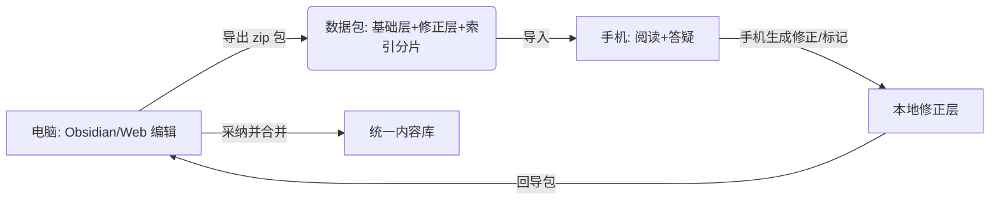

# 04 · 数据可信与修正机制设计（含端数据共通 + 内置 AI 答疑）

> 本文档为前期方案补充，对应 2026-09-06 第二轮讨论。
> 关联：`01-PRD-知识学习站.md` / `01b-PRD补充-学习顺序与类目扩展.md` / `02-架构设计-知识学习站.md` / `03-决策与整合总览.md`。
> 当前阶段：**前期方案（不写代码）**。

## 0. 本篇要解决的三件事

1. **数据可信**：AI 抓来的内容未经校验，用户如何分辨"AI 说的"还是"我确认过的"？错了去哪找对的？
2. **端数据共通**：Web 与 App 是同一份数据，电脑主编辑、手机主阅读，错了回电脑改。
3. **内置 AI 答疑**：阅读中发现某段存疑，直接在 App 内问，不跳出。

---

## 1. 数据可信：溯源 + 校验状态 + 修正层（三层叠加）

### 1.1 每条内容必须携带溯源元数据（front-matter）

```yaml
entry:
  slug: surplus-value
  title: 剩余价值
  sources:                 # 溯源：每一句都能量化到来源
    - { title: 资本论 第三卷, url: https://www.marxists.org/..., accessed: 2026-09-01, license: public-domain }
  ai_generated:            # AI 生成留痕
    model: claude-opus-4.6
    prompt_hash: a1b2c3
    generated_at: 2026-09-01
  status: auto             # 见 1.2 状态机
  verified_immune: false   # 见 1.4 免疫标记
```

**原则**：没有 `sources[]` 的 AI 生成内容，在 UI 中一律标记为"无来源、未校验"。

### 1.2 校验状态机

```
        ┌─────────┐
        │  auto   │  AI 生成，未校验（默认）
        └────┬────┘
    标记存疑│    │核对通过
   ┌─────────┴──┐ └─────────┐
   ▼            ▼           ▼
┌──────┐   ┌──────────┐  ┌──────────┐
│flagged│   │verified │  │corrected │
│存疑   │   │已校验   │  │已修正    │
└──────┘   └────┬─────┘  └────┬─────┘
                │             │
                └── 均对"整体刷新"免疫 ──┘
```

- `auto`：默认，渲染时标题旁显示弱标记（如小圆点/「AI 草稿」角标）。
- `flagged`：用户标存疑，UI 高亮为警示色，提示"此条待核查"。
- `verified`：用户核对过，移除未校验标记。
- `corrected`：用户改过（修正层覆盖生效）。

### 1.3 修正层（Overlay）语义

修正层是一个**独立、量小、永远优先**的数据层，渲染时按 slug/区块合并到基础层之上：

| 操作 | 修正层语义 | 基础层 |
|------|-----------|--------|
| 覆盖某条 | 同名 slug 以修正层为准 | 保留但被遮 |
| 追加补充 | 同 slug 新增 section（如"补充解读"） | 不变 |
| 标记冗余 | 区块标 `collapsed` / `hidden` | 渲染时跳过 |
| 多视角并存 | 同一 slug 挂多个解读来源（不同立场并列） | 不主张唯一"正确" |
| 删除 | 标 `removed`（墓碑），非物理删 | 逻辑隐藏 |

**关键点**：是"分层合并"不是"整库覆盖"——AI 全量刷新只更新基础层，你的校订（修正层）永不丢。

### 1.4 免疫标记（解决"刷新冲掉校订"）

`verified_immune: true` 的条目，**任何批量刷新/重新抓取都不得修改**。这是防误操作的安全阀。

### 1.5 多视角并存（政治理论等争议话题必需）

覆盖式"对错替换"会抹杀立场多元性。修正层支持同一词条内**并列多个来源解读**（如不同流派对"剩余价值"的阐释），UI 以"观点 A / 观点 B"呈现，而非单一正确答案。

### 1.6 分级信任 + 校订包

- 来源是权威典据（公有领域 canonical 文本）的条目，导入时可批量标 `verified`。
- 普通 AI 生成的，默认 `auto`，靠用户抽看或**共享校订包**（别人核过的修正层导出给你）。

### 1.7 版权与时效约束

- **公有领域**（马克思原著等）：可全文 + 标 canonical 源。
- **现代二手/论文/百科**：仅做摘要或本地标注来源不传播；抓取管线需按类目设"可录策略"。
- **时效**：AI 内容必须标 `generated_at` + `model`，回看时可知是否过时。

### 1.8 冲突合并（3-way）

基础层刷新与修正层同改一处时：以 `bundle.json.base_snapshot` + 本地 `imports.json` 做三方比对（见 02 §1 C2），冲突进"待决队列"由用户定，绝不静默覆盖。

---

## 2. 端数据共通：电脑主编辑、手机主阅读

### 2.1 定位（用户本轮明确）

> "假如数据错了要改，我不可能只在手机上改，还是要回电脑改。"

由此确立分工：

| 端 | 角色 | 主要能力 |
|----|------|----------|
| **电脑 Web** | **主编辑端** | 全量编辑（Obsidian 文件夹 + 轻量应用内编辑修正层）、生成/导出数据包、跑 AI 录入 CLI |
| **手机 App** | **主阅读端** | 阅读、导入数据包、内置 AI 答疑；修正层以"消费 + 暂存"为主 |

### 2.2 共通机制（一期）

数据是**同一套 Markdown + YAML 文件**（基础层 + 修正层），两端共用代码、共用格式。两端"共通"通过**导入/导出数据包**实现（沿用 01 §8 设计，且修正层已是一等公民，随包走，关闭 PRD §6 的遗留项 E）：



- **电脑→手机**：编辑后导出（全量或按 slug 增量），手机导入，自动按片合并索引。
- **手机→电脑**：手机内 AI 答疑"采纳建议"或"标记存疑"会写入手机本地修正层；导出该包回电脑导入，三方合并（见 1.8）。
- **续读位置**：可选随包带回，实现跨端"接着读"。

### 2.3 二期可选（用户原决策：一期手工，二期再议）

若不愿手工搬包，可加 WebDAV / 网盘 / 自建轻服务做自动同步；但一期**不做**，保持零服务器。

### 2.4 内容录入由谁运营（关键澄清，2026-09-06）

> 用户明确：AI 上网抓取录入内容**不是 App 内的运行时功能**，而是**项目交付之前由助手（我）运营的工作**；内容若不达标，用户会回来要求我重新搜寻并修订项目源文件。

由此确立**人机协作的内容运营模型**：

- **AI 录入 CLI = 交付期工具，操作者 = 助手**：构建阶段我用该 CLI 抓取 → 结构化 → Lint → 落盘到内容仓库，生成初始知识库（按 `01b` 排产 B0/B1 批次）。**App 本身不含任何抓取/联网逻辑**（与"纯本地/离线/无网络权限"一致）。
- **用户审阅 + 反馈**：用户在各端阅读，标记问题（错、冗余、过简、缺项），反馈回到助手——而非用户在 App 内自行抓取。
- **重新录入 = 助手 surgical 重跑**：针对具体 slug/章节，我重新抓取权威来源、生成更好版本，更新内容仓库并产出新数据包；用户的**修正层（overlay）不受损**（基础层更新、修正层保留）。
- **已 `verified_immune` 条目**：即便我重跑批量刷新，也受 §1.4 免疫保护，不被覆盖。

**对架构的影响**：
1. 抓取管线必须支持**按 slug / 按 Section 增量重跑**（非整库重建），且断点续传（见 `02` §6）。
2. 每次录入须写全 `sources[]` / `ai_generated{}` / `rev`，保证可审计、可重跑、可溯源。
3. 内容仓库（md 文件）= **单一事实源**，助手与用户都只改它；App 通过导入包消费。
4. **版权边界**：公有领域（马克思等）可全文；现代二手/论文/百科仅摘要或本地标注来源不传播——抓取策略须按类目设"可录策略"，由用户在**每批开始前确认范围**。

#### 2.4.5 版权三档（可录策略基线，2026-09-06 补充）

抓取策略按类目设"可录策略"，落到三档；导入时自动带 `license` 与默认 `status`，从源头规避版权风险：

| 档 | 适用 | 可录内容 | 默认 status | 示例 |
|----|------|----------|-------------|------|
| **T1 公有领域** | 已超版权期的原著 / 经典 | 全文 + 标 canonical 源 | `verified`（权威典据可批量标） | 马恩原著、古典哲学 / 科学原著、古代史籍 |
| **T2 现代二手** | 论文 / 百科 / 评述 / 教材 | 仅摘要 + 标注来源，**不传播全文** | `auto` | 现代研究综述、百科条目、当代解读 |
| **T3 受限** | 版权期内且无权录入 | 仅本地引用片段（合理使用）+ 来源链接，**不入库传播** | `auto` + 标记"引用" | 当代专著、受保护文本 |

> 任意档若用户手动核过 → 升 `verified`；用户改过 → `corrected`；免疫项 → `verified_immune`（见 §1.4）。T2/T3 的"仅摘要 / 仅引用"与 §1.7 时效约束一致。

### 2.5 两级提炼层（密度轴，解决"太大看不完"，2026-09-06 A 细化）

用户对大部头著作（马恩、毛选、邓选、江选、胡选、习选等）明确：**先看每本要点、觉得值得再进原文；且原文每个章节前再提炼一次章节要点**，其他类目同理。
→ 数据模型补**第四维度：密度轴（要点 ↔ 全文 三级钻取）**，与分类轴 / 顺序轴 / 修正层正交：

- **著作级摘要 `summary`**（全书要点）：`{ tldr, keyPoints[], whyRead, readingTime }`
- **章节级摘要 `section.summary`**（章 / 节要点）：`{ tldr, keyPoints[] }`
- **章节全文 `section.body`**（原始正文，长文 chunk 化挂载，见 `02`）

**三级钻取路径**：
`著作卡（看 summary）→ 点进 → 章节列表（每章先显 summary）→ 点某章 → 章 summary + 全文`

这解决"大书看不完 / 太冗余"：用户先读薄薄一层要点判断是否值得深读，再逐级下钻；先薄后厚也天然适配手机小屏。

**跨类目映射（统一"先摘要后全文"范式）**：

| 类目 | 著作级摘要 | 章节级摘要（对应"节"） |
|------|-----------|----------------------|
| 哲学 | 思想家要点 + 代表作要点 | 单篇 / 单章要点 |
| 科学 | 学科要点 + 核心概念要点 | 单概念 / 单实验要点 |
| 金融 | 工具 / 品种要点 + 关键条款要点 | 单条款 / 单公式要点 |
| 政治理论 | 思潮 / 流派要点 + 文献要点 | 单文献 / 单章节要点 |
| 历史 | 时期要点 + 转折事件要点 | 单事件 / 单人物要点 |

> **工作量提示**：两级摘要 = 全类目条目 ×2 的额外生成量（著作级一份 + 章节级每份一份）。该量须计入 `06-类目内容规划.md §3` 的排产，随 B0/B1 批次一并核算与 Lint。

### 2.6 标记问题回传机制（B 确认，2026-09-06）

用户在 App 阅读中发现问题（错 / 冗余 / 过简 / 缺项 / 存疑），可**就地标记**；标记随导出包回电脑，汇入助手的"待办修订队列"，进入 §2.4 的内容运营闭环。

**反馈结构 `feedback.json`**（每条一条记录；与修正层 overlay **物理分离**——feedback 是"给助手的信号"，不直接改内容）：

```json
{
  "slug": "surplus-value",
  "sectionId": "ch03",          // 可选，章节级定位
  "selectedText": "……被标记的原文片段……",  // 可选
  "type": "wrong|redundant|too-brief|missing|doubt",
  "note": "此处数据与我读的 XX 不符",
  "severity": "low|mid|high",
  "createdAt": "2026-09-06T20:00:00",
  "device": "android"
}
```

**回路**：
`App 标记 → 写入 feedback.json（随导出包）→ 电脑导入 → 助手读取 → 按 slug/section surgical 重跑 → 新数据包 → 用户导入 → 对应 feedback 标记 resolved（按 slug+sectionId+type 去重匹配）`

- App 写 `feedback.json` 到**本地数据包**，导出时随包走；与修正层 overlay 分离，互不干扰。
- 电脑导入该包后，助手读取 feedback → 进入 §2.4 闭环：更新内容仓库、产出新包；**用户修正层 overlay 不受影响**。
- 闭环确认：新包导入手机后，对应 feedback 标记 resolved，UI 反馈"已修正"。

---

## 3. 内置 AI 答疑窗口 —— ★ 已取消（用户 2026-09-06 决定）

> **用户决定移除 App 内 AI 答疑窗口**。理由：与「纯本地 / 离线优先 / 无服务器 / 手机安全 / 秒开」多处冲突，性价比不足。
>
> **澄清**：本决定仅取消 *App 内答疑*。最初需求中的 **AI 上网抓取录入内容（桌面端 Node CLI → 落盘为 md 文件）仍按原需求保留**——它只在电脑运行，产出本地文件，不进入 App、不联网、不影响手机安全。
>
> 原 §3.1–§3.5 设计（形态 / 上下文注入 / 采纳闭环 / 云端 vs 本地张力 / 联网查证）及 §4 的 Q17–Q21 全部作废，留作二期参考。

---

## 4. 待确认问题（需用户拍板）

> 原 Q17–Q21（内置 AI 相关）已随 §3 取消而作废。本期待确认项见 `01` / `02` / `03`。

## 5. 对已有方案的影响

- 升级 `01` §9.5 字段表：新增 `sources[]` / `ai_generated{}` / `status` / `verified_immune` / `removed`。
- 升级 `02` 存储分层：修正层 = 独立的 overlay 目录/分片；索引需含 status 字段以支持"仅搜已校验"。
- 升级 `01b`：Track 与修正层正交，互不影响。
- 关闭 `03` §6 中项 E（tracks/ 进包）；**§3 内置 AI 答疑已取消（见 §3）**，内容录入 AI（桌面 CLI）保留。
