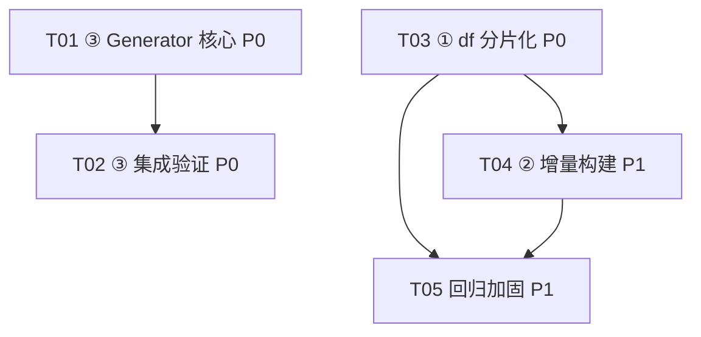

# PKS 知识站三项优化 — 架构设计与有序任务分解

**作者**：高见远（software-architect）　**日期**：2026-09-10　**针对**：pks-opt 团队
**范围**：① df.json 分片化　② builder 增量构建　③ 批量生成管线（最重要，排最前）
**结论优先**：所有方案均基于已读源码（`inverted.ts` / `builder.ts` / `loader.ts` / `searchWorkerClient.ts` / `search.worker.ts` / `repository.ts` / `frontmatter.ts` / `taxonomy.yaml` / 实际 `money/entry.md` 等），不凭空假设。

---

## 0. 代码事实核对结论（先给结论）

| 待确认项 | 结论 | 证据 |
|---|---|---|
| **buildShards 是否按 doc id 哈希稳定？** | **已按 slug 哈希，无需改造**。当前 `inverted.ts:57` 用 `shardOf(doc.slug, m)`，`doc.slug` 是 entry/section 的 slug（非 `doc.id`）。slug 不变 → 分片不变。 | `inverted.ts:48-84`、`shards.ts:15-17` |
| **增量构建的真正不稳定源** | 是 **M 阈值跳变**：`chooseShardCount(totalWords)` 在 300万/1000万 处 16→64→256。`M` 变 → 所有分片重映射 → 增量失效，必须强转全量。 | `shards.ts:9-13`、`builder.ts:209` |
| **docId 性质** | 分片内位置号（`shard.docs.length`），每次全量重排。**增量不能用位置号对齐**，必须「按 slug 复用旧分片 postings」。 | `inverted.ts:59` |
| **df 与 M 解耦** | df 按 term 哈希分桶，与 M 无关；M 变不影响 df 桶（仅影响 `sNN` 分片）。 | — |
| **主线程能否算查询词桶** | 能。`tokenize` 已从 `@pks/core` 导出，主线程可 tokenize 查询词 → 算桶 → 懒加载。 | `index.ts:24` |
| **df 当前生产者/消费点** | 生产者 `builder.ts:221-229,292-296`；消费：`loader.ts:234`、`searchWorkerClient.ts:130`、`search.worker.ts:70-76`、`load-index.ts`（CLI 当前**未传 df**）。 | 见 §6 矩阵 |
| **47 单测** | 位于 `packages/core/test/`（23 个文件）。直接字面断言 `.index/...` 键的有 `builder.test.ts:96-97,106`、`bundle.test.ts:28`、`cover.test.ts:50-53` 等；另有按 key-set 迭代的断言。`df.json` 键改名必然触发。 | `grep df.json / '.index/search/df' / files['.index/search/df.json']` |

**核心判定**：② 增量构建**不需要改 `buildShards` 的哈希逻辑**（它已经是 slug 哈希）。只需 (a) 检测 M 变化→强转全量；(b) 按 slug 复用旧 `sNN.json` 的 postings 实现「跳过分词」。

---

## 1. 三项实现方案 + 框架选型

### ① df.json 分片化（解决运行期 48MB 卡顿）

**方案**
- term 按 `fnv1a(term) & (B-1)` 分桶，**B 固定 = 64**（常量 `DF_BUCKET_COUNT`，导出供 builder 与消费端共用，避免 manifest 耦合）。
- 落盘：
  - `.index/search/df/meta.json` = `{ totalDocs, avgLen }`（极小，常驻加载，替代原 df.json 的全局参数部分）。
  - `.index/search/df/bucket-NNN.json` = `{ "df": { term: count } }`（NNN 三位补零，按桶散列）。
- **Worker 懒加载协议**：
  - `init` 只传 `dfMeta:{totalDocs, avgLen}`（**去掉全量 df**）。
  - 新增消息 `dfb`：`{ type:'dfb', buckets: Array<{n, df}> }`。主线程在 `searchViaWorker` 中：tokenize 查询 → 算桶号 → `fetchText` 仅需要的桶（缓存优先 + 单飞去重）→ 推给 worker → worker 合并进 `dfMap`。
  - 主线程降级路径（worker 不可用）：`fullTextSearch` 兜底时同样只 `loadDfForTerms(terms)` 加载需要的桶，再喂给 `engine.stats.df`（`SearchEngine` API **不改**，df Map 只是延迟填充）。
- **框架选型**：纯复用 `@pks/core`（`tokenize`/`fnv1a`/`decodePostings`）；无新依赖。

### ② builder 增量构建（O(变更) 而非 O(N)）

**方案**
- 每词条 `contentHash` = `sha1( entry.md + chapters/*.md 拼接内容的稳定序列化 )`，存 **`content/.pks-build-state.json`**（**不进 `.index/`**，gitignored，既满足「不随包分发」又不污染 47 个 `.index/` 键断言）。格式：
  `{ version:1, shardCount:M, entries:{ [slug]:{ hash, shard } }, built_at }`。
- 流程：`buildIndex(vfs, {incremental:true})`：
  1. 读旧 `build-state` + 旧 `sNN.json`（用于按 slug 复用 postings）。
  2. 对每个 entry 算 `hashEntryDir`；**未变 slug** → 从旧分片按 slug 取出 `{docs[i], lengths[i], index 词条}` 复用（跳过分词）；**新增/变更** → 走现有分词逻辑。
  3. 按 snapshot 顺序重建每个分片（docs/lengths/index 自洽即可，docId 重排无妨，因为 `shard.docs[i].id` 是 slug）。**仅含≥1 变更的分片重写文件**，其余跳过（字节级不变）。
  4. **增量 df**：每分片 df 片段 = `shard.index[term].length`（本分片含该 term 的文档数）；全局 df = Σ片段 → 再走 `buildDfBuckets` 分桶。仅变更分片重算片段 + 重分桶。
  5. 写新 `build-state`。
- **回退条件**（任一触发即 `--full` 全量）：`--full` 显式；无旧 state/corrupt；`shardCount(M)` 变化；某 slug 旧 postings 缺失。
- **框架选型**：复用 `@pks/core` 已有 `sha1`（`util/sha1.js`）；`repository.ts` 增 `hashEntryDir`。无新依赖。

### ③ 批量生成管线（最重要）

**方案**
- 新增 CLI 命令 **`pks gen`**（子命令 `run`/`resume`/`promote`/`status`），注册进 `packages/cli/src/index.ts`。
- **work-order 落盘格式：推荐 YAML**（与项目 YAML-first 一致、git diff 友好）。顶层 `items:[{slug,title,categories,timeline,see_also,outline,sources,material}]`。
- **provider 抽象边界**（关键）：
  - `LLMProvider.generate(req): Promise<{text}>` —— **仅做 text→text**，不碰文件系统、不碰 lint、不碰 PKS 布局。
  - `OpenAIProvider`：`fetch` 调 `${PKS_LLM_BASE_URL}/v1/chat/completions`，`Authorization: Bearer ${PKS_LLM_API_KEY}`（OpenAI 兼容，可接 Ollama/OpenRouter/本地）。
  - `FileProvider`（pilot）：从 `answers/{slug}.json` 读预写内容，**零 API 验证整条管线**（主代理直接产出文件验证）。
- **单条生成回路**（`runner.ts`）：
  1. `prompt.ts` 用 item + taxonomy 上下文 + lint 规则摘要 + frontmatter schema 构造严格 system/user 消息，要求输出可解析的目录文件集。
  2. `provider.generate` → `parse-output.ts`（支持：JSON `{entry, chapters:{name,content}[]}` / 多个 ```lang 围栏块带文件名 / 直接目录） → `Map<filename, content>`。
  3. 写 `content/.staging/{slug}/`（entry.md + chapters/*.md，frontmatter 严格遵循现有 schema）。
  4. `lintEntryDir(vfs, slug)`（在 `lint.ts` 新增、复用现有 8 条规则）校验；**失败带错误反馈重试，attempts ≤ 3**；通过则 `state=done`。
  5. **`gen promote {slug}`** 人工抽查后把 `content/.staging/{slug}` 移到 `content/entries/{slug}`；下游 `build:index` **零改动**（staged 文件与 entries schema 完全一致）。
- **断点续跑 + 无人值守**：state 文件 `content/.pks-gen-state.json`（`{items:{[slug]:{status,attempts,error?,hash}}}`）；重启跳过 `done/promoted`，重试 `pending/failed`；并发限流（`--concurrency` 默认 2 + 指数退避）；`failed` 隔离；全队列跑完即退出（仅当 `--strict` 且有 failed 时返回非零）。
- **框架选型**：复用 `js-yaml`（已依赖）、`validateEntryMeta`/`validateSectionMeta`、`loadSnapshot`；并发用内置小工具，**无新运行时依赖**。

---

## 2. 文件清单（新建 / 修改 标注）

### ① df 分片化
| 文件 | 动作 | 说明 |
|---|---|---|
| `packages/core/src/index/df.ts` | **新建** | `DF_BUCKET_COUNT`(重导出)、`dfBucketOf`、`buildDfBuckets(shards)`、`DfBucket`/`DfMeta` 类型 |
| `packages/core/src/constants.ts` | 改 | `+DF_BUCKET_COUNT = 64` |
| `packages/core/src/index/builder.ts` | 改 | `df.json` → `df/meta.json` + `df/bucket-NNN.json`；调用 `buildDfBuckets` |
| `apps/web/src/lib/loader.ts` | 改 | `loadStation` 改读 `df/meta.json`；新增 `loadDfForTerms()`/`loadDfBuckets()`（缓存+单飞） |
| `apps/web/src/lib/searchWorkerClient.ts` | 改 | `ensureInitialized` 传 `dfMeta`；`searchViaWorker` 算桶→`loadDfBuckets`→发 `dfb` |
| `apps/web/src/lib/search.worker.ts` | 改 | `init` 仅建 `dfMeta`；新增 `dfb` 消息 handler 合并进 `dfMap` |
| `apps/web/src/lib/searchWorkerProtocol.ts` | 改 | `init` 增 `dfMeta`；新增 `SearchWorkerDfbRequest` |
| `packages/cli/src/load-index.ts` | 改(可选) | 顺带懒加载 df，统一 CLI 打分（低成本） |

### ② 增量构建
| 文件 | 动作 | 说明 |
|---|---|---|
| `packages/core/src/index/builder.ts` | 改 | 增量主逻辑 + `build-state` 读写 + 增量 df（复用 `df.ts`） |
| `packages/core/src/content/hash.ts` | **新建** | `hashEntryDir(vfs, slug)`（`sha1` 稳定序列化目录文件） |
| `packages/cli/src/commands/build-index.ts` | 改 | 透传 `opts.incremental` / `--full` |
| `packages/cli/src/index.ts` | 改 | help 文案补充 `--full`（`--full` 已被通用 flag 解析透传，仅需 help） |

### ③ 批量生成管线
| 文件 | 动作 | 说明 |
|---|---|---|
| `packages/cli/src/commands/gen.ts` | **新建** | `pks gen` 子命令分发（run/resume/promote/status） |
| `packages/core/src/gen/provider.ts` | **新建** | `LLMProvider` 接口 + `GenRequest`/`GenResponse` 类型 |
| `packages/core/src/gen/providers/openai.ts` | **新建** | OpenAI 兼容 provider（fetch） |
| `packages/core/src/gen/providers/file.ts` | **新建** | FileProvider（pilot，零 API） |
| `packages/core/src/gen/prompt.ts` | **新建** | prompt 模板构造（lint 规则 + taxonomy + frontmatter schema） |
| `packages/core/src/gen/parse-output.ts` | **新建** | LLM 输出 → `Map<filename,content>`（JSON/围栏/目录） |
| `packages/core/src/gen/runner.ts` | **新建** | 逐条回路 + 重试 + 并发限流 + state/resume + promote |
| `packages/core/src/gen/workorder.ts` | **新建** | 解析 YAML/JSON work-order → `WorkOrderItem[]` |
| `packages/core/src/gen/staging.ts` | **新建** | `writeStaging` / `promote`（staging→entries） |
| `packages/cli/src/index.ts` | 改 | 注册 `gen` 命令到 `KNOWN` 集合 + 分发 |
| `packages/cli/src/commands/lint.ts` | 改 | 新增可复用 `lintEntryDir(vfs, slug)`（复用现有 8 规则） |
| `packages/cli/templates/workorder.example.yaml` | **新建** | 示例 work-order |
| `content/.staging/` + `content/.pks-build-state.json` + `content/.pks-gen-state.json` | 运行时 | 均 **gitignored** |

---

## 3. 有序任务列表（③ 排最前；≤5 任务；含依赖/优先级）

> 本仓库已存在 monorepo，无新建构建配置需求；T01 的 CLI 注册即 ③ 的「集成入口基础设施」。

- **T01　③ Generator 核心**　`[P0]`　依赖：无
  - 源文件：`packages/core/src/gen/*`（provider/providers/openai/file/prompt/parse-output/runner/workorder/staging）、`packages/cli/src/commands/gen.ts`、`packages/cli/src/commands/lint.ts`(+`lintEntryDir`)、`packages/cli/src/index.ts`(+`gen`)
- **T02　③ Generator 集成验证（pilot）**　`[P0]`　依赖：T01
  - 源文件：`packages/cli/templates/workorder.example.yaml`、`packages/core/src/gen/providers/file.ts`、`packages/core/src/gen/runner.ts`（resume/promote/退避/并发）、`content/.staging/` 运行时约定
- **T03　① df 分片化（核心+协议+懒加载）**　`[P0]`　依赖：无（与 T01 并行）
  - 源文件：`packages/core/src/constants.ts`、`packages/core/src/index/df.ts`、`packages/core/src/index/builder.ts`、`apps/web/src/lib/searchWorkerProtocol.ts`、`apps/web/src/lib/loader.ts`、`apps/web/src/lib/search.worker.ts`、`apps/web/src/lib/searchWorkerClient.ts`
- **T04　② 增量构建**　`[P1]`　依赖：T03（复用 `df.ts` 与桶分片）
  - 源文件：`packages/core/src/content/hash.ts`、`packages/core/src/index/builder.ts`(增量+state+增量df)、`packages/cli/src/commands/build-index.ts`、`packages/cli/src/index.ts`(help)
- **T05　跨切面回归加固**　`[P1]`　依赖：T03, T04
  - 源文件：`packages/core/test/*`（df 键迁移 + 增量确定性）、`packages/cli/src/load-index.ts`(懒 df)、bundle/OTA 桶一致性、文档



---

## 4. 回归风险（消费点 + 47 单测）

### 4.1 「3 处搜索消费点 + 生产者 + CLI」改动矩阵（① df 分桶 / ② 增量 df）

| 文件 | 角色 | ① df 分桶改动 | ② 增量构建改动 |
|---|---|---|---|
| `packages/core/src/index/builder.ts` | 生产者 | `df.json`→`df/meta.json`+`df/bucket-NNN.json`；新增 `buildDfBuckets()` | 读 `build-state`；未变 slug 复用旧 `sNN` postings（跳分词）；仅重写 touched 分片；增量合并 df |
| `apps/web/src/lib/loader.ts` | 消费① | `loadStation` 不再 fetch 全量 `df.json`，改读 `df/meta.json`；新增 `loadDfForTerms()`/`loadDfBuckets()` 懒加载（缓存+单飞） | 无（df 来源变桶，但 `stats.df` 接口不变） |
| `apps/web/src/lib/searchWorkerClient.ts` | 消费② | `ensureInitialized` 仅传 `dfMeta`；`searchViaWorker` 算查询词桶→`loadDfBuckets`→发 `dfb` | 无 |
| `apps/web/src/lib/search.worker.ts` | 消费③ | `init` 仅建 `dfMeta` 的 `totalDocs/avgLen`；新增 `dfb` handler 合并进 `dfMap` | 无 |
| `apps/web/src/lib/searchWorkerProtocol.ts` | 协议 | `init` 增 `dfMeta`；新增 `SearchWorkerDfbRequest` | 无 |
| `packages/cli/src/load-index.ts` | 消费④(可选) | 建议新增懒加载 df（与 loader 同逻辑）以统一 CLI 打分 | 不强制 |
| `packages/core/test/*`（47 处） | 断言 | 所有 `'.index/search/df.json'` 键断言 → 改为 `'.index/search/df/meta.json'` + 抽样 `df/bucket-000.json` 等；bundle 测试关注 `sNN` 键不变 | 新增：同输入两次构建字节一致；单条变更仅影响相关 shard+df 桶 |
| `packages/core/src/content/repository.ts` / 新 `hash.ts` | — | 不涉及 | 新增 `hashEntryDir(vfs, slug)` |
| `packages/cli/src/commands/build-index.ts` / `index.ts` | — | 不涉及 | 透传 `--full`；help 补 `--full` |

### 4.2 47 单测具体迁移点（grep 目标）
- 在 `packages/core/test/**` 中检索：`df.json`、`'.index/search/df'`、`files['.index/search/df.json']`、`bundle.test.ts`（关注 `s00.json` 键）、`builder.test.ts:96-97,106`、`cover.test.ts:50-53`。
- **必改**：把对 `df.json` 的存在性/形状断言替换为 `df/meta.json` + 至少 1 个 `df/bucket-NNN.json` 断言。
- **务必**：`build-state.json` 不放在 `.index/` 下（放 `content/` 根并 gitignore），否则会新增 `.index/` 键、污染 key-set 断言、且违背「不随包分发」。
- **新增测试**（②）：(a) 同输入两次 `buildIndex` → `files` 除 `built_at`/`contentHash` 外字节一致；(b) 仅改 1 个 entry → 仅该 entry 所在 `sNN` + 其涉及 df 桶变化，其余文件字节不变。

---

## 5. 待明确事项（需 team-lead / 产品确认）

1. **work-order 落盘格式**：推荐 **YAML**（与项目一致、diff 友好）；是否接受 JSON 备选？
2. **LLM provider 抽象边界**：当前定为「provider 仅 text→text，不碰文件/lint」。是否需支持**流式 (stream) SSE**？建议 V1 不做，降低复杂度。
3. **build-state.json 位置**：需求写 `.index/build-state.json` 但又要「不随包分发」——**建议改 `content/.pks-build-state.json`**（gitignore，不进 `.index`，不影响 47 断言）。请确认。
4. **df 桶数 B**：建议固定 **64**（每桶 ≈ 48MB/64 ≈ 750KB，Worker 按需拉数桶）。是否要随 M 缩放？固定最简且与 M 解耦。
5. **df 分桶与 M 联动**：df 按 term 哈希，与 M 无关；M 变化只动 `sNN`，无需联动 df —— 确认无需联动。
6. **Generator 抽查 UI**：V1 用 `gen promote` 手动 promote（CLI）；是否需 web 端抽查页？建议 V1 不做。
7. **失败重试/退出策略**：attempts ≤ 3，failed 隔离，跑完即退；仅 `--strict` 且有 failed 时返回非零。是否认可？
8. **并发 provider 调用**：默认 `--concurrency 2` + 指数退避；是否需可配上限？
9. **Generator 产出约束**：work-order 的 `outline` 决定章节骨架；是否强制每章 ≤20000 字（L003）、每章 tldr ≤120（L004）？lint 已约束，请确认 generator 必须严格满足全部 8 条。
10. **CLI 检索(df) 一致性**：① 是否顺带让 `load-index.ts`（CLI search）也走全局 df 懒加载？建议顺带（低成本统一打分），是否必须？

---

## 6. df 分桶 + 增量构建 对「3 消费点 + 47 单测」具体改动点清单（速查）

**生产者（1）**
- `builder.ts`：删除 `files['.index/search/df.json']` 整段（原 :292-296），改为写 `df/meta.json` + 循环 `buildDfBuckets(shards)` 写 `df/bucket-NNN.json`；增量分支复用 `DfBucketStore`。

**消费点（3，外加 CLI 可选 1）**
- `loader.ts`：`loadStation` 删 `fetchJson('index/search/df.json')`，改 `fetchJson('index/search/df/meta.json')`；导出 `loadDfForTerms(terms)/loadDfBuckets(idxs)`（基于 `fetchText`+`shardTextInflight` 同款单飞）。
- `searchWorkerClient.ts`：`ensureInitialized` 的 `init` 消息 `stats` 改为 `dfMeta`（仅 totalDocs/avgLen）；`searchViaWorker` 中在 `ensureShardsSent` 前插入 `loadDfForTerms(tokenize(query))` → 发 `dfb`。
- `search.worker.ts`：`init` 不再把全量 df 建 Map，仅存 `dfMeta`；新增 `case 'dfb'` 把各桶 `df` 合并进 `dfMap`。
- `searchWorkerProtocol.ts`：`SearchWorkerInitRequest.stats` → `dfMeta:{totalDocs,avgLen}`；新增 `SearchWorkerDfbRequest{type:'dfb',buckets:Array<{n,df}>}` 并入 `SearchWorkerRequest`。
- `load-index.ts`（可选）：与 loader 同款懒 df，让 CLI 检索也用全局 df。

**47 单测**
- grep `df.json` 与 `'.index/search/df'` → 把 `df.json` 断言替换为 `df/meta.json` + 抽样 `df/bucket-000.json`。
- 新增 ② 增量确定性测试（见 §4.2）。

---

## 附：设计图
- 类图：`docs/class-diagram.mermaid`
- 时序图（df 懒加载 + generator 管线）：`docs/sequence-diagram.mermaid`

**共享约定（Shared Knowledge）**
- tokenize 空间一致性：索引期（`termFrequencies`）与查询期（`tokenize`）共用同一 `tokenize`，df 桶与 BM25 打分都依赖该空间——新增分词器前必须保持同空间。
- 内容指纹：`sha1(slug:rev)` 用于 `manifest.contentHash`（已存在）；`hashEntryDir` 用于增量 state；二者职责不同，勿混。
- lint 8 条规则（L001–L008）是 generator 的**硬契约**，也是 `lintEntryDir` 的校验集。
- 所有 `.index/` 之外的 state 文件（`build-state`、`gen-state`、`.staging`）一律 gitignore，不进 bundle/APK。
